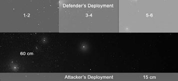

# Scenario Five: Daemon Blockade

_**Reinforcements en route to the Belis Corona and Scelus sectors find themselves
having to penetrate various Chaos blockades. This is risky business indeed.
Admirals find themselves having to move as fast as possible through treacherous
minefields and withering amounts of firepower. Surprise is the only thing on their
side. To make matters even more difficult, there are reports that the ruinous powers
have infused orbital mines with Daemonic power. This can only be a bad thing.**_

## Forces

Agree on a points value total for the battle.

The Chaos fleet will act as the blockading fleet.

**Chaos Fleet:** The blockading player may
spend up to the agreed points value minus
100 on his fleet. In addition to the chosen
fleet this player receives ten daemon mines,
which follow the special rules below.

**Forces of Order:** The attacker (attempting
to break the blockade) may spend up to
half the agreed points total on ships.

## Battlezone

Set up a 180 cm × 120 cm table. The
blockading force is stationed on the edges
of the system, so the battle will take place
in either the outer reaches or deep space.

## Set-up

Divide the table lengthways into thirds, as
shown. The blockading player then sets up
his fleet. Roll a D6 for each blockading ship,
squadron or Daemon mine to determine
which third of the table it is deployed in.
Blockading ships may start facing in any
direction, but may not be placed within 60 cm
of the attacker’s table edge. The attacker then
sets up his force within 15 cm of his table edge.

# First Turn

Players roll a D6. The player who rolls
the highest decides who goes first.

## Special Rules

**Daemon Mines:** These function
as the orbital mines except:

* They move 10+D6 cm each
Ordnance Phase.
* A Daemon mine will devour any enemy
ordnance it comes in contact with
no repercussions, except for fighters.
Yes, this means torpedoes too!
* When enemy fighters contact a
Daemon Mine, roll a D6. On a roll of
4+, the Mine remains in play. Remove
the enemy fighter counter from
play regardless of the outcome.

## Game Length

The game lasts for six turns.

## Victory Conditions
Both players score [victory points](../scenarios.md#victory-points) for
destroying and crippling enemy ships as
normal. In addition, the attacker scores
victory points equal to the points value of any
ships that he can move off the table via the
blockading player’s table edge. [Crippled ships](../the-shooting-phase.md#crippled-ships)
are worth a quarter of their points value if the
attacker can get them off the table. Daemon
Mines that are destroyed (not detonated) are
worth 10 pts each to the attacking player.
The side with the most victory points wins.
