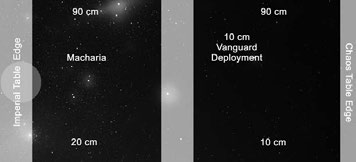

# Scenario Seven: Macharia’s End

_**The dreaded *Planet Killer* has managed to battle its way to the planet Macharia
with the help of a sizable Chaos armada. If action is not taken immediately,
the unthinkable will happen. Data previous victims of the *Planet Killer* points
to the fact that the Armageddon gun takes a considerable amount of time to
charge to a level of energy capable of destroying a planet. This means that
there may still be enough time to thwart the Chaos fleet and save Macharia
if swift Imperial vengeance is brought upon Abaddon’s infernal machine.**_

## Forces

**Chaos Fleet:** The Chaos player
has 1500 pts to spend on a fleet in
addition to the *Planet Killer* itself.

**Imperial Fleet:** The Imperial player
has 2000 pts to spend on the main
fleet. Up to 500 of the 2000 pts may
be separated as a Vanguard fleet.

## Battlezone

Set up a 180 cm × 120 cm table.
Place Macharia in the centre of the
Imperial player’s table edge.

## Set-up

1. The Imperial player places his main
fleet within 20 cm of his table edge.
2. The Chaos player places his fleet minus the
*Planet Killer* within 10 cm of his table edge.
3. The Imperial player can now place
his vanguard fleet anywhere within
5 cm of the table centre line.
4. The *Planet Killer* will move onto
the table from the Chaos player’s
table edge during the first turn.

## First Turn

The Imperial player goes first.

## Special Rules

This scenario uses a large number of special
rules, especially for the *Planet Killer*.

**Armageddon Overcharge:** The *Planet Killer*
needs to build up a charge of energy before it
can deal the deathblow to Macharia. While
it can use this weapon normally if desired, it
must overcharge the weapon in order to win
the game. At the start of the Chaos player’s
turn decide whether or not to begin the charge
build up for the Armageddon Gun. If you
do, place a charge counter (a penny will do
fine) next to the *Planet Killer*, and another
counter at the start of each following turn.
Once 3 counters have been accumulated the
gun must fire during the [Shooting Phase](../the-shooting-phase.md).

**While Charging the Gun:** The *Planet Killer*
cannot [turn](../the-movement-phase.md#turning), nor can it take any [Special
Orders](../the-rules.md#special-orders) or fire its [lances](../the-shooting-phase.md#direct-firing-lances). The *Planet Killer*
gains an extra 2 [shields](../the-shooting-phase.md#shields). Once started, the
charging process can not be stopped.

**Firing The Gun:** Place the [Nova Cannon](../the-shooting-phase.md#nova-cannon)
template so that it is touching the *Planet
Killer*’s stem then move it directly ahead
60 cm. Note that this is a slightly shorter
firing range than the gun normally enjoys.
It does NOT fire 90 cm when overcharged!
If any part of the template passes over ANY
ship’s base, that ship is obliterated. If the
template hole touches planet Macharia
it is destroyed and the game is over.

**Recharging:** If for some reason you
manage to miss planet Macharia with the
overcharged blast (how did you do that?),
the *Planet Killer* needs to pass two [*Reload
Ordnance*](../the-rules.md#reload-ordnance) [special orders](../the-rules.md#special-orders) over different
turns IN A ROW to bring it back online.
During this time the *Planet Killer* cannot
fire any weapons; all it can do is move.

## Game Length

The game lasts until Macharia is destroyed
or the *Planet Killer* is crippled.

## Victory Conditions

The Chaos player needs to destroy
Macharia. The Imperial player needs to
stop the *Planet Killer* by crippling it.
