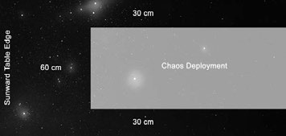

# Scenario two: Rearguard Attack

_**Forces sector wide have been split up into smaller patrols and sent in to
cripple or destroy as much of the Chaos rearguard as possible before they
are destroyed themselves. The targeted Chaos forces are experiencing radar
malfunctions due to the presence of jammer mines scattered in their way. The
time to strike is now. If the Forces of Order cause enough damage, then these
rearguard fleets will be rendered temporarily ineffective, buying the systems
ahead some time to organize their defences. The odds are stacked against
the Imperium, but stealth may just triumph over numerical superiority.**_

## Forces

Agree a points limit for the battle.

**Forces of Disorder:** This player is the
defender. They may spend up to the agreed
points limit in total on their fleet. Split
25% of this force off as [reinforcements](#reinforcements).

**Forces of Order:** This player is the
attacker. They may spend up to half of
the agreed points limit on their fleet.

## Battlezone

Set up a 180 cm × 120 cm table with whatever
celestial terrain you wish for the scenario.

## Set-up

1. The defender deploys his whole fleet first.
The defending fleet must be set up with
all the ships facing the [sunward table edge](../the-battlefield.md#fighting-sunward)
and at least 30 cm from any long table edge
and 60 cm from the sunward table edge.

2. Each defending ship or squadron must
be set up at least 10 cm away from all
other defending ships or squadrons.
3. The attacker moves any of his ships in
from any table edge in his first turn.

## First Turn

The attacker takes the first turn and
moves his fleet onto the table.

## Special Rules

**Ambushed:** For the first D6 turns, all the
defender’s ships suffer a -1 [Leadership](../the-rules.md#leadership) penalty
to represent their reduced state of readiness.

**Reinforcements:** Reinforcements for the
Forces of Disorder may enter the [sunward
table edge](../the-battlefield.md#fighting-sunward) on any turn, including Turn 1. If
the reinforcing ships enter after Turn 1, they
may be deployed up to 30 cm along the long
table edges for each turn after the first.

*For example, a Slaughter class cruiser enters
as reinforcements on Turn 4, so it may be
placed on the short table edge or up to 90 cm
(30 cm × 3) along one of the long edges.*

## Game Length

The game continues for eight turns,
or until one fleet disengages.

## Victory Conditions

Both fleets score [victory points](../scenarios.md#victory-points) as normal
and the fleet with the highest victory
points total at the end of the battle wins.

