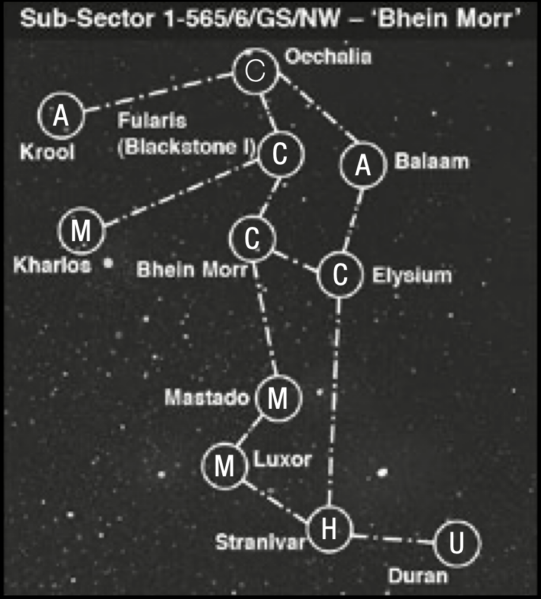
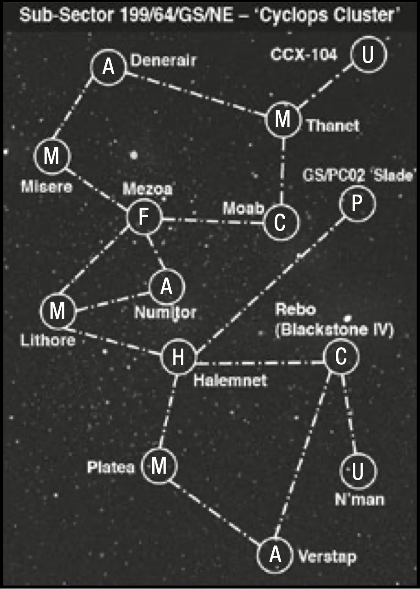
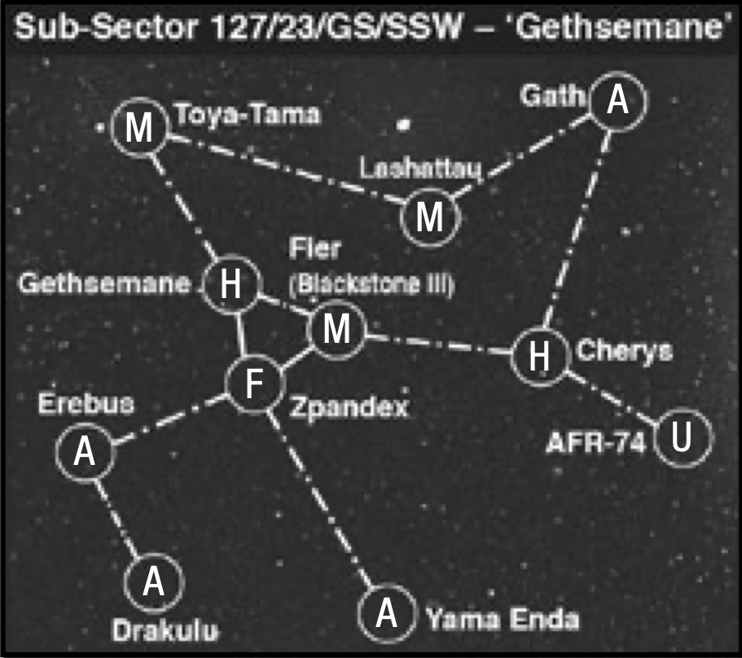
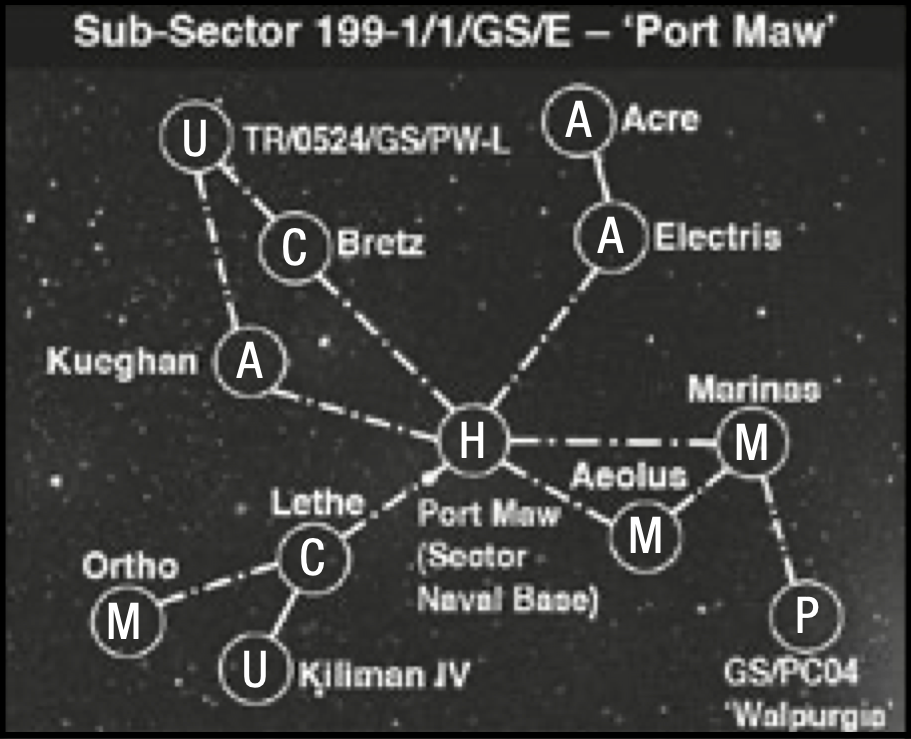
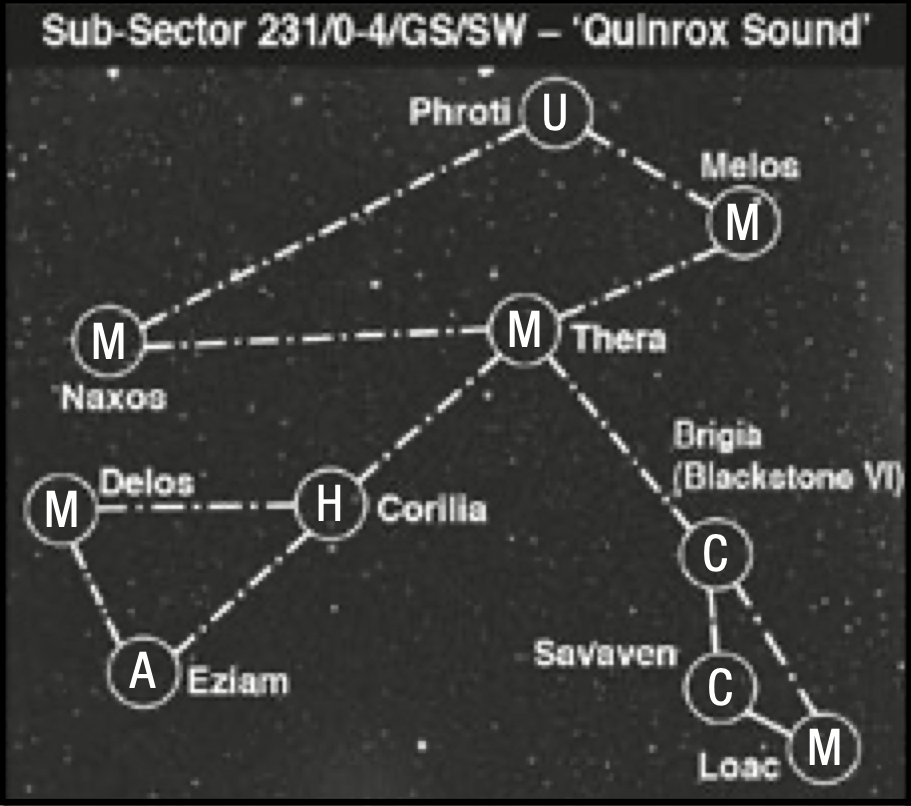
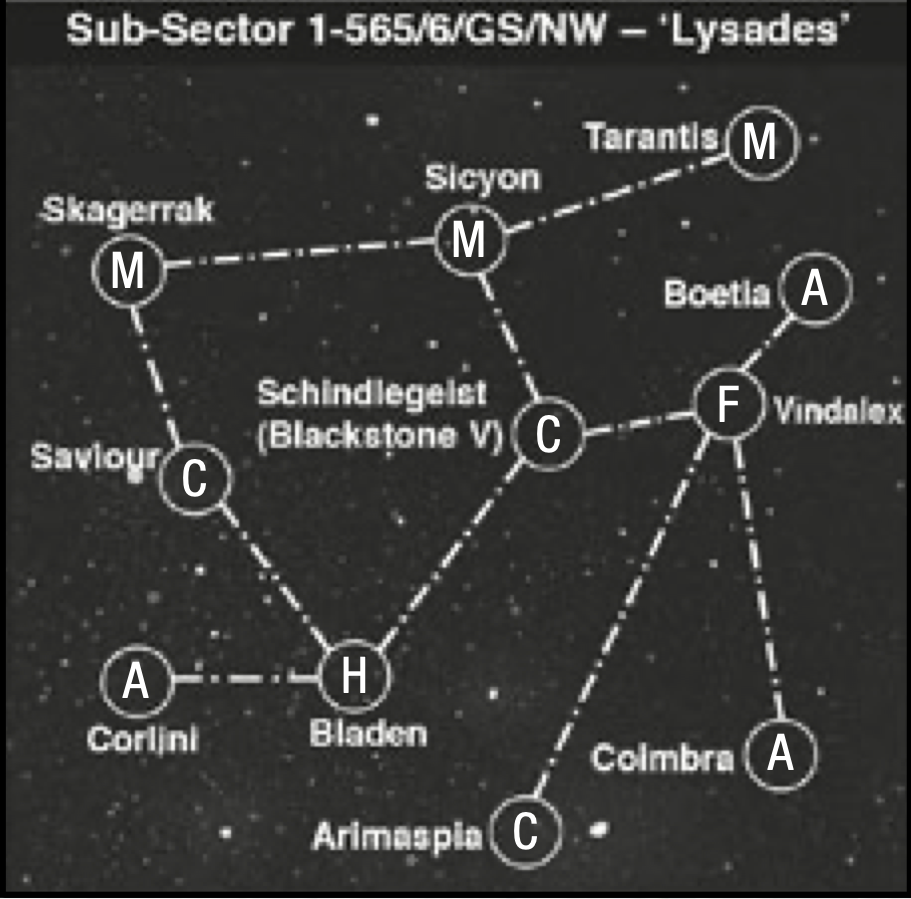
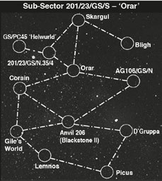

# Campaign Rules

At some stage all wargamers contemplate
running a campaign. This is understandable
– after all, battles don’t take place in isolation,
they are part of an ongoing war. A campaign
allows you to fight your own ‘ongoing war’
by linking battles together, so that the results
of one battle will have an effect on the future
ones you fight. It adds a lot to a campaign if
you keep a journal of the progress of the war,
and from this you can write your own part of
the history of the Gothic campaign. Over the
course of the war you will be able to develop
cunning strategies to conquer a whole subsector of the Gothic system and you will be
able to watch your fleet develop as ships’ crews
gain in skill and ability – or are destroyed and
have to be replaced with inexperienced crews.
In the battles you fight there will be famous
victories and shameful defeats, legendary (or
infamous!) commanders will emerge and ships
in your fleet will gain fame for the awesome
feats they have pulled off against all the odds!

As I hope you can tell, campaigns can be a lot
of fun and they are not all that difficult to run
either. To help you, we’ve developed a mapbased campaign system based on our own
experiences of running campaigns over the
years, but you really should feel free to modify
and change what’s here to suit your own tastes.

For example, playing a campaign offers
great opportunities to try out new rules or
new classes of ship that you’ve invented, or
you could start thinking of adding rules for
fighting land battles and boarding actions
using the Warhammer 40,000 and Kill Team
rules. The possibilities really are endless.

## Getting Started

In order to run a campaign you’ll need
at least one player with a [Chaos](fleet-lists/chaos.md) fleet
and one player with an [Imperial](fleet-lists/imperial-navy.md) fleet.
Any amount of extra players can join in,
including players with [Ork](fleet-lists/orks.md) or [Eldar](fleet-lists/eldar.md) fleets.

Once you’ve got your players together you
need to pick one of the [sub-sectors](#the-sub-sector-maps) we’ve
provided maps for as the location for your
campaign (the maps can be found at the
end of this section). For your first campaign
we recommend starting off with one of the
smaller sub-sectors, unless there are lots of
players (i.e. more than eight) taking part
in the campaign. You’ll need to photocopy
the sub-sector map you’ve decided to use
(or draw it by hand) to keep track of which
player controls each system. We glued
our map to a sheet of card and blu-tacked
it to the wall in our gaming area, then
used coloured pins to show which player
controlled each system, but you could just
as easily write down who controls what.

Next you need to get all the players together
for a ‘campaign briefing’. The most important
thing you’ll need to go over at this point is
the rules for the campaign, to make sure that
everybody knows what’s going on. You should
then decide how long the campaign is to
last. For your first campaign we recommend
playing for one month of real time and on
the whole it’s best to keep campaigns short –
after all, you can always start another one!

Once this has been decided, players can
pick their [starting systems](#starting-systems) and design their
fleets using the rules described below, then
you can start fighting battles. However,
it is usually a good idea to set a regular
time and place for campaign meetings,
and also to elect a ‘campaign arbitrator’
who is in charge of making sure that the
campaign runs smoothly. You might
also want to consider putting together a
campaign newsletter, in which case you’ll
need to decide who will be its editor.

## Starting Systems

At the start of the campaign,
many of the systems in the
sub-sector will be neutral.
As the campaign progresses,
this will change and players
will gain control of systems
that will pay them tithes
and help repair their ships.

_**Designers’ Note:** Actually
all systems start nominally
under the control of the
Imperium, but as planetary
governors tend to go their own
way until reminded of their
obligations, they are for all
intents and purposes neutral._

[Imperial](fleet-lists/imperial-navy.md) and [Chaos](fleet-lists/chaos.md) players
start with one of the systems
in the sub-sector under
their control. Roll a D6 to
decide the order that both
players pick their system, and
record who controls which
system with coloured pins
on the campaign map, or by
keeping a written record.
[Eldar](fleet-lists/eldar.md) and [Ork](fleet-lists/orks.md) players start
with a hidden pirate base
instead, and should write
down secretly which system
it is hidden in (they can pick
a system controlled by an
Imperial or Chaos player).

## Starting Fleets & the Fleet Register

[Imperial](fleet-lists/imperial-navy.md) and [Chaos](fleet-lists/chaos.md) fleets
begin the campaign with
2,000 points and [Ork](fleet-lists/orks.md) and
[Eldar](fleet-lists/eldar.md) fleets start with 1,500
points. Important: you must
have models to represent all
of the ships in your fleet, in
case they all end up in a big
battle! If your fleet doesn’t
add up to 2,000 points,
then just use what you’ve
got available (don’t worry – you will get to add new
ships to your fleet during
the course of the campaign
as you buy and paint new
models for your collection).

Each player has his own
fleet registry. He uses it
to keep notes and dates of
when a [capital ship](the-rules.md#capital-ships) or [escort](the-rules.md#escorts)
[squadron](squadrons.md) was commissioned
(i.e. bought) along with
class of ship etc., when it
takes its fleet trials (i.e. it’s
assembled, painted and its
[Leadership](the-rules.md#leadership) rating is rolled
for), its campaign history
and its loss if and when they
occur. If a vessel is used in
battle before its fleet trials
are complete (i.e. it’s not
fully assembled and painted)
it will suffer a [critical hit](the-shooting-phase.md#critical-hits)
on a D6 roll of 1 every time
it uses [special orders](the-rules.md#special-orders).
Ships which are added to the
fleet register after the start
of the campaign suffer a -1
modifier to their [Leadership](the-rules.md#leadership)
due to their hasty training
and less experienced officers.

When players fight battles
they must pick their forces
from their own fleet register.

## The Commander

Each player’s fleet has
a [commander](fleet-lists.md#fleet-commander) (or an
appropriately named leader
for their race) who represents
the player himself. Over
the course of the campaign,
your commander will
collect [renown points](scenarios.md#renown) and
gain in rank, and at the
end of the campaign the
commander with the highest
renown is the winner.

Once you’ve filled in your
fleet register, you need to
fill in the details of your
[commander](fleet-lists.md#fleet-commander). He’ll need a
name, and starts off with
1 point of [renown](scenarios.md#renown) and one
[re-roll](the-rules.md#re-rolls). In addition, you must
pick one ship in your fleet
as his flagship. If this ship is
involved in a battle then ‘you’
are there, and you may use
the commander’s [re-roll](the-rules.md#re-rolls) or
any other special abilities he
may have in the battle. If the
flagship is not there then you
may not use the commander’s
re-roll or abilities.

If the flagship is destroyed,
then it is assumed that your
commander manages to
escape somehow. He may
not have any further effect
in that game, but you may
choose a new flagship for
him once the game is over.

## Fighting Battles

In order for things to happen
in the campaign players
must fight battles (doh!). At
its simplest level all players
have to do is challenge any
other player that is in the
campaign to a game and if
they agree then the game
uses the additional campaign
rules below as well as the
rules used for a normal game.

The only problem with
this is that it can lead to
some odd situations where
[Imperial](fleet-lists/imperial-navy.md) fleets attack other
Imperial fleets to gain
control of systems, and
because of this, it’s best if
the Imperial players are not
allowed to attack each other
and if the [Chaos](fleet-lists/chaos.md) and [Eldar](fleet-lists/eldar.md)
players restrain themselves,
if possible, from attacking players of their
own race. If you have a lot of Imperial fleets
in the campaign (or, indeed, only Imperial
fleets), then it is best to split them into
loyalists and rebels, the latter being assumed
to have gone over to the dark gods of Chaos!

Anyway, however you decide to do it, you need
to challenge other players in the campaign to
a game. The game is arranged in exactly the
same manner as a one-off game; simply agree
on a time and a place and go for it. You can
play as many or as few campaign games as you
like, all you need to do is find an opponent.

Note that opposing players do not have to
agree to play just because you happened to
have challenged them to a battle – but you may
want to penalise players that refuse to play
games with anybody for long periods of time
and spoil the campaign for the other players.

*For example, if a player doesn’t play
any games for (say) a fortnight then they
lose a point of renown, and if they don’t
play any games for a month then one of
their systems (randomly selected) rebels
and is turned over to another player.*

## The Campaign Turn

Campaign games include a number
of extra steps which take place at the
beginning and end of the game, these are
described below. Unless stated otherwise
all of the normal Battlefleet Gothic
rules apply in a campaign game.

Each time that two players have a game they
both get what is known as a campaign turn.
The turn uses the following sequence of play:

**1) Build-Up** 
&emsp;&emsp;[Determine Initiative](campaign-rules.md#1-determine-initiative) 
&emsp;&emsp;[Roll for incoming Orders](campaign-rules.md#2-receive-orders) 
&emsp;&emsp;[select target system if necessary](#decide-location) 
&emsp;&emsp;[Select Forces from Fleet Registry](#3-pick-fleets) 
**2) Fight Battle 
3) Aftermath** 
&emsp;&emsp;[Claim System](#1-the-spoils-of-war) 
&emsp;&emsp;[Adjust Renown](campaign-rules.md#2-adjust-renown) 
&emsp;&emsp;[Promotions & Demotions](campaign-rules.md#3-promotions-and-demotions) 
&emsp;&emsp;[Ship Experience](campaign-rules.md#4-ship-experience) 
&emsp;&emsp;[Repairs & Withdrawals](campaign-rules.md#5-repairs-withdrawals) 
&emsp;&emsp;[Make Appeals](campaign-rules.md#6-appeals)

## Build-up

The build-up stage takes place at the start
of the battle, before either player deploys or
picks his fleet. In this stage you decide where
the battle will be, what type of scenario
to play, and what size of fleets to use. The
stage has a number of steps that need to
be carried out in the following order:

1. [Determine Initiative](campaign-rules.md#1-determine-initiative)
2. [Receive Orders](campaign-rules.md#2-receive-orders)
3. [Pick Fleet](campaign-rules.md#3-pick-fleets)

### 1. Determine Initiative

Roll to see who is attacker and who is defender
(the player who rolls highest is the attacker).
If one player has more systems than the other
his forces are stretched more thinly, so the
player with fewer systems gains a +1 bonus to
the dice roll. You may want to incorporate the
attack ratings from the [scenarios](scenarios.md) introduction,
where you roll a number of dice, picking the
highest one, to determine the initiative.

### 2. Receive Orders

Although [fleet commanders](fleet-lists.md#fleet-commander) have a large
measure of autonomy, higher command still
sends down the orders telling them what
they must achieve next. In effect, the players
get to decide what happens in the battles,
but receive orders that direct the strategy
they must follow, and the type of battles
they will fight. To reflect this, one of the
players must roll a D6 to determine what
type and size of scenario is to be played.

#### Incoming Orders

| **D6 Roll** | **Orders** |
| :-: | --- |
| 1-2 | Raid (500-750 points) |
| 3-6 | Battle (750-1500 points) |

If one player has 21 [Renown](campaign-rules.md#renown) points
or more he may choose whether to
fight a battle or a raid (if both are this
status then roll to see who decides).

**Decide Scenario:** Roll on the tables below
to determine which [scenario](scenarios.md) is to be played,
or if both player agree you can pick one
from those listed for the type of scenario.

#### Raids

| D6 Roll | Scenario |
| :-: | :-: |
| 1 |  [Cruiser Clash](scenarios/cruiser-clash.md) |
| 2 |  [The Bait](scenarios/the-bait.md) |
| 3 |  [The Raiders](scenarios/the-raiders.md) |
| 4 |  [Blockade Run](scenarios/blockade-run.md) |
| 5-6 | [Convoy](scenarios/convoy.md) | 

#### Battles

| D6 Roll | Scenario |
| :-: | :-: |
| 1 |  [Exterminatus!](scenarios/exterminatus.md) |
| 2 |  [Surprise Attack](scenarios/surprise-attack.md) |
| 3 |  [Planetary Assault](scenarios/planetary-assault.md) |
| 4 |  [Escalating Engagement](scenarios/escalating-engagement.md) |
| 5-6 | [Fleet Engagement](scenarios/fleet-engagement.md) |

**Decide Location:** The attacker must select
the system in which the [scenario](scenarios.md) will take
place. The system must be connected to one
already controlled by the player via a warp
route. If no systems are already held, any
may be chosen. If an uninhabited system is
chosen, the defender must reduce his points
value by 100 pts. Other types of system can
affect the number of [planetary defences](fleet-lists/planetary-defences.md),
as described elsewhere in the rules.

**Decide Size of Battle:** Once a mission has
been generated, players agree the points
value of the game and select their forces. The
players can agree on the exact number of
points for the game within the limits listed
on the [Incoming Order](#incoming-orders) table. If one player
holds more systems than the other their forces
will be spread thinly, giving the player with
the least number of systems an advantage.
Each extra system a player holds over his
opponent reduces his fleet size by 10 points.

**Ork & Eldar Scenarios:** [Ork](fleet-lists/orks.md) and [Eldar](fleet-lists/eldar.md) fleets
only ever make [raids](#raids), they never take part in
battles. If you roll up a battle on the [Incoming
Orders](#incoming-orders) table, then it is treated as a major
raid instead. Roll for the scenario for the
major raid on the [Raids table](#raids), but the size of
the battle is increased to 750-1,500 points.

### 3. Pick Fleets

Both players must now pick their fleets using
ships from their [fleet register](campaign-rules.md#starting-fleets-the-fleet-register). The total
value of the ships you pick may not exceed
the points total you and your opponent have
decided for the [scenario](scenarios.md) you are to play. Note
that you can’t change the details of ships on
the register or adjust their points value at this
stage – the ships you pick must come from
your register and not be changed in any way.

**Fight the Battle:** With the build-up
completed all you need do now is roll for a
[sub-plot](scenarios.md#sub-plots) and then get fighting (hurrah!).

> #### Attacking Pirate Bases
> 
> [Orks](fleet-lists/orks.md) and [Eldar](fleet-lists/eldar.md) never get to capture
> systems, but instead have a secret
> pirate base. If an Ork or Eldar player’s
> opponent with a rank of Admiral or
> higher (or its equivalent for other races)
> gains the initiative for a [scenario](scenarios.md),
> then he can attempt to attack the base
> instead of playing a normal scenario.
> 
> The attacker must, however, first find
> the base: roll a D6 and multiply the
> score by 10. If you roll under the Ork
> or Eldar side’s [renown](campaign-rules.md#renown), then you’ve
> tracked down the base and system that
> it is hidden in must be revealed. If the
> player fails to find the base (i.e. fails
> to roll under the defender’s renown)
> then play a normal [scenario](scenarios.md). Once you
> know the location of the base you don’t
> have to find it again (you can reveal its
> location to other players too if you want).
> 
> Once the base is found, the player may
> attack it if he controls the system, or it
> is in a neutral system. If neither of these
> conditions apply, then play a normal
> scenario instead. Assuming you find
> the base and it is in a location where
> you can attack it, then play either the
> [Planetary Assault](scenarios/planetary-assault.md) or the [Exterminatus](scenarios/exterminatus.md)
> scenario. If the attacker wins then the
> base is destroyed and can no longer
> be used by the [Ork](fleet-lists/orks.md) or [Eldar](fleet-lists/eldar.md) player.

## Aftermath

Once you have fought a campaign game and
know who has won, you come to probably
the most important stage: the aftermath.
This is where you find out what effect
the game you have just played has on the
campaign map, as well as the effect it has
had on the ships and crew that took part.
This stage has a number of steps, which need
to be carried out in the following order:

1. [Spoils of War](campaign-rules.md#1-the-spoils-of-war)
2. [Adjust Renown](campaign-rules.md#2-adjust-renown)
3. [Promotions & Demotions](campaign-rules.md#3-promotions-and-demotions)
4. [Ship Experience](campaign-rules.md#4-ship-experience)
5. [Repairs & Withdrawals](campaign-rules.md#5-repairs-withdrawals)
6. [Appeals](campaign-rules.md#6-appeals)

### 1. The Spoils of War

Whenever an attacker wins a battle, he
may claim control of the system if it is
connected by a warp route to one he already
controls. The system can only be taken
over by the player that won the battle if it
previously belonged to the player that he
defeated, or if it was previously neutral.

Whenever an attacker wins a raid, he
may count the opponent’s system where
the raid took place as his own for the
rest of this campaign turn (which is
important, since the systems you control
affect your ability to repair ships, etc.).

### 2. Adjust Renown

[Renown](scenarios.md#renown) is a measure of the
fame or infamy enjoyed by
you, the fleet commander.
Players start the campaign
with 1 point of renown and
can gain or lose renown
as shown on the [Renown
table](#renown). Renown is very, very
important because, at the
end of the campaign, the
player that has earned the
most renown is the winner!
Note that you can gain or
lose renown even if your
[commander](fleet-lists.md#fleet-commander) was not present
during the scenario (i.e. his
flagship did not take part).

#### Renown

| Renown can be gained for the following: | &nbsp; |
| --- | :-: |
| Winning a battle or major raid | +2 |
| Winning a raid | +1 |
| Victory points earned | +(VPs/100 round up) |
| Sub-plots | variable |
| Each capital ship hulk captured | +1 |
| Fought commander with higher renown | +1 | 
| Fought fleet with higher points value and lost | +1 |
| Fought fleet with higher points value and won | +2 |
| **Renown is lost for the following:** | &nbsp; |
| Losing a battle | -1 |
| Losing a raid | -1 |
| Each capital ship lost | -1 |
| Sub-plots | variable |

_**Note:** A commander can never be reduced below 1 renown point (you
may be renowned as a bad commander, but you will be renowned
nonetheless)._

### 3. Promotions and Demotions

The player gains promotions
according to their renown as
shown on the tables below.
It is possible to lose rank
if you lose [renown](#renown) points.
Your rank determines how
many [re-rolls](the-rules.md#re-rolls) or [Marks of
Chaos](fleet-lists/chaos.md#marks-of-chaos) you receive in the
scenarios that you fight.
[Tau](fleet-lists/tau.md) [fleet commanders](fleet-lists.md#fleet-commander)
use the [Imperial table](campaign-rules.md#imperial-promotions-all-imperials-except-mechanicus-fleets)
for their promotions.

#### Imperial Promotions (all Imperials Except Mechanicus Fleets)

| Renown | Title | Ld | Notes |
| :-: | :-: | :-: | :-: |
| 1-5   | Commander | 8 | 1 re-roll |
| 6-10  | Battle Group Commander | 8 | 2 re-rolls |
| 11-20 | Sub-sector Commander | 9 | 2 re-rolls |
| 21-31 | Admiral | 9 | 3 re-rolls |
| 31-50 | Fleet Admiral | 10 | 3 re-rolls |
| 51+   | Solar Admiral | 10 | 4 re-rolls |

#### Mechanicus Promotions

| Renown | Title | Ld | Notes |
| :-: | :-: | :-: | :-: |
| 1-5   | Explorator Techpriest | 7 | 1 re-roll |
| 6-10  | Magos Errant | 8 | 1 re-roll, 1 refit |
| 11-20 | Magos Explorator | 8 | 2 re-rolls, 1 refit |
| 21-31 | Aspiring Archmagos | 9 | 2 re-rolls, 1 refit |
| 31-50 | Archmagos Explorator | 9 | 3 re-rolls, 1 refit |
| 51+   | Archmagos Veneratus 1| 10 | 3 re-rolls, 2 refits |

#### Chaos Promotions

| Renown | Title | Ld | Notes |
| :-: | :-: | :-: | :-: |
| 1-5   | Chaos Champion | 8 | 1 re-roll |
| 6-10  | Exalted Chaos Champion | 8 | 1 re-roll, 1 Mark of Chaos |
| 11-20 | Tyrant | 9 | 1 re-roll, 1 Mark of Chaos |
| 21-31 | Chaos Lord | 9 | 1 re-roll, 2 Mark of Chaos |
| 31-50 | Overlord | 10 | 1 re-roll, 2 Mark of Chaos |
| 51+   | Warmaster | 10 | 1 re-roll, 3 Mark of Chaos |

#### Ork Promotions

| Renown | Title | Notes |
| :-: | :-: | :-: |
| 1-5   | Nob | 1 re-roll |
| 6-10  | Big Nob | 2 re-rolls |
| 11-20 | Boss | 2 re-rolls |
| 21-31 | Big Boss | 3 re-rolls |
| 31-50 | War Boss | 3 re-rolls |
| 51+   | Warlord | 4 re-rolls |

#### Eldar Promotions (all Types of Eldar)

| Renown | Title | Ld Bonus | Notes |
| :-: | :-: | :-: | :-: |
| 1-5   | Captain | +0 | 1 re-roll |
| 6-10  | Lord | +1 | 1 re-rolls |
| 11-20 | Shadow Lord | +1 | 2 re-rolls |
| 21-31 | Prince | +2 | 2 re-rolls |
| 31-50 | Shadow Prince | +2 | 3 re-rolls |
| 51+   | King | +2 | 4 re-rolls |

### 4. Ship Experience

As the campaign progresses
ships (or rather, ship crews)
will gain experience.
This is represented by
increasing their [Leadership](the-rules.md#leadership)
characteristic, and by giving
them special ‘[crew skills](campaign-rules.md#crew-skills)’.
On the other hand a ship
that is badly [damaged](the-shooting-phase.md#damage) is
likely to have lost a sizable
proportion of its experienced
crewmen, which will reduce
its effectiveness, while a
ship that is destroyed will
have to be replaced by a new
or salvaged vessel with a
very inexperienced crew.

**Gaining Experience:** Ships
which fought in a battle
and were not [crippled](the-shooting-phase.md#crippled-ships) or
destroyed roll 2D6. If the
roll is higher than their
[Leadership](the-rules.md#leadership) rating, then
either their Leadership may
be improved by +1 point (up
to a maximum of 10) or the
ship may roll on the [Crew
Skills](campaign-rules.md#crew-skills) table. You may choose
which option to take, unless
the ship has a [Leadership](the-rules.md#leadership)
of 6 or 7, in which case you
must choose to increase the
ship’s Leadership by +1 point
instead of taking a skill.

**Crippled Ships:** Ships which
were [crippled](the-shooting-phase.md#crippled-ships) in a battle lose
-1 **Leadership** (to a minimum
of 6). Note that [crew skills](campaign-rules.md#crew-skills)
aren’t lost for being crippled,
even if the ship’s [Leadership](the-rules.md#leadership)
is reduced to 6 or 7.

**Destroyed Ships:** Ships
which are destroyed (i.e.
reduced to 0 damage points)
must be replaced with a new
ship. Change their name
on your [fleet register](campaign-rules.md#starting-fleets-the-fleet-register). The
new ship has a [Leadership](the-rules.md#leadership)
of 6, no crew skills, and
any [refits](fleet-lists/refits.md) that have been
taken are lost (the [rules
for refits](#refits) follow later on).

**Escort Squadrons:** [Escort](the-rules.md#escorts)
[squadrons](squadrons.md) gain and lose
[Leadership](the-rules.md#leadership) and skills in the
same way as ships. Escort
squadrons which suffer 50%
or greater casualties are
considered [crippled](the-shooting-phase.md#crippled-ships) for the
purpose of experience, while
those that are wiped out
are considered destroyed.

### 5. Repairs & Withdrawals

In a campaign, ships that have suffered
[damage](the-shooting-phase.md#damage) must be repaired, and it is the
number of systems a player controls that
determines just how much [damage](the-shooting-phase.md#damage) can
be fixed. Sometimes the systems under
your control won’t be able to repair all the
damage your fleet has suffered, in which
case you can either withdraw the ships and
send them to be repaired outside the subsector, or you can let them limp on as they
are until you have time to repair them.

**Repairs:** Each system a player controls may
repair a number of damage points. This
varies depending on the type of system and
your [renown](#renown). The number of [damage points](the-shooting-phase.md#damage)
different systems can repair is shown below.
Renown is important because it helps with
recruiting/press ganging extra crew, claiming
resources and time in dock etc.. Note that all
[criticals](the-shooting-phase.md#critical-hits) are repaired automatically, including
ones which may not be repaired during
a battle (i.e. Bridge Smashed and Shields
Collapse). Also remember that if the attacker
won a raid he may count the enemy system
where the raid took place as his own for this
turn. You can use Repair points to bring
[escort](the-rules.md#escorts) squadrons back up to strength, in which
case each escort ship is worth 1 damage point.

### Repair Points

| Renown | Agri | Penal (min. of 1) | Mining | Forge, hive, pirate world | Civilised | Uninhabited |
| :-: | :-: | :-: | :-: | :-: | :-: | :-: |
| 1-5 | 1 | 1 | 2 | 3 | 1 | 1 |
| 6-10 | 1 | D6-4 | 2 | 3 | 2 | 1 |
| 11-20 | 1 | D6-3 | 2 | 4 | 3 | 1 |
| 21-30 | 2 | D6-2 | 2 | 5 | 4 | 1 |
| 31-50 | 2 | D6-1 | 3 | 6 | 5 | 1 |
| 51+ | 3 | D6 | 4 | 12 | 6 | 1 |

> ### Repairing Vessels
> 
> An [Imperial](fleet-lists/imperial-navy.md) commander has just won
> a battle. He now controls a hive world,
> two Agri-worlds and a penal colony
> and has 28 [renown](campaign-rules.md#renown) points. During the
> battle one of his [cruisers](the-rules.md#cruisers) took five points
> of [damage](the-shooting-phase.md#damage), another took three points of
> damage and another lost four hits. He
> also lost two frigates from a [squadron](squadrons.md)
> of four. With the systems he currently
> has under his control, the Imperial
> commander may repair nine points of
> damage plus D6-2 for his penal colony.
> He rolls a 4, which gives him a total of
> 11 repair points. He uses 5 to totally
> repair the first cruiser and another 3 to
> repair the second cruiser. He replaces the
> two lost frigates, meaning he can only
> repair 1 point of damage on the third
> cruiser. This cruiser will start its next
> battle with three hits less than normal.

**Withdrawing ships:** A player may choose to withdraw ships to get them fully repaired at a
major base. Mark the fact they have been withdrawn on the [fleet register](campaign-rules.md#starting-fleets-the-fleet-register). Ships which are
withdrawn are unavailable for the player’s next game, after which they return to the fleet with
their full number of hits. Escort squadrons which are withdrawn may return at full strength.

### 6. Appeals

After repairs have been completed, both
players can appeal to higher authorities/
the gods of Chaos for aid. The amount of
help you can expect to receive depends on
how well you’ve been doing, as measured
by your [renown](campaign-rules.md#renown). To reflect this, the number
of appeals that may be made depend on the
players’ renown as shown on the table below.

| RENOWN | NO. OF APPEALS |
| :-: | :-: |
| 1-10 | 1 Appeal |
| 11-30 | 2 Appeals |
| 31-50 | 3 Appeals |
| 51+ | 4 Appeals |

Appeals may be made for the things listed
below. If you are allowed to make more than
one appeal you can ask for the same thing
up to two times (and may have each appeal
granted), or you can appeal for different
things – it’s up to you! However, you must
declare what you will appeal for this turn
before determining whether the appeals
have been granted. Having declared what
you are going to appeal for, roll a D6 for
each appeal to see if the appeal is granted.

### Type of appeals allowed

There are 3 different types of appeal.
Not every fleet is allowed every type.
Allowances, restrictions and specific
upgrades are printed with the fleet lists.
The General Upgrades on the following pages
are used by most fleets, so they are printed
here and are not repeated in the fleet lists.

| APPEAL GRANTED | &nbsp; |
| :-: | :-: |
| Reinforcements | 2+ |
| Refits | 4+ |
| Other | 5+ |

### Reinforcements

If the appeal is granted, one new [capital
ship](the-rules.md#capital-ships) or a [squadron](squadrons.md) of up to five escorts
may be added to the player’s [fleet registry](campaign-rules.md#starting-fleets-the-fleet-register).
Note that you must have the models to
represent the ships – if you don’t, then
they can’t be added to the [fleet register](campaign-rules.md#starting-fleets-the-fleet-register).

### Refits

If you read through the background sections
of Battlefleet Gothic, you’ll see that ships
often have things added, or have equipment
updated or improved. This is called refitting,
and in a campaign, you’ll get a chance to refit
the ships in your fleet in order to (hopefully)
improve their performance in different areas.
A player who is granted a refit must choose
one of his [capital ships](the-rules.md#capital-ships) to undergo the
refit, then roll a D6 to see what type of
equipment system is upgraded. On a roll of
1 or 2 you receive a [ship refit](campaign-rules.md#ship-refit), on a roll of 3
or 4 an [engine refit](campaign-rules.md#engine-refit), and on a roll of 5 or 6
a [weapon refit](campaign-rules.md#weapons-refit) Then roll on the appropriate
Refit table given later to see exactly what
you get. If you roll a result that the ship
already has, roll again until you get a result
the ship does not already benefit from.
The points value of the ship is increased by
10% for each refit it has and you’ll need to
update your ship register appropriately.

### Other Appeals

Other appeals allow you to request the aid
of other allied forces. For example, [Imperial](fleet-lists/imperial-navy.md)
players can call on the aid of a [Space Marine](fleet-lists/space-marines.md)
Chapter, [Chaos](fleet-lists/chaos.md) players may draw on the
power of the warp to cast arcane spells, etc..
The types of other appeal you can make
are listed under [“Types of Appeal Allowed”](#type-of-appeals-allowed)
earlier, and if granted allows you to roll on
the appropriate Appeal table. Again, if you
roll a result on the table that you already have,
then roll again until you get a new result.

## Conclusion

As noted in the introduction,
you should set a deadline
for the campaign. When
the deadline comes up the
player that has built up
the greatest [renown](campaign-rules.md#renown) is the
winner. However, once you’ve
got some experience running
campaigns like this, you
should feel free to change
the criteria for victory. For
example, you could say that
the first player to gain control
of five systems is the winner
(though this will be tough
on [Ork](fleet-lists/orks.md) and [Eldar](fleet-lists/eldar.md) players),
or you could keep on playing
until the entire sub-sector
is entirely controlled by
[Chaos](fleet-lists/chaos.md), in which case all of
the Chaos and Ork players
win, or is entirely controlled
by the Imperium, in which
case all of the Imperial
and Eldar players win.

Other alternatives include
doing a convoy run, where
a fleet has to travel from
system to system across the
map, fighting opponents
along the way as it does so, or
you could have a game based
on an Ork Waaagh! where
Ork players are allowed to
control systems. The most
important thing to remember
is that the rules above are
only a starting point, and
the possibilities for making
up your own campaigns are
really only limited by your
imagination. Have fun!

## General Upgrades

*These refits and crew skills can be earned by every ship, unless otherwise noted.*

### Engine Refit

*The ship’s engines are fitted with additional systems or improvements have been made to
the power generators and energy relays in some fashion. Roll on the following table.*

| D6 roll | Engine Refit |
| :-: | --- |
| 1 | **Secondary Reactors:** The ship’s additional power generators allow it to put on a tremendous burst of speed for short lengths of time. The ship rolls an extra 2D6 when on [*All Ahead Full*](the-rules.md#all-ahead-full) special orders. |
| 2 | **Evasive Jets:** The hull of the vessel is studded with powerful short-burn engines which allow it to drastically turn to avoid incoming fire. At the start of the enemy [Shooting Phase](the-shooting-phase.md), the ship may take a [Leadership](the-rules.md#leadership) test. If it is passed, the ship may make a single 45° [turn](the-movement-phase.md#turning) immediately. However, the ship may not go on to [special orders](the-rules.md#special-orders) during the next turn. |
| 3 | **Manoeuvring Thrusters:** Additional thrusters along the length of the ship allow it to turn much more quickly. The ship reduces the distance it needs to move before [turning](the-movement-phase.md#turning) by 5 cm. |
| 4 | **Arrester Engines:** The ship has a number of secondary engines mounted near its prow, which enable the vessel to reduce speed rapidly. When attempting to [*Burn Retros*](the-rules.md#burn-retros) or [*Come to New Heading*](the-rules.md#come-to-new-heading) [special orders](the-rules.md#special-orders), the ship may add +1 to its [Leadership](the-rules.md#leadership). |
| 5 | **Auxiliary Power Relays:** The rear of the ship is criss-crossed with additional cables and pipelines, feeding more power to the engines. The ship gains +5 cm to its speed. |
| 6 | **Navigational Shields:** The ship is enveloped in low-frequency shields designed to shunt aside debris and other impediments as the ship moves. The ship does not suffer reductions to its speed for moving through [Blast Markers](the-shooting-phase.md#blast-markers) (this includes [gas and dust clouds](the-battlefield.md#gas-and-dust-clouds) and similar effects). |

### Ship Refit

*The structure of the ship is improved in some way, new equipment is installed, or better
trained or specialised crew members are brought in. Roll on the following table.*

| D6 roll | Ship Refit |
| :-: | --- |
| 1 | **Improved Sensor Array:** The ship’s assayers and long range surveyors are particularly attuned to pick up energy emissions and signals from enemy ships. When taking [Leadership](the-rules.md#leadership) tests to go on to special orders, the ship gains +2 for enemy ships on [special orders](the-rules.md#special-orders), rather than the normal +1. |
| 2 | **Additional Shield Generator:** The ship has additional shield generators to deflect incoming shots. The ship gains +1 [Shields](the-shooting-phase.md#shields). |
| 3 | **Superior Damage Control:** The ship benefits from an improved auto-repair system, or more highly adept engineers and technicians. The ship may roll one extra dice in [the End Phase](the-end-phase.md) when attempting to [repair damage](the-end-phase.md#damage-control). |
| 4 | **Reinforced Hull:** The ship’s hull is fitted with additional armour and internal bracing, increasing its damage by 25% (rounded up) but reducing its speed by 5 cm. |
| 5 | **Improved Logic Engines:** The ship’s countless metriculators and mechanical cogitators enable the crew to perform with full effectiveness even in the midst of the fiercest battle. The ship does not suffer -1 [Leadership](the-rules.md#leadership) for being in contact with [Blast Markers](the-shooting-phase.md#blast-markers). |
| 6 | **Overload Shield Capacitors:** Specialised power relays and generators allow the ship’s engineers to temporarily divert extra power to the shields. For each hit against the shields, roll a D6. On a roll of a 6, the hit is ignored and no [Blast Marker](the-shooting-phase.md#blast-markers) is placed. |

### Weapons Refit

*The ship has been upgraded with additional or more sophisticated weapons systems,
greatly enhancing its battle effectiveness. Roll on the following table:*

| D6 roll | Weapons Refit |
| :-: | --- |
| 1 | **Extra Turrets:** The vessel is studded with numerous close defence weapons to shoot down enemy [torpedoes](the-ordnance-phase.md#torpedoes) and [attack craft](the-ordnance-phase.md#attack-craft). This ship adds +1 to its [Turrets](the-ordnance-phase.md#turrets) value. |
| 2 | **Turbo-weapons:** The ship’s weapons have been given additional punch and accuracy at long range. The ship does not suffer a [right column shift](the-shooting-phase.md#modifiers) when firing over 30 cm. |
| 3 | **Targeting Matrix:** The ship’s weapon systems are linked together through a massive targeting network so that they can maximise their fire. All firing by [weapons batteries](the-shooting-phase.md#direct-firing-weapons-batteries) benefits from a left column shift on the [Gunnery table](the-shooting-phase.md#gunnery-table) (before any [other column shifts](the-shooting-phase.md#modifiers) for range or [Blast Markers](the-shooting-phase.md#blast-markers)). |
| 4 | **Auto-loaders:** The ship’s crew are aided in their task of readying [torpedoes](the-ordnance-phase.md#torpedoes) and [attack craft](the-ordnance-phase.md#attack-craft) by huge semi-automated machinery. The ship adds +1 to its [Leadership](the-rules.md#leadership) when attempting [*Reload Ordnance*](the-rules.md#reload-ordnance) [special orders](the-rules.md#special-orders) (re-roll this if the ship has no ordnance). |
| 5 | **Superior Fire Control:** A powerful fire control system has been installed in the ship’s bridge, enabling the command crew to direct the ship’s firing with greater effect. The ship adds +1 to its Leadership when attempting [*Lock On*](the-rules.md#lock-on) [special orders](the-rules.md#special-orders). |
| 6 | **Motion-Tracking Targeters:** A complex analytical array linked to the ship’s navigational systems enables the gun crews to fire with greater accuracy when the ship is performing special manoeuvres. If the ship is on [*All Ahead Full*](the-rules.md#all-ahead-full), [*Burn Retros*](the-rules.md#burn-retros) or [*Come to New Heading*](the-rules.md#come-to-new-heading) [special orders](the-rules.md#special-orders), its firepower and lance Strength is reduced by 25% (rounded up) rather than halved. |

### Crew Skills

| D6 roll | Skill |
| :-: | --- |
| 1 | **Expert Gunnery:** The ship’s gun crew are amongst the finest in the whole sector, able to lay down a devastating barrage. When the ship attempts [*Lock On*](the-rules.md#lock-on) [special orders](the-rules.md#special-orders) you may roll 3D6 and discard the highest roll before comparing the score to the ship’s [Leadership](the-rules.md#leadership). |
| 2 | **Skilled Engineers:** The crew responsible for running the engines are highly adept, able to respond quickly to orders for more or less power. When the ship attempts [*All Ahead Full*](the-rules.md#all-ahead-full) or [*Burn Retros*](the-rules.md#burn-retros) [special orders](the-rules.md#special-orders) you may roll 3D6 and discard the highest roll before comparing the score to the ship’s [Leadership](the-rules.md#leadership). |
| 3 | **Adept Trimsman:** The officers and crew responsible for the ship’s manoeuvring boast that they could get the ship to turn on the head of a pin! Whenever the ship attempts [*Come to New Heading*](the-rules.md#come-to-new-heading) [special orders](the-rules.md#special-orders) you may roll 3D6 and discard the highest roll before comparing the score to the ship’s [Leadership](the-rules.md#leadership). |
| 4 | **Excellent Pilots:** The ship is famed for the skill of its pilots. The well-timed attack runs of its [bombers](the-ordnance-phase.md#bombers) can cause horrendous damage while its fighter pilots fly rings around enemy [attack craft](the-ordnance-phase.md#attack-craft). Any bombers launched by this ship may re-roll the dice when determining how many To Hit rolls they have. If [fighters](the-ordnance-phase.md#fighters) from this ship intercept attack craft or [torpedoes](the-ordnance-phase.md#torpedoes), roll a D6. On a score of 4+ the fighters are not removed as normal but remain in play. Re-roll this skill if the ship does not carry attack craft. Eldar and Space Marine players should re-roll this skill. |
| 5 | **Disciplined Crew:** The ship’s crew bend to their tasks with enthusiasm and loyalty. Once per battle the ship may re-roll a failed [Leadership](the-rules.md#leadership) test or [Command check](the-rules.md#taking-command-checks). |
| 6 | **Elite Command Crew:** The ship’s command crew work well as a team, able to respond quickly to the orders of the fleet commander. Once per battle the ship may automatically pass a [Leadership](the-rules.md#leadership) test or [Command check](the-rules.md#taking-command-checks) – there is no need to roll any dice. |

## The Sub-Sector Maps

### Number of Systems

A sub-sector contains many
stars, but of these only a
few will have any planets
orbiting. The vast majority
will be gas giants or planets
locked in sub-zero ice ages.
This means that any given
sub-sector will have relatively
few star systems actually
worth fighting over. Of these,
the majority will be mining
worlds, agri-worlds and
other worlds with a sizeable
population and contemporary
technology level (categorised
as civilised worlds). A few
systems may have a forge
world, hive world or other
such planet. Occasionally
uninhabited systems also
have strategic importance
as jump points or gathering
places for assembling war
fleets. The sub-sector maps
only show those systems
of military or strategic
importance to the forces
fighting in the Gothic War.

### Warpspace Channels

In theory it is possible to
travel anywhere through
warp space. However, the
warp’s shifting tides make
it easier to travel from some
systems to others, and short
warp jumps are always more
accurate than longer ones.
This is particularly true when
moving a large fleet, which
may become spread out across
several light years of space. For
this reason, the systems on a
sub-sector map are connected
by a number of warp channels
to the other systems.

### System Type

Each system will be one of the
following types: uninhabited,
agri-world, mining world,
hive world, penal colony, forge
world or civilised world. The
system may actually contain
more than one world, but
the political power and the
bulk of the resources will be
concentrated on the type of
world shown. The system
type will influence how much
ship damage it can repair and
level of its orbital defences.

### Special Notes

**Blackstone Fortresses:** We
have marked on the maps
where each of the Blackstone
Fortresses is located. If you
wish to (and you don’t have
to if you don’t want to) you
can include a Blackstone
Fortress in the [planetary
defences](fleet-lists/planetary-defences.md) of that system.

**Port Maw:** Port Maw is
the largest naval base
in the Gothic Sector
and the headquarters of
the Battlefleet Gothic.
Any planets in the Port
Maw system (not to be
confused with the Port
Maw sub-sector) have
double the normal amount
of [planetary defences](planetary-defences.md).

## Gothic Sector

### Key to Sub-Sector Maps

<table><tbody>
<tr><th scope="row" align="center">A</th><td>Agri-world</td></tr>
<tr><th scope="row" align="center">C</th><td>Civilised world</td></tr>
<tr><th scope="row" align="center">F</th><td>Forge world</td></tr>
<tr><th scope="row" align="center">H</th><td>Hive world</td></tr>
<tr><th scope="row" align="center">M</th><td>Mining world</td></tr>
<tr><th scope="row" align="center">P</th><td>Penal world</td></tr>
<tr><th scope="row" align="center">U</th><td>Uninhabited system</td></tr>
</tbody></table>