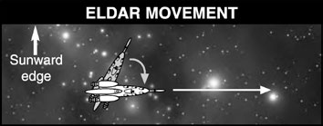
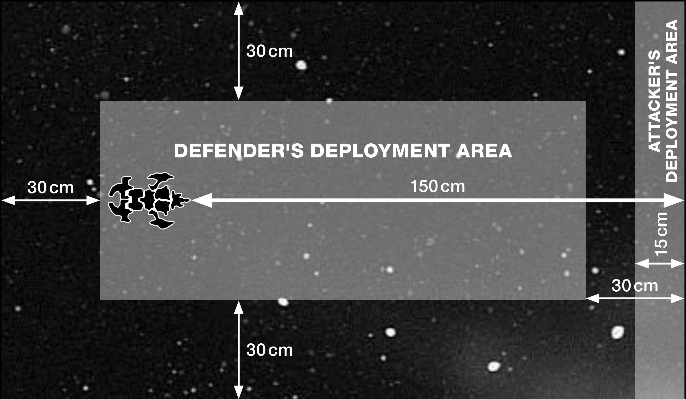

# Eldar

*This page is a work in progress!*

## Special Rules

### Eldar Leadership

All Eldar ships add + 1 to the [Leadership](../the-rules.md#leadership) score
generated on the Leadership table on pg. [???]
of the Remastered [Rulebook](), giving them a
Leadership value between 7 and 10.

### Eldar Attack Rating

An Eldar fleet containing any Craftworld Eldar
vessels has an [attack (or initiative) rating](../scenarios.md#using-an-attack-rating) of 3.

An Eldar Corsair fleet containing no Craftworld
Eldar vessels has an attack (or initiative) rating of 4.

### Craftworld & Corsair Vessels

Outright alliance between fleets acting
on the will of a Craftworld’s Seers and the
more volatile, self-serving Eldar Corsairs is
relatively rare, but certainly not unknown.
It does, however, usually only occur when
a knowledgeable leader of great influence
is present, able to both satisfy the careful
measured desires of the Seers yet at the same
time prove his might to the more aggressive
pirates. Such leaders, like the legendary Yriel,
are rare, but the fleets they command are
invariably powerful.

Ordinarily, Craftworld Eldar fleets cannot
use the Reserves rules to pick ships from a
Corsair fleet (nor vice versa). To use a mixed
Craftworld and Corsair fleet, you must first
choose to use ONE particular Eldar fleet list. In
place of that fleet’s normal Fleet Commander
option, you must then choose an Eldar Hero.
The presence of an Eldar Hero then entitles
your fleet to take ships from the ‘other’ Eldar
list (i.e. reserve Corsair ships if your fleet is
a Craftworld Eldar fleet, reserve Craftworld
Eldar ships if your fleet is made up of Corsairs).

### Eldar Ship Movement

The movement rules below replace the normal
[movement rules](../the-movement-phase.md) for Eldar ships. Assume
anything not modified below applies normally
to the Eldar. Eldar ships move in their
movement phase and in the [ordnance phase](../the-ordnance-phase.md) of
their own turn. Note that they do not move in
the ordnance phase of the enemy's turn.

Before an Eldar ship moves, it may [turn](../the-movement-phase.md#turning) to face
any direction. It always turns before it moves
and then remains facing in that direction until
the start of its next move.

Work out the speed an Eldar ship can move
at after it has turned. Its speed depends on its
facing towards the [sunward table edge](../the-battlefield.md#fighting-sunward). All Eldar
ships have three speeds (for example, 10/20/30).
The first is used if the sunward table edge is in
the Eldar ship's front fire arc; the second is used
if the sunward table edge is in its rear fire arc;
and the third is used if the sunward table edge is
in its left or right fire arcs. If the sunward table
edge lies on the line between two fire arcs, the
Eldar player may choose which he uses.

An easy way to determine a ships facing in
relation to the sunward edge is to place a
[bearing compass](../the-rules.md#the-bearing-compass) over the ship and draw the
shortest possible line from the ships stem to the
sunward edge. The arc this line passes through
is the sunward facing, or sunward arc.
Eldar ships have no minimum move
distances. They move from zero up to the
maximum distance allowed by the direction
of the sun. After their initial turn they travel
in a straight line and may not make additional
turns as they move. If under Lock-On special
orders, Eldar ships cannot turn for BOTH
their movement phases.

*Craftworld and Corsair Eldar vessels follow
similar movement rules. Here a Hellebore class
Corsair escort has Speed 10/20/30. At the start
of its move, it turns in the direction shown, so
that the sunward table edge is in its left fire arc.
This gives it a speed of 30 cm. It can then move
up to 30 cm straight ahead.*

As noted above, the Eldar move twice in each
of their turns. The second move is made in the
[ordnance phase](../the-ordnance-phase.md) after any ordnance is moved,
but apart from this all the rules described for
Eldar movement will apply.

#### Celestial Phenomena

Eldar ships can make a [leadership check](../the-rules.md#taking-command-checks) to
ignore all effects of [celestial phenomena](../the-battlefield.md#celestial-phenomena) such
as [gas clouds](../the-battlefield.md#gas-and-dust-clouds), [solar flares](../the-battlefield.md#solar-flares), etc. Escorts may
re-roll this result for free.

If an Eldar vessel passes its leadership check
during a solar flare, it will take no damage
but turn directly away from the sun edge and
move 2D6 cm.

This ability only applies to celestial phenomena,
not explosions from [catastrophic damage](../the-shooting-phase.md#catastrophic-damage), [nova
cannon](../the-shooting-phase.md#nova-cannon), etc. It also does not affect negative
[leadership](../the-rules.md#leadership) modifiers caused by [radiation bursts](../the-battlefield.md#radiation-bursts).
Leadership checks against [asteroid fields](../the-battlefield.md#asteroid-fields) are
unchanged from those for other fleets.

#### Blast Markers and Gravity Wells

Eldar are affected by [Blast markers](../the-shooting-phase.md#blast-markers) in the same
way as other ships without [shields](../the-shooting-phase.md#shields) – they will
take a point of damage on a D6 roll of 6 and
reduce their speed by 5 cm that turn. Eldar
have to make a test after each of their two
movements in which they encounter blast
markers . [Gravity wells](../the-battlefield.md#typical-gravity-wells) allow Eldar to curve
their normally straight line move around the
[planet](../the-battlefield.md#planets) and so the ship may make a free turn
towards the planet at the end of its move (since
it can turn in any direction at the start, there is
no additional benefit at the start of its move).

### Special Orders

Due to their unique method of movement,
the Eldar may not use the following [special
orders](../the-rules.md#special-orders): [*All Ahead Full*](../the-rules.md#all-ahead-full), [*Burn Retros*](../the-rules.md#burn-retros) and [*Come
To New Heading*](../the-rules.md#come-to-new-heading). Note: because Eldar ships
cannot use [*All Ahead Full*](../the-rules.md#all-ahead-full) special orders, they
also may not [ram](../the-movement-phase.md#all-ahead-full-ramming-speed).

If under [*Lock-On*](../the-rules.md#lock-on) special orders, Eldar ships
cannot turn for BOTH their movement
phases. When locked-on, Eldar Pulsars re-roll
EACH miss until either up to three hits is
scored or a miss is missed again.

### Holofields

Against attacks that use the [Gunnery table](../the-shooting-phase.md#gunnery-table),
the holofields cause one column shift to the
right, in addition to any other column shifts
for range or [Blast markers](../the-shooting-phase.md#blast-markers). Against any other
form of attack (ALL strength-based weapons,
[Nova Cannon](../the-shooting-phase.md#nova-cannon) shots, any [ordnance](../the-ordnance-phase.md) attacks and
any kind of [hit and run attacks](../the-end-phase.md#hit-and-run-attacks), [ramming](../the-movement-phase.md#all-ahead-full-ramming-speed) and
[boarding](../the-end-phase.md#boarding-actions)), roll to hit an Eldar ship as normal,
but the Eldar player may then make a saving
roll for his holofields:

| D6 ROLL | RESULT |
| :-: | --- |
| 1 | Hit! Score a hit on the Eldar ship. |
| 2-6 | Missed! Place a Blast marker in contact with the ship. |

Note that holofields do not negate hits or effects
from moving through [blast markers](../the-shooting-phase.md#blast-markers), area effects,
exploding ships and [celestial phenomena](../the-battlefield.md#celestial-phenomena).
They do, however, work against [ordnance](../the-ordnance-phase.md) hits,
[hit-and-run raids](../the-end-phase.md#hit-and-run-attacks), [boarding actions](../the-end-phase.md#boarding-actions), [teleport
attacks](../the-end-phase.md#teleport-attacks), [ramming](../the-movement-phase.md#all-ahead-full-ramming-speed) or [nova cannon](../the-shooting-phase.md#nova-cannon).

Against [ramming](../the-movement-phase.md#all-ahead-full-ramming-speed) and [boarding](../the-end-phase.md#boarding-actions), they save
once against the ramming or boarding
attempt, NOT against any damage suffered if
this save fails.

They do NOT protect against hits caused by
celestial phenomena nor any area effects such
as Warp Drive implosions, Necron Nightmare
Fields, Chaos Marks of Slaanesh, etc.

Holofields save against the shell hit of the [nova
cannon](../the-shooting-phase.md#nova-cannon), meaning both a direct hit from a Nova
Cannon where the hole is over the base as well
as against the single automatic hit for coming
in base contact with the blast template.

If this save is successful the effect of the Nova
Cannon is negated, and a [Blast Marker](../the-shooting-phase.md#blast-markers) is
placed normally for the save.

If the vessel fails to save, it must immediately
take as many hits as the damage roll allocates.
Holofield saves can't be taken against the
subsequent damage rolls, but if it [braced](../the-rules.md#brace-for-impact)
beforehand, this works normally.

Eldar must determine if they wish to [brace](../the-rules.md#brace-for-impact)
against damage they may face BEFORE rolling
their holofield save. This includes damage from
scatter weapons such as [Nova Cannon](../the-shooting-phase.md#nova-cannon) fire.

When protecting against damage (except
against weapons that use the [gunnery table](../the-shooting-phase.md#gunnery-table)),
Holofields roll its save once against each
successful attack, whether it be from [lance](../the-shooting-phase.md#direct-firing-lances)
fire, [ordnance](../the-ordnance-phase.md) hits, etc. In other words, its
rolls once against a [ramming](../the-movement-phase.md#all-ahead-full-ramming-speed) attack, once
against each [Nova Cannon](../the-shooting-phase.md#nova-cannon) shot, and once
against each hit imparted by [ordnance attacks](../the-movement-phase.md),
[Hit and Run attacks](../the-end-phase.md#hit-and-run-attacks), etc.

### Eldar Weapons

Eldar ships carry three main weapon systems
which are described below.

#### Pulsar Lance

Pulsar lances fire volleys of high energy laser
bolts. These count as [lance](../the-shooting-phase.md#direct-firing-lances) shots, and hit
on a 4+ no matter what the target's armour.
However, if a pulsar lance shot hits, then you
may roll to hit again and you may keep on
rolling to hit until you miss or the lance has
scored a total of 3 hits.

#### Shadow Lance

Although larger capital ships employ the
powerful Pulsar lance, the vast energy arrays
required to power such weaponry are far too
large to be mounted on the necessarily swift
and nimble Shadowhunters. Instead, smaller
Eldar vessels are armed with the Shadow lance
– a less powerful version of the same Eldar laser
technology. Shadow lances count as typical
[lances](../the-shooting-phase.md#direct-firing-lances) in every respect (ie. no multiple shots).

#### Weapons Batteries

Eldar [weapons batteries](../the-shooting-phase.md#direct-firing-weapons-batteries) are short-ranged
weapons that unleash a torrent of fire. They
employ sophisticated targeting systems which
make them very accurate even at extreme angles
of attack. To represent their accuracy, Eldar
weapons batteries count all targets as 'closing' on
the [Gunnery table](../the-shooting-phase.md#gunnery-table), no matter what the target's
actual aspect is (defences are still targeted as
such). This aside, all the normal rules apply.

### Ordnance

For various lore reasons described below, all
Eldar Ordnance can only be hit by defensive
[turrets](../the-ordnance-phase.md#turrets) on a roll of 6, rather than on a roll of
4, 5, or 6 as is normally the case. This includes
[attack craft](../the-ordnance-phase.md#attack-craft), any [torpedo](../the-ordnance-phase.md#torpedoes) types, [assault boats](../the-ordnance-phase.md#assault-boats)
and orbital mines.

When orbital mines are used, they completely
replace all other attack craft used by the launching
carrier, with one orbital mine per launch bay.

As Eldar vessels do not actually have turrets,
enemy [bombers](../the-ordnance-phase.md#bombers) do not get any bonus against
turrets from escorting [fighters](../the-ordnance-phase.md#fighters).

#### Torpedoes

Eldar torpedoes use sophisticated targeter
scrambling systems to make themselves
virtually undetectable until they strike and
have highly accurate targeting sensors.

Any torpedo that comes in contact with a ship
and misses the target on the first attempt must
re-roll the hit roll, even if the ship is already
destroyed.

#### Attack Craft

Eldar attack craft benefit greatly from the Eldar’s
grasp of technology and the skills of their crews.

| ATTACK CRAFT | SPEED |
| :-: | :-: |
| Nightwing / Darkstar fighters | 30 cm |
| Phoenix / Eagle bombers | 20 cm |
| Vampire Raiders | 25 cm |

Eldar Nightwing and Darkstar fighters are
[resilient](../the-ordnance-phase.md#resilient-attack-craft), meaning they get a 4+ save once
per [ordnance phase](../the-ordnance-phase.md) whenever they come in
contact with enemy ordnance.

Eldar Phoenix and Eagle bombers have highly
accurate targeting sensors which allows you
to re-roll the dice to determine the number of
attacks they make (the second roll stands).

Additionally, for the cost listed in their special
rules, certain vessels with launch bays may be
equipped with Vampire raiders, which serve
as [assault boats](../the-ordnance-phase.md#assault-boats).

### Aspect Warrior Hosts

Unlike Eldar Pirates, who rely on the same self-serving rogues who crew their ships to conduct
raids and [boarding actions](../the-end-phase.md#boarding-actions), Eldar Craftworld
vessels are able to go to war carrying hosts
of Eldar Aspect Warriors who form fighting
contingents aboard their ships. Many of the
Aspect Warrior shrines excel at the kind of rapid
assaults which are ideally suited to [teleport](../the-end-phase.md#teleport-attacks) and
other [hit-and-run attacks](../the-end-phase.md#hit-and-run-attacks) and hence specialize
in attacking enemy vessels in this manner.

Certain ships in an Eldar fleet are permitted to
carry Aspect Warrior Fighting Crews as chosen
from the fleet list, adding +2 to their dice roll
when fighting in a [boarding action](../the-end-phase.md#boarding-actions), or +1 to the
dice roll when conducting a [hit-and-run attack](../the-end-phase.md#hit-and-run-attacks).

### Boarding

An Eldar vessel intending to [board](../the-end-phase.md#boarding-actions) an
opponent may do so in either [movement phase](../the-movement-phase.md),
but it may not [shoot](../the-shooting-phase.md) or launch [ordnance](../the-ordnance-phase.md) before
doing so. If it boards in its movement phase, it
may not make its second movement.

### Eldar Critical Hits

Any hit on an Eldar ship causes [critical
damage](../the-shooting-phase.md#critical-hits) on a D6 roll of 4+, rather than the
usual 6+. Roll 2D6 on the following Eldar
Critical Hits table, rather than the standard
Critical Hits table.

### Critical Hits Table

| 2D6 Roll | Extra Damage | Result |
| :-: | :-: | --- |
| 2 | +0 | **Infinity circuit damaged:** The ship's infinity circuit, which aids control and internal communications, is damaged by the hit. The ship's [Leadership](../the-rules.md#leadership) is reduced by -1 until the damage can be repaired. |
| 3 | +0 | **Keel armament damaged:** The keel armament is taken off line by the hit and may not fire until it has been [repaired](../the-end-phase.md#damage-control). |
| 4 | +0 | **Prow armament damaged:** The ship's prow is ripped open. Its prow armament may not fire until it has been [repaired](../the-end-phase.md#damage-control). |
| 5 | +0 | **Mast lines severed:** The systems that allow the ship to alter the angle of the sails and turn swiftly are broken by the hit. Until the damage is [repaired](../the-end-phase.md#damage-control), the ship may only turn up to 90° before it moves. |
| 6 | +1 | **Mainsail scarred:** The ship's main solar sail suffers surface damage, reducing the amount of energy it can store. Each of the ship's speeds is reduced by 5cm until the sail is [repaired](../the-end-phase.md#damage-control). |
| 7 | +1 | **Superstructure damaged:** The hit tears into the ship, causing a small breach. Excess strain on the ship's hull could increase the damage. Until the damage is [repaired](../the-end-phase.md#damage-control), roll a dice every time the ship turns over 45°. On a roll of 1, the ship suffers 1 extra point of damage. |
| 8 | +0 | **Mainsail shredded**: The solar cells of the mainsail are tom to tatters by the hit. The ship cannot move in the [ordnance phase](../the-ordnance-phase.md) until the damage is [repaired](../the-end-phase.md#damage-control). |
| 9 | +1 | **Infinity circuit smashed:** The fine crystal matrix of the infinity circuit is shattered by the hit. The ship's [Leadership](../the-rules.md#leadership) is reduced by -3. This damage may not be repaired. |
| 10 | +0 | **Holofield generators destroyed:** The [holofield](#holofields) generators are smashed beyond repair by the hit. The ship no longer benefits from its holofields. This damage may not be repaired. |
| 11 | +D3 | **Hull Breach:** A huge gash is torn in the ship’s hull, causing carnage among the crew. |
| 12 | +D6 | **Bulkhead Collapse:** Internal pillars buckle and twist, whole compartments crumple with a scream of tortured metal. Just pray that some of the ship holds together! |

## Using Ghostships

Ghostships do not represent a particular class
of vessel, but rather they are those vessels
which are substantially controlled by spirit
stones, having only a small or even non-existent living crew. The use of Ghostships is
strongly disliked by the Eldar, since it requires
disturbing the spirits of the dead and forcing
them to return once more to battle that they
might aid their living kin. It is for this reason
that the vessels are known as Ghostships,
representing an undeniably powerful entity
which straddles the boundary between life
and death, yet equally represents a force that
the Eldar would be wise to leave undisturbed
in all but the most dire of circumstances. The
Tyranid invasion and the ensuing decimation
of the population make Ghostships an
abhorrent necessity to the Eldar of Iyanden,
however, and they are a far more common
component of the Craftworld’s fleets than the
Eldar would wish.

Any vessel in an Iyanden fleet may be
converted to a Ghostship. Ghostships use the
following special rules:

**Leadership:** Ghostships have normal Eldar
[leadership](../the-rules.md#leadership).

**Special Orders:** Ghostships are able to go onto
[special orders](../the-rules.md#special-orders) and use [re-rolls](../the-rules.md/#re-rolls) in just the same
manner as other vessels, however there is
always a danger that the spectral and deathly
manner in which these vessels interact with
the real universe will distract them and turn
their attention away from the battle at hand.
If a Ghostship fails a [Command check](../the-rules.md#taking-command-checks) for a
special order, it not only fails to go onto the
special order, but may also do nothing except
move this turn.

You may not make any further Command
checks for other Ghostships during the same
turn. You may, however, continue to give
special orders to other ‘crewed’ vessels in the
fleet (until, of course, you fail a Command
check with one of them as well).

If the failed Command check is as a result of
attempting to go onto [*Brace for Impact*](../the-rules.md#brace-for-impact) orders,
the Ghostship may still attempt to [*Brace for
Impact*](../the-rules.md#brace-for-impact) but may do nothing except move
during its next turn instead.

**Deathless:** Ghostships require none of the
more delicate systems required to support
a living crew, and the ease with which
the interred spirits move throughout the
wraithbone arteries of the vessel means
that even when badly damaged the vessel
is still able to function effectively. By the
normal fragile standards of the Eldar,
Ghostships present a fairly sturdy proposition.
Ghostships, unlike other Eldar vessels, only
suffer a [critical hit](../the-shooting-phase.md#critical-hits) on a roll of a 6 (not a 4, 5 or
6 as is usually the case with Eldar vessels).

**Uncrewed:** Since Ghostships are piloted by the
spirits of long-dead Eldar warriors, their crews
are either small or non-existent. For this reason:

* Ghostships may not contain [Aspect Warrior](#aspect-warrior-hosts) fighting crews.
* Ghostships may not be armed with launch bays.
* Ghostships may not initiate [boarding actions](../the-end-phase.md#boarding-actions) or [hit-and run attacks](../the-end-phase.md#hit-and-run-attacks) of any form.
* Enemies boarding a Ghostship gain a +1 modifier in the [boarding action](../the-end-phase.md#boarding-actions), in addition to other modifiers.
* Enemies making a [hit-and-run attack](../the-end-phase.md#hit-and-run-attacks) against Ghostships add +1 to their dice roll.
Ghostships roll only half the normal
number of dice when undertaking [damage
control](../the-end-phase.md#damage-control) in the [End phase](../the-end-phase.md) (before halving it
again for [Blast markers](../the-shooting-phase.md#blast-markers), if appropriate).

## Eldar in Campaigns

In a campaign, an Eldar
fleet commander earns
promotions (re-rolls) in the
following manner:

### Eldar Promotions (all Types of Eldar)

| Renown | Title | Ld Bonus | Notes |
| :-: | --- | :-: | --- |
| 1-5 | Captain | +0 | 1 re-roll |
| 6-10 | Lord | +1 | 1 re-rolls |
| 11-20 | Shadow Lord | +1 | 2 re-rolls |
| 21-30 | Prince | +2 | 2 re-rolls |
| 31-50 | Shadow Prince | +2 | 3 re-rolls |
| 51+ | King | +2 | 4 re-rolls |

This crew skills table is for use by the Haven, any capital ships or escort squadrons in a Corsair
Eldar or Craftworld Eldar fleet. The refit table on the next page is for use by any capital ships
in a Corsair Eldar or Craftworld Eldar fleet. It is not for use by escorts. Eldar Havens may earn
ship or weapon refits but not engine refits. Ships that cannot use the refit or crew skill rolled for
whatever reason may re-roll the result, such as not being equipped with weapon batteries, attack
craft, etc.

### Eldar Eldar Crew Skills

*Over the course of a campaign, a ship’s crew develops experience that only comes
from serving together in the crucible of war. Roll on the following table:*

| D6 roll | Skill |
| :-: | --- |
| 1 | **Expert Gunnery:** The ship’s gun crews are amongst the finest in the whole sector, able to lay down a devastating barrage. When the ship attempts to make [*Lock-On*](../the-rules.md#lock-on) Special Orders, you may roll 3D6 and discard the highest D6 before comparing the roll against the ship’s [leadership](../the-rules.md#leadership). |
| 2 | **Warlock:** A renowned Seer accompanies the vessel, disclosing fragments of possibility to the ship's captain. This vessel may always attempt to go on [Special Orders](../the-rules.md#special-orders), even if another ship or squadron in the fleet has failed a [command check](../the-rules.md#taking-command-checks) this turn. |
| 3 | **Excellent Pilots:** Even the [bomber](../the-ordnance-phase.md#bombers) pilots assigned to this ship number several ‘Aces’ amongst its crew. Bombers launched by this vessel may survive being intercepted by enemy fighters utilizing the ‘[Resilient Attack Craft](../the-ordnance-phase.md#resilient-attack-craft)’ 4+ save rule in the same manner as Eldar fighters. As they are not fighters themselves, they still ignore other types of [ordnance](../the-ordnance-phase.md) normally. Fighters from this vessel are always moved before enemy [attack craft](../the-ordnance-phase.md#attack-craft) in the [ordnance phase](../the-ordnance-phase.md). Re-roll this result if the ship does not carry attack craft. |
| 4 | **Battle Stance:** [Aspect Warriors](#aspect-warrior-hosts) or even the dreaded Harlequins have been enticed to join your vessel. This ship may re-roll the dice in a [boarding action](../the-end-phase.md#boarding-actions). The second roll stands (even if less!). This benefit can be combined with having an embarked Aspect Warrior Host. |
| 5 | **Disciplined Crew:** Whenever this ship checks [leadership](../the-rules.md#leadership) or attempts to go on [Special Orders](../the-rules.md#special-orders), you may roll 3D6 and discard the highest D6 before comparing the roll against the ship’s [leadership](../the-rules.md#leadership). |
| 6 | **Elite Command Crew:** Once per battle the ship may automatically pass a [Leadership](../the-rules.md#leadership) test or [command check](../the-rules.md#taking-command-checks) – there is no need to roll any dice. This may be used even if another ship or squadron in the fleet has failed a command check this turn. |

### Engine Refit

*The ship’s engines are fitted with additional systems or improvements have been made to
the power generators and energy relays in some fashion. Roll on the following table.*

| D6 roll | Engine Refit |
| :-: | --- |
| 1 | **Celestial Dragon Engine:** The standard manoeuvring thrusters have been augmented, allowing breathtaking turns. The vessel may choose to turn up to 90º at the end of its movement instead of turning normally at the beginning of its movement. |
| 2 | **Polarization Field:** A low-level energy bubble surrounds the ship, channelling the debris of space around the vessel. The ship does not suffer a hit for moving through [blast markers](../the-shooting-phase.md#blast-markers) and ignores all effects of [solar flares](../the-battlefield.md#solar-flares). |
| 3 | **Drunken Weave:** An intricate system of particle flow rudders and graviton impellers are fitted to the vessel, allowing for drastic evasive manoeuvres. The ship gains a 6+ save on a D6 against any damage it takes without requiring a Command Check. This does not count as being [braced](../the-rules.md#brace-for-impact), but the ship may not use this save when on [*Brace For Impact*](../the-rules.md#brace-for-impact) Special Orders or attempt to go on [*Brace For Impact*](../the-rules.md#brace-for-impact) special orders against any round of shooting or event of taking damage if this save fails. |
| 4 | **Phoenix Sails:** Hyper-efficient materials of exceeding purity are used to replace the mainsails, squeezing extra energy from the solar wind, adding +5 cm to all speed bands. |
| 5 | **Moon Gossamer Rigging:** A Bonesinger has spent many hours re-splicing the ship’s control mechanisms. Instead of turning to any facing at the start of its movement, it may choose to make a single 45º turn at any point along its movement. |
| 6 | **Stream Flow Enhancers:** A dramatic re-rig of the ship’s sails and control surfaces give the captain much greater control over his or her vessel. When the ship is facing the sun, it counts as having the [sunward edge](../the-battlefield.md#fighting-sunward) in its rear. If the sun is in the rear arc, it counts as on its side. |

### Ship Refit

*The structure of the ship is improved in some way, new equipment is installed, or better
trained or specialised crew members are brought in. Roll on the following table.*

| D6 roll | Ship Refit |
| :-: | --- |
| 1 | **Crystal Web:** A sizable colony of crystal spiders have been introduced to the hull, greatly enhancing the ship's chances of survival. If the ship has no [critical damage](../the-shooting-phase.md#critical-hits), roll a number of D6 equal to the number of hits it has remaining, recovering 1HP if any rolls of 6 are made. No more than 1HP can be regained in this manner per turn, regardless of how many rolls of 6 are made. |
| 2 | **Bonesinger:** A much-respected Bonesinger has joined the ranks of the crew. The ship only suffers [critical damage](../the-shooting-phase.md#critical-hits) on a 5+ instead of a 4+. |
| 3 | **Mask of the Laughing God:** Special psychic dampers and crossspectrum jammers hide the intentions of the crew. Enemy vessels do not gain +1 [Leadership](../the-rules.md#leadership) for this vessel going under [Special Orders](../the-rules.md#special-orders). |
| 4 | **Gestalt Spirit Stone:** The ship is incredibly ancient, even by Eldar standards, and its spirit has literally aeons of experience. The vessel ignores all penalties to [leadership tests](../the-rules.md#taking-command-checks), such as [blast markers](../the-shooting-phase.md#blast-markers), Marks of Chaos, etc. |
| 5 | **Netherfield:** A refined holofield design coupled with an absorptive masking layer make this ship nearly impossible to target. It grants an additional right column shift to the vessel against all weapons that use the [gunnery table](../the-shooting-phase.md#gunnery-table) (no additional modifier is granted past the far right of the gunnery table). |
| 6 | **Structural Purity:** The cores of the ship’s wraithbone supports are partially replaced by a fluidic medium that dissipates damage throughout the hull. Before the battle begins, the vessel gains +1HP to its starting damage capacity. |

### Weapons Refit

*The ship has been upgraded with additional or more sophisticated weapons systems,
greatly enhancing its battle effectiveness. Roll on the following table:*

| D6 roll | Weapons Refit |
| :-: | --- |
| 1 | **Talons:** Both the outer hull and the ship’s airlocks are lined with psychically charged scatter-shard point defences. Enemy ships attempting to [board](../the-end-phase.md#boarding-actions) the vessel or perform a [hit-and run attack](../the-end-phase.md#hit-and-run-attacks) suffer a -2 modifier. |
| 2 | **Distortion Charges:** The vessel has been fitted with a weapon system which ejects a Warp Distortion charge into its wake (usable once per game). This D-charge must be placed at the same time the player places the rest of the fleet’s [ordnance](../the-ordnance-phase.md) on the table, in the ship’s aft firing arc. When launched, it moves 10 cm toward the nearest enemy vessel every [ordnance phase](../the-ordnance-phase.md). If it comes in contact with an enemy ship’s base, the enemy vessel may attempt to shoot it down with [turrets](../the-ordnance-phase.md#turrets), hitting on a roll of 6. If the D-charge is not destroyed, place a [warp rift](../the-battlefield.md#warp-rifts) marker at the point of impact using a [Nova Cannon](../the-shooting-phase.md#nova-cannon) template. Any vessel touching the template suffers the effects of coming in contact with a warp rift! At the beginning of each subsequent Eldar turn roll a D6. On a roll of 6 the rift closes and is removed from play. |
| 3 | **Rune-Assisted Targeting Nodes:** The fire control systems are linked by a complex sensor array. Ships fitted with [lance](../the-shooting-phase.md#direct-firing-lances)-type weapons may re-roll their first miss each turn. |
| 4 | **Gravitic Accelerators:** An extra boost is provided to [torpedoes](../the-ordnance-phase.md#torpedoes) and [attack craft](../the-ordnance-phase.md#attack-craft). When first launched, [ordnance](../the-ordnance-phase.md) receives an extra +10 cm to its movement. |
| 5 | **Anomaly Clarification Stones:** The ship’s scanners are able to compensate for local spatial distortions. [Blast markers](../the-shooting-phase.md#blast-markers) do not cause a column shift when the ship’s [weapon batteries](../the-shooting-phase.md#direct-firing-weapons-batteries) fire through them. |
| 6 | **Enhanced Crystal Focusing:** Rare ultra-pure crystals and a delicate realignment of the firing mechanisms raise the power transfer ratio of the ship’s weapons, significantly increasing their range. Add +15 cm range to the ship’s [weapon batteries](../the-shooting-phase.md#direct-firing-weapons-batteries) and [lance](../the-shooting-phase.md#direct-firing-lances)-type weapons. |

## Scenario: Craftworld Assault

_**Direct attacks against a craftworld are exceedingly rare not least because, despite
their immense size, craftworlds are extremely elusive prey, rarely sighted by non-Eldar. However, when the Tyranid swarms of Hivefleet Kraken descended upon the
galaxy, they did so in such numbers that Iyanden could not help but cross their path
and in so doing find itself in the greatest peril of its history…**_

### Forces

Both fleets are of equal points. The defender
(Eldar) does not spend extra points on
[planetary defences](planetary-defences.md) – these are included in
the special rules for the craftworld instead
(see below). Since the attackers are Tyranids,
they do not gain any extra transport models
(since all Tyranid ships are ‘transports’ in
effect), but if you want to replay this scenario
with another attacker, they may take two free
transports for every 500 points (or part) in his
fleet.

**Reserves:** Any number of Eldar ships
(including the flagship!) may be purchased
against the fleet’s total at 50% cost, but they
count as reserves and start off the table. Ships
may not use their [re-rolls](#pulsar-lance) if they are not yet in
play. How vessels counting as reserves deploy
is explained in the Craftworld special rules.

### Battlezone

Craftworlds will typically avoid being too
close to stars but can otherwise be found
just about anywhere in space. Determine the
[battlezone](../the-battlefield.md) normally using a D3 for a [Primary
Biosphere](../the-battlefield.md#4-primary-biosphere-generator), [Outer Reaches](../the-battlefield.md#5-outer-reaches-generator) or [Deep Space](../the-battlefield.md#6-deep-space-generator)
result. Determine the [sunward edge](../the-battlefield.md#fighting-sunward) and set
up [celestial phenomena](../the-battlefield.md#celestial-phenomena) normally or in any
mutually agreed-upon fashion, ignoring any
outcome that results in a [planet](../the-battlefield.md#planets).

### Set-up

The Craftworld template is placed on the table in
the same manner as a planet using the [Planetary
assault](../scenarios/planetary-assault.md) rules on [???] p.76 of the Rulebook.
The defender can choose to place ships and
squadrons either on patrol or on standby in high
orbit, or within the craftworld’s gravity (low
orbit table). Roll a D6 for each defending ship/
squadron (except Shadowhunters) on patrol: on
a 1-3 the attacker may set up the ship/squadron,
on a 4-6 the defender may set it up.

Ships on patrol may be set up anywhere that
is not within 30cm of a table edge or within
an area of [celestial phenomena](../the-battlefield.md#celestial-phenomena). The defender
always decides the facing of ships, regardless
of who set them up. The attacker deploys
his fleet within 15cm of the short table edge
furthest from the planet. You will also need a
separate [low orbit table](../the-battlefield.md#fighting-in-low-orbit).

#### Shadowhunter Patrols

Shadowhunters are quite simply the most
nimble patrol vessels in the galaxy, and so
must always be set-up on patrol, but no dice
roll is required, and they are always deployed
by the defender.

### The Craftworld

In this scenario, the craftworld is considered
to be the target of an attack, in the same
manner as a planet would be in a [planetary
assault](../scenarios/planetary-assault.md). The Tyranid assault of Hive Fleet
Kraken targetted Iyanden, which is a very
large craftworld (about 25cm in diameter).
However, if you are refighting this scenario
with another craftworld as the target, or if you
want to introduce some degree of randomness
into the game, you can always vary the size of
the craftworld, or roll on a dice: 1 = small (no
more than 15cm) , 2-5 = medium (no more
than 20cm, 6 = large (no more than 30cm).
Craftworlds follow all the rules for [planets](../the-battlefield.md#planets),
since their immense size means they create
their own gravity wells, etc. However, they do
not roll for [moons](../the-battlefield.md#moons), [rings](../the-battlefield.md#ringed-planets), etc.

Small craftworlds have a gravity well of
10cm, medium craftworlds of 15cm and
large craftworlds of 20cm. The craftworld
is placed no more than 150cm from one of
the short table edges. Whilst craftworlds
do actually travel through space, their
progress is so remarkably slow that during
the course of a battle they will exhibit no
noticeable movement, and hence the template
representing the Craftworld itself does
not move, in just the same way as planets
do not move during a battle, despite their
actual movement in orbit of the nearest star.
Instead of [planetary defenses](planetary-defences.md) in the normal
sense, individual areas of the Craftworld
are purpose-constructed to provide for its
collective defense. In the particular case of
Iyanden, these roles are fulfilled by three areas
– the Spear of Light, the Fortress of Tears, and
the Fortress of the Red Moon. Whilst other
craftworlds may vary in their defenses, you
can safely use the following rules as standard
for all craftworlds.

#### Fortress of Tears & Fortress of the Red Moon

Both these fortresses are designed to repel
invaders from Iyanden, utilizing powerful
but indirect plasma shots to disrupt and
scatter any enemy which manage to evade the
craftworld’s cruiser patrols. At full effect the
fortresses are designed to act as the defences
for the end the entire eastern and western
halves of the craftworld respectively. Each
time an Assault Point is scored (or ‘landed’
on the Craftworld), roll a dice. On a score of
a 4 or more, one of the fortresses damages the
attacking wave so heavily that the landing is
essentially ineffective and no Assault Point is
scored.

The fortresses also allow the craftworld to
repel ships in [low orbit](../the-battlefield.md#fighting-in-low-orbit). During the Eldar
player’s [Shooting phase](../the-shooting-phase.md), the two fortresses
each unleash one 45cm [pulsar lance]() against
each escort squadron or capital ship on the
[Low Orbit table](../the-battlefield.md#fighting-in-low-orbit). These cannot be redirected
or “stacked” on a single or group of targets;
each enemy escort squadron or capital ship
can receive no more than two pulsar lance
shots that roll to hit in the normal manner
pulsar lances are used.

There is always the danger that the fortresses
themselves will fall. During each [End phase](../the-end-phase.md),
roll one dice for each Assault Point already
scored on the craftworld. If any of these
score a ‘6’ one of the fortresses are damaged,
and the chance of destroying enemy Assault
Points, or scoring a hit on ships in low orbit, is
reduced by 1 (ie, to a 5+ the first time, then to
a 6+, then they are destroyed completely). No
matter how many 6’s are rolled, only a single
–1 reduction can apply in each End phase,
meaning only a single Fortress can be affected
by a single -1 reduction each end phase. When
a Fortress is destroyed completely, it can no
longer fire upon enemy vessels in low orbit.
The number of pulsar lances fired at each
enemy ship in low orbit is reduced by 1 for
every Fortress destroyed.

#### Spear of Light

While the Spear of Light is essentially another
heavily armed redoubt constructed for the
defence of the entire Craftworld, it is most
renowned for the Spear of Light, a titanic
linear accelerator bearing its name and
capable of hurling plasma charges at nearly
the speed of light. Its primary purpose is to
eliminate dangerous objects in its path, such
as recalcitrant moonlets! However, when the
defence of the Craftworld is at stake, it can be
re-purposed as a weapon with poor accuracy
by Eldar standards but horrifying destructive
power. The Spear of Light functions as a
single [Nova Cannon](../the-shooting-phase.md#nova-cannon) in all respects. Like the
fortresses, one dice must be rolled during
each [End Phase](../the-end-phase.md) for each Assault Point already
scored on the craftworld. If any of these score
a ‘6’ the Spear of Light is damaged, and a
[*Reload Ordnance*](../the-rules.md#reload-ordnance) special order must be passed
each time the weapon is used again. If a ‘6’ is
rolled again in a subsequent [End Phase](../the-end-phase.md), the
Spear of Light is considered destroyed for the
rest of the battle. The Spear of Light is used
against targets at range and has no effect
against vessels on the [Low Orbit table](../the-battlefield.md#fighting-in-low-orbit).

#### Forge of the Singers and Forge of Lost Souls

A craftworld’s Bonesingers have at their
disposal the means to construct and service
an entire Battlefleet of Eldar vessels. Indeed,
their construction and fabrication techniques
are so efficient, they can quite literally have
at their disposal more starships than there
are Eldar crew to man them. While even this
prodigious capacity serves little utility in the
heat of battle, it can in an emergency aid a
vessel in dire straits. Any Eldar capital ship
in [low orbit](../the-battlefield.md#fighting-in-low-orbit) can dock with the Craftworld by
“landing” on the surface without requiring
a leadership check. Unlike when coming in
contact with a planet’s surface, the vessel does
not count as destroyed by doing so, though it
must subsequently remain in place for one full
turn. It gains +4D6 to repair critical damage
in the [End Phase](../the-end-phase.md) and may regain up to 1Hp
damage for every roll of 6 not used to [repair
critical damage](../the-end-phase.md#damage-control) (all critical damage must be
repaired before this benefit can be taken).
Additionally, it counts as passing a [*Reload
Ordnance*](../the-rules.md#reload-ordnance) special order for free. However,
it may not [move](../the-movement-phase.md), [shoot](../the-shooting-phase.md) or [launch ordnance](../the-ordnance-phase.md#launching-ordnance)
while docked, critical damage that cannot
normally be repaired during a battle (such as
holofields damaged) still remains damaged,
and while docked to the Craftworld the ship
counts as defences for purposes of being fired
upon using the [gunnery table](../the-shooting-phase.md#gunnery-table). [Holofields](#holofields) work
normally against gunnery-based weapons,
and the ship benefits from an additional right
column shift and may ignore [blast markers](../the-shooting-phase.md#blast-markers)
while docked, as it is inside the sheath of the
craftworld’s powerful polarization field.

#### Gate of Dreams and Gate of Nightmares

Like virtually all craftworlds, Iyanden has a
series of webway portals scattered throughout
its structure. The two largest of these are the
Gate of Dreams and the Gate of Nightmares.
Each one of these is capable of opening vast
portals sizable enough for even the largest
of the Eldar’s war machines. Together,
they create a single portal at the rear of
the Craftworld large enough for traversing
starships. Beginning turn 2, after the Eldar
fleet moves roll a D6. On a 5+, D3 capital
ships and/or escort squadrons of the owning
player’s choice held in reserve at the start of
the game now appear along the table edge
closest to the Craftworld no more than 30cm
away from it. Eldar ships cannot move or
shoot in the same turn they appear.

### First Turn

The players roll a D6, with each player adding
their fleet’s initiative (attack rating) to the roll.
Whoever got the highest may take either the
first or second turn.

### Special Rules

Attacking ships must move within 30cm of
the craftworld table edge (which obviously
replaces the planet edge) on the [low orbit table](../the-battlefield.md#fighting-in-low-orbit)
to send troops to the surface and bombard
enemy positions. Remember that since the
attackers are most likely Tyranids, you should
follow the special scenario considerations for
Tyranids, as presented in Armada. However,
should you wish to vary the attackers, the
following basic rules apply:

For each turn an attacking capital ship spends
within 30cm of the craftworld edge, the
attacker scores 1 Assault Point. For each turn
an attacking transport spends within 30cm
of the craftworld edge, the attacker scores
2 Assault Points. A ship deploying troops
or bombarding the craftworld may not do
anything else that turn.

### Game Length

The game lasts until one fleet is destroyed or
disengages, or the attacker has scored 10 or
more Assault Points.

### Victory Conditions

Add up the Assault Points earned by the
attacker and add +1 to the total for every 500
[Victory Points](../scenarios.md#victory-points) (rounding down) scored by the
attacker for destroying or [crippling](../the-shooting-phase.md#crippled-ships) ships and
[planetary defenses](planetary-defences.md). Deduct -1 Assault Point
for every 500 Victory Points (rounding up)
scored by the defender. Look up the adjusted
Assault Point total on the table below:

| ASSAULT POINTS | RESULT |
| :-: | --- |
| 0-1 | **Defender’s Victory (+1 Renown)** The attacking forces achieved almost nothing. The pitiful amount of assaulting troops that reached the craftworld will be quickly annihilated. |
| 2-5 | **Defender’s Marginal Win** The assaulting forces are prevented from making a substantial landing on the craftworld. Nonetheless, enemy detachments will now have to be hunted down and destroyed. |
| 6-9 |**Attacker’s Marginal Win** The assault dropped enough troops, etc, to capture a large part of the craftworld’s resources. Ongoing battles for control of the world will rage for months, even years. |
| 10+ | **Attacker’s Victory (+1 Renown)**  The attackers succeeded in sweeping aside the defending forces and staging decisive landings at key points all over the craftworld. Within a few weeks of mopping up, the attackers will have complete control of the craftworld. |

## Gothic Sector: Eldar Corsairs Fleet List

### Fleet Commander

#### 0-1 Pirate Prince

*You may include 1 Pirate Prince in your fleet,
who must be assigned to a ship and adds +2 to
its Leadership, to a maximum of 10. If the fleet
is worth over 750 points a Pirate Prince must be
included to lead it.*

Pirate Prince (+2 Ld) ................................ 100 pts

You may purchase Fleet Commander re-rolls
for your Pirate Prince by paying the cost listed
below.

One re-roll ..................................................+25 pts 
Two re-rolls ................................................+50 pts 
Three re-rolls ...........................................+100 pts

#### Eldar Hero

*Your fleet may be led by an Eldar Hero, in place of
its normal fleet commander. Only a fleet led by an
Eldar Hero may take reserves from the Craftworld
Eldar fleet list.*

Eldar Hero (Ld 10) .................................... 100 pts

You may purchase Fleet Commander re-rolls for
your Eldar Hero by paying the cost listed below.

One re-roll ..................................................+50 pts 
Two re-rolls ................................................+75 pts 
Three re-rolls ...........................................+100 pts

### Capital Ships

#### 0-12 Cruisers

Eclipse class cruiser (pg. 307)....................... 250 pts 
Shadow class cruiser (pg. 308) .................... 210 pts

### Escorts

*You may include any number of escorts in your
fleet in squadrons of 2–6.*

Hellebore class frigate (pg. 311) .................... 65 pts 
Aconite class frigate (pg. 312) ........................ 55 pts 
Hemlock class destroyer (pg. 313) ................. 40 pts 
Nightshade class destroyer (pg. 314) ............. 40 pts

### Ordnance

Any ship with launch bays may choose to have
them launch any mix of Darkstar fighters and
Eagle bombers. Ships with torpedo tubes are
armed with Eldar torpedoes.

### Reserves and Allies

An Eldar Hero must lead the fleet in order to use
Craftworld Eldar vessels as reserves. Following
this, one Craftworld Eldar *Flame of Asuryan*,
Dragonship or Wraithship may be taken for
every three cruisers in the f leet. Craftworld
Eldar Shadowhunters may be taken in the
same ratio of no more than one for every three
escort vessels in the fleet. Corsair Eldar escorts
and Shadowhunters may not be in the same
squadron. If the *Flame of Asuryan* is taken, the
Eldar Hero must be embarked aboard it.

## Later Gothic war: Eldar Corsairs Fleet List

### Fleet Commander

#### 0-1 Pirate Prince

*You may include 1 Pirate Prince in your fleet,
who must be assigned to a ship and adds +2 to
its Leadership, to a maximum of 10. If the fleet
is worth over 750 points a Pirate Prince must be
included to lead it.*

Pirate Prince (+2 Ld) ................................ 100 pts

You may purchase Fleet Commander re-rolls
for your Pirate Prince by paying the cost listed
below.

One re-roll ..................................................+25 pts 
Two re-rolls ................................................+50 pts 
Three re-rolls ...........................................+100 pts

#### Eldar Hero

*Your fleet may be led by an Eldar Hero, in place of
its normal fleet commander. Only a fleet led by an
Eldar Hero may take reserves from the Craftworld
Eldar fleet list.*

Eldar Hero (Ld 10) .................................... 100 pts

You may purchase Fleet Commander re-rolls for
your Eldar Hero by paying the cost listed below.

One re-roll ..................................................+50 pts 
Two re-rolls ................................................+75 pts 
Three re-rolls ...........................................+100 pts

### Capital Ships

#### Battleships

*Your fleet may include up to one battleship for
every full 1,000 points it contains. Therefore, if
you have between 0 to 999 points, you cannot field
any battleships, while from 1000 to 1,999 points
you can include one, and so on.*

Void Stalker class battleship (pg. 306) ........ 380 pts

#### 0-12 Cruisers

Eclipse class cruiser (pg. 307)....................... 250 pts 
Shadow class cruiser (pg. 308) .................... 210 pts 
Aurora class light cruiser (pg. 309) ............. 140 pts 
Solaris class light cruiser (pg. 310) ............. 130 pts

### Escorts

*You may include any number of escorts in your
fleet in squadrons of 2–6.*

Hellebore class frigate (pg. 311) .................... 65 pts 
Aconite class frigate (pg. 312) ........................ 55 pts 
Hemlock class destroyer (pg. 313) ................. 40 pts 
Nightshade class destroyer (pg. 314) ............. 40 pts

### Ordnance

Any ship with launch bays may choose to have
them launch any mix of Darkstar fighters and
Eagle bombers. Ships with torpedo tubes are
armed with Eldar torpedoes.

### Reserves and Allies

An Eldar Hero must lead the fleet in order to use
Craftworld Eldar vessels as reserves. Following this,
one Craftworld Eldar *Flame of Asuryan*, Dragonship
or Wraithship may be taken for every three cruisers
in the fleet. Craftworld Eldar Shadowhunters may
be taken in the same ratio of no more than one
for every three escort vessels in the fleet. Corsair
Eldar escorts and Shadowhunters may not be in
the same squadron. If the *Flame of Asuryan* is
taken, the Eldar Hero must be embarked aboard it.

## Iyanden Craftworld Fleet

### Fleet Commander

#### 0-1 Autarch

*You may include one Eldar Autarch in your fleet,
who replaces the ship’s Leadership with his own.
If the fleet is worth over 750 points, an Autarch
must be included to lead it.*

Eldar Autarch (Ld 9) .................................. 75 pts 
Iyanden Bearer of the Flame (Ld 10) ..... 100 pts

The fleet commander may purchase a re-roll, at
the cost listed below:

One re-roll ..................................................+25 pts

#### Eldar Hero

*Your fleet may be led by an Eldar Hero, in place
of its normal fleet commander. Only a fleet led by
an Eldar Hero may take reserves from the Corsair
Eldar fleet list.*

Eldar Hero (Ld 10) .................................... 100 pts

You may purchase Fleet Commander re-rolls for
your Eldar Hero by paying the cost listed below.

One re-roll ..................................................+50 pts 
Two re-rolls ................................................+75 pts 
Three re-rolls ...........................................+100 pts

#### 0-3 Farseers

*You may include up to three Farseers in your
fleet, each of whom must be assigned to a capital
ship (including the flagship if desired) and gives
the vessel a re-roll which may be used on itself,
another capital ship in the same squadron or an
escort squadron within 15 cm.*

0-3 Farseers ................................................+30 pts

> ### Prince Yriel, Bearer of the Flame, Autarch of Iyanden
> 
> Before becoming one of the most feared
> corsairs in all of the Imperium, he
> was the Autarch of Iyanden, supreme
> commander of its war host and battle
> fleet. Unlike an Exarch, an Autarch
> is one that has the ability to step away
> from the Path of the Warrior, seek
> out other disciplines and assume a
> leadership role. Despite his considerable
> martial prowess and tactical acumen, it
> was along the Path of the Mariner that
> he found his true calling.
> 
> **Prince Yriel .................................150 pts**
> 
> Prince Yriel has at his disposal the
> very finest weaponry and resources
> available to the Iyanden Eldar. Treat
> this character as an Eldar Hero with the
> following additions as part of his point
> cost: he is accompanied by the fiercest
> members of Yriel’s own pirate warband,
> which count as an [Aspect Warrior host](#aspect-warrior-hosts).
> His vessel is equipped with Vampire
> raiders. He has one re-roll as part of his
> point cost, but a second or third re-roll
> can be purchased at +25 points each.
> 
> Prince Yriel must be embarked on a
> Dragonship equipped with launch bays,
> even if he is leading a Corsair fleet. A
> fleet led by him has an attack rating of
> 4, even if it includes Craftworld vessels.
> He must be embarked aboard the Flame
> of Asuryan if it is present, in which case
> his cost is 125 points.

### Capital Ships

#### Dragonships

*Your fleet may include up to one Dragonship for
every two Wraithships included in the fleet. If
your fleet is led by an Autarch, you may include
a single Dragonship as his flagship which does not
count against this limitation. In order to take the
Flame of Asuryan, an Eldar Hero must lead the
fleet and be embarked aboard it.*

(0-1) *Flame of Asuryan* (pg. 315) .................. 320 pts 
Dragonship (pg. 316) ..................................... 260 pts

#### Wraithships

*Your fleet may include any number of Wraithships.*

Wraithship (pg. 317) ...................................... 160 pts

#### Ghostships

*Any capital ship in the fleet may be upgraded to
a Ghostship. Such a vessel may not also include
a Farseer or Aspect Warrior crew.*

Ghostship (pg. 292) ............................................. Free

### Aspect Warrior Host

*Any capital ship in the fleet may be equipped with
Aspect Warriors, serving as the ship’s fighting
crew.*

Aspect Warrior Host (pg. 290) .....................+20 pts

### Escorts

*You may include any number of escorts in your
fleet in squadrons of 2–6.*

Shadowhunter (pg. 318)................................... 40 pts

### Ordnance

Any ship with launch bays may choose to have
them launch any mix of Nightwing fighters and
Phoenix bombers. Ships with torpedo tubes are
armed with Eldar torpedoes.

Attack craft carriers may also be equipped
with torpedo bombers for +15 points per
launch bay, with these functioning the same
way as other Eldar torpedoes.

Reserves and Allies

An Eldar Hero must lead the fleet in order to use
Corsair Eldar vessels as reserves. Following this,
one Corsair Eldar cruiser or light cruiser may
be taken for every three Dragonships and / or
Wraithships in the fleet. Corsair Eldar escort
vessels may be taken in the same ratio of no more
than one for every three Shadowhunters in the
f leet. These may be organized in squadrons
in any mix desired, but Corsair Eldar escorts
and Shadowhunters may not be in the same
squadron. Up to one Void Stalker may be taken
in the fleet as long as the fleet is at least 1000
points and at least three Corsair Eldar cruisers
and / or light cruisers are already present in the
fleet.
