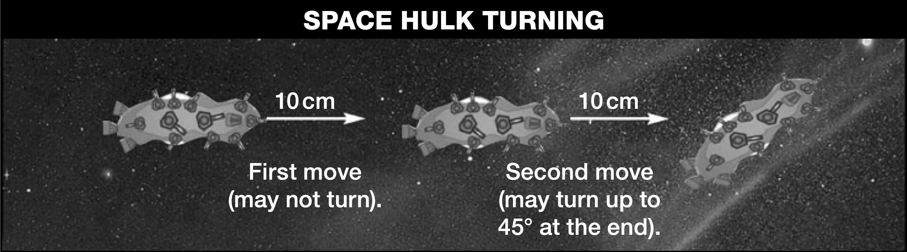
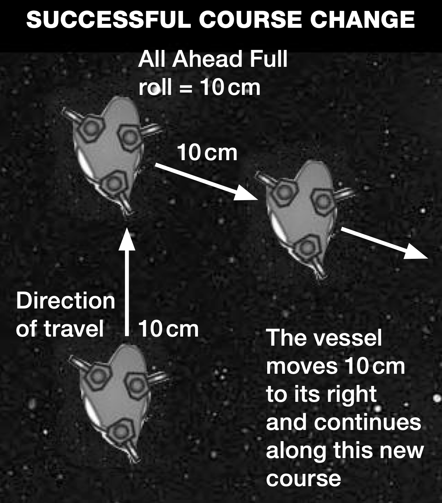
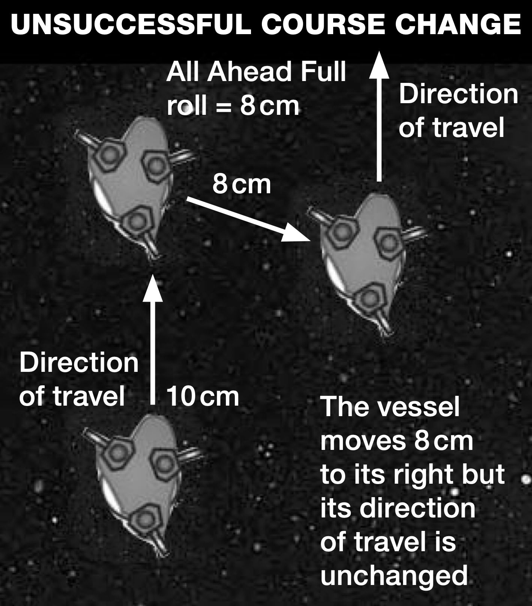

# Orks

*This page is a work in progress!*

## Special Rules

### Leadership

While Orks approach space combat with
the same gusto they reserve for all forms of
violence, the technical nature of the fighting
is often at odds with their ability. This means
that all Ork ships reduce their [Leadership](../the-rules.md#leadership) by
-1 from whatever they rolled, giving them a
Leadership range of 5 to 8.

#### All Ahead Full Special Orders

One thing Orks need very little
encouragement to do is go fast. Their ships
commonly mount a plethora of excess (and
excessive) thrusters, boosters and extra drives
– usually all wired up to a prominent red
button in the cockpit.

Because of this, Orks do not need to pass a
[Command check](../the-rules.md#taking-command-checks) to use [*All Ahead Full*](../the-rules.md#all-ahead-full) special
orders. However, Ork drives are less efficient
than those of other races and are often short
on fuel, so they only travel an extra 2D6 cm on
[*All Ahead Full*](../the-rules.md#all-ahead-full) orders instead of 4D6 cm.
This special rule does not exempt it from
the restrictions that occur when a ship or
[squadron](../squadrons.md) fails a [special order command
check](../the-rules.md#special-orders). If an Ork command check is failed Ork
ships not already on [*All Ahead Full*](../the-rules.md#all-ahead-full) may not
then be put on [*All Ahead Full*](../the-rules.md#all-ahead-full) special orders.

### Boarding

Orks are ferocious close combat opponents and
exceptionally good at [boarding actions](../the-end-phase.md#boarding-actions), where
their brute strength and hardiness is most
useful. To represent this renowned savagery,
they get a +1 bonus in boarding actions.

### Ordnance

#### Boarding Torpedoes

Any capital ship in the Ork fleet list armed
with [torpedoes](../the-ordnance-phase.md#torpedoes) can use [boarding torpedoes](../the-ordnance-phase.md#boarding-torpedoes)
for +5 points. A Space Hulk may use boarding
torpedoes for +15 points. Escorts cannot use
boarding torpedoes.

#### Launch capacity

Some ships in an Ork fleet may possess a
variable launch capacity (as is the case with
many Ork capital ships). In the [Ordnance
phase](../the-ordnance-phase.md) of each Ork turn when Ork [attack craft](../the-ordnance-phase.md#attack-craft)
remain in play, an Ork fleet with variable
launch bay Strength must roll to check its
attack craft capacity. Roll the relevant dice for
any vessel with variable launch bay Strength
and add on to this the launch bay Strength for
any ship with fixed Strengths to find the total
launch capacity for the fleet. Any excess attack
craft above this total are removed at the end
of the turn as they run out of fuel – use ’em
or lose ’em. [Torpedoes](../the-ordnance-phase.md#torpedoes) are not subject to this
rule, as they have no [launch limits](../the-ordnance-phase.md#fleet-ordnance-limits).

#### Fighta-Bommas

Ork [attack craft](../the-ordnance-phase.md#attack-craft) are known as fighta-bommas
and perform the roles of both interceptor and
bomber. They carry heavy bombs and rockets
for attacking at close range, but gladly pounce
on other attack craft they encounter. This hybrid
approach means that they function as [fighters](../the-ordnance-phase.md#fighters)
with a speed of 25 cm normally but can attack
ships as if they were [bombers](../the-ordnance-phase.md#bombers). However, when
attacking a ship, each squadron only rolls a D3
not a D6 for the number of attacks they inflict.

As they behave as both fighters and bombers,
they apply a bonus to [turret](../the-ordnance-phase.md#turrets) suppression by
adding +1 attack for each marker in the wave
after attacks are modified by turrets – meaning
each ordnance marker that survives against
turrets will be able to conduct at least one attack
and will not have a minimum of zero attacks.

When a wave of fighta-bommas attacks a
ship, you must decide beforehand if any of
the markers will forgo their attack runs in
favour of turret suppression. Every one that
does so cannot make any attack rolls but
adds an additional +1 bonus attack to any
surviving fighta-bommas when rolling their
attacks. Fighta-bommas used in this manner
cannot contribute more bonus attacks than
the defending ship actually has turrets or
the number of surviving fighta-bommas,
whichever number is lower.

NOTE: In either case, at least one fighta-bomma
has to survive against turrets for the wave to
attack in this manner.

*Example: A Terror Ship launches a single wave
of four fighta-bommas against a Devastation
cruiser with three turrets and no CAP, declaring
two markers are not attacking and will only be
suppressing turrets. The Devastation’s turrets roll
2,3,4 to knock down one fighta-bomma. Another
one of the surviving markers is removed for
suppressing turrets. The two remaining markers
now each roll 1D3-3 (minimum zero) attacks, but
because each marker also counts as a fighter, it
adds +1 attack for each marker. It then adds +2
attacks for the two markers used only to suppress
turrets (even though one was removed), for a
single total addition of +4 attacks.*

#### Torpedo-Bommas

Orks will sometimes strip out all point-defence
weapons from their fighta-bommas to sling
gigantic, ship killing weapons underneath
their attack craft, all in the effort to make
them more shooty. Such converted attack
craft are torpedo-bommas, which lose all
their manoeuvrability and are slowed down
considerably to carry such enormous weapons.

Torpedo-bommas only move 20 cm and do
NOT retain the ability to behave as fighters
and cannot intercept other ordnance or
provide a bonus attack for turret suppression.

In the beginning of any turn after the turn they
are launched, each torpedo-bomma marker may
be converted into a Strength-2 torpedo salvo.
Torpedo-bommas in a wave may combine their
salvoes into a single salvo, or any number of
markers may launch their salvoes separately.

Torpedo-bommas may be taken by any ship
equipped with launch bays for +10 points per
launch bay strength. For ships with variable
launch bays, this is calculated based on the
maximum number of launch bays available.
This means a Terror Ship must pay +40 points
and a Space Hulk must pay +160 points to use
Torpedo Bommas.

When taken, torpedo-bommas are an
additional ordnance choice available to the
carrier and do not replace fighta-bommas.

#### Ork Orbital Mines

Orks may buy orbital mines like other fleets at
+5 pts per (maximal) launch bay strength and
minefields for the normal point cost.

Note: Ork Space Hulks cannot take orbital
mines.

Regardless of how the Orks refer to the four
named Ork battleships, they are battleships
nonetheless and cannot take orbital mines.

### Ork Weapons

Ork weapons are mostly limited to fairly
crude but efficient slug-throwers and missiles,
mixed with other captured weaponry
salvaged from hulks and defeated ships. The
effectiveness in battle of Ork firing varies
wildly from moment to moment as different
weapons break down or are repaired, or even
improved during combat.

#### Gunz

Standard Ork [weapons batteries](../the-shooting-phase.md#direct-firing-weapons-batteries) are referred
to as 'gunz'. These often have a random
firepower which is rolled each time they
are fired. The dice roll and modifier for
different gunz is indicated on the Ork ship's
characteristics.

#### Heavy Gunz

The Orks commonly mount massed batteries
of very powerful but short ranged weapons on
their ships, as well as more standard weapons
batteries. At close ranges, the barrage of fire
from these weapons has spelled the doom of
many ships.

Heavy gunz roll to hit like ordinary [weapons
batteries](../the-shooting-phase.md#direct-firing-weapons-batteries) but do not count gunnery modifiers
for range. Each hit scored by heavy gunz causes
double damage, i.e, two hits instead of one.

#### Torpedo Launchas

As with their gunz, Ork torpedoes can
vary wildly in their effectiveness. The
strength of a salvo from an Ork torpedo
launcha is randomly generated each time it
is fired by rolling the dice indicated on its
characteristics. Ork ships in skwadrons may
not combine torpedoes into larger salvoes.

### Ork Planetary Defences

Ork Roks can be taken as [planetary defences](planetary-defences.md)
and purchased using planetary defence
point allowances in scenarios that allow the
use of planetary defences and the Orks are
the defender. When used in this manner,
they follow all rules for planetary defences,
meaning they automatically pass all [leadership
checks](../the-rules.md#taking-command-checks) they are required to make but cannot
undergo any [Special Orders](../the-rules.md#special-orders) except [*Reload
Ordnance*](../the-rules.md#reload-ordnance) and [*Brace For Impact*](../the-rules.md#brace-for-impact), for which
they are Leadership 7 (Yes, 7 and not 6!).

Ork Roks cannot move and count as
stationary in all effects when purchased as
defences, including all rules concerning
[removal of blast markers from planetary
defences](../planetary-defences.md#blast-marker-removal). When used in this manner, roll a
2D6 after setting up each Rok. On a roll of
12, the Rok falls 2D6 cm toward the [celestial
phenomena](../the-battlefield.md#celestial-phenomena) it is orbiting near. If the Rok
makes contact with an [asteroid field](../the-battlefield.md#asteroid-fields) or the
[planet](../the-battlefield.md#planets) edge in this manner, it is destroyed!

When playing the defender in [scenarios](../scenarios.md) that
call for [planetary defences](planetary-defences.md), Orks have access
to all the defences listed on [???] pp.141-146
in the rulebook. These can be represented
as captured Imperial or Chaos defences, or
weapon emplacements installed on small
asteroids. System ships, defence monitors and
fireships can all be captured vessels, worn out
Brute ramships or gunships that have more
dakka bolted on to defend ‘da planet! In place
of the Imperial Blackstone Fortress, substitute
a non-moving Space Hulk using the same
(unchanged) profile and point cost listed on
[???] p.145.

## Ork Pirates: Cyclops Cluster Fleet List

### Warlord

*You may include 1 or more Warlord in your
fleet, each of whom must be assigned to a ship
or squadron. If the fleet is worth 500 points or
more it must include at least 1 Warlord to lead it.
An Ork fleet can include a max. of one Warlord
per 500 points. ie, if the fleet is worth up to 500
points, it may have one Warlord. If it is worth
500–1,000 points two Warlords may be included,
etc.*

<table class=fleet-list><tbody>
<tr><td>Ork Warlord</td><td>40 pts</td></tr>
</tbody></table>

Warlords get one re-roll. They can have up to two
more re-rolls for the additional cost noted below.

<table class=fleet-list><tbody>
<tr><td>One extra re-roll</td><td>+20 pts</td></tr>
<tr><td>Two extra re-rolls</td><td>+40 pts</td></tr>
</tbody></table>

A vessel carrying a Warlord doubles its [boarding
value](../the-end-phase.md#boarding-value) and may include up to one of the upgrades
shown below at the additional cost indicated.

<table class=fleet-list><tbody>
<tr><td><strong>Maniac Gunners</strong></td><td><strong>+35 pts</strong></td></tr>
</tbody></table>

The ship may re-roll the dice for the firepower
of its gunz when it fires.

<table class=fleet-list><tbody>
<tr><td><strong>Mad Meks</strong></td><td><strong>+25 pts</strong></td></tr>
</tbody></table>

The ship may re-roll the dice for damage control.

<table class=fleet-list><tbody>
<tr><td><strong>Extra Power Fields</strong></td><td><strong>+25 pts</strong></td></tr>
</tbody></table>

The ship’s [shield](../the-shooting-phase.md#shields) value is increased by +1. If this
would take it to 3 or more shields, don’t forget
to mount it on a 60 mm base!

<table class=fleet-list><tbody>
<tr><td><strong>Mega-armoured Boarding Parties</strong></td><td><strong>+15 pts</strong></td></tr>
</tbody></table>

+1 modifier on boarding.

<table class=fleet-list><tbody>
<tr><td><strong>Looted Torpedoes</strong></td><td><strong>+20 pts</strong></td></tr>
</tbody></table>

The ship may re-roll the dice for the strength of
torpedo salvoes when it fires.

### Kroozers

*You may include up to six kroozers in your fleet.*

<table class=fleet-list><tbody>
<tr><td>Terror ship (<a target="_new" title="Open Page 362 in the Fleets PDF" href="../src/BFG Remastered Official Fleets_WIP.pdf#page=362">pg. 362</a>)</td><td>185 pts</td></tr>
<tr><td>Kill kroozer (<a target="_new" title="Open Page 364 in the Fleets PDF" href="../src/BFG Remastered Official Fleets_WIP.pdf#page=364">pg. 364</a>)</td><td>155 pts</td></tr>
</tbody></table>

### Escorts

*You may include any number of escorts in your
fleet in squadrons of 2–6.*

<table class=fleet-list><tbody>
<tr><td>Ravager attack ship (<a target="_new" title="Open Page 368 in the Fleets PDF" href="../src/BFG Remastered Official Fleets_WIP.pdf#page=368">pg. 368</a>)</td><td>40 pts</td></tr>
<tr><td>Onslaught attack ship (<a target="_new" title="Open Page 366 in the Fleets PDF" href="../src/BFG Remastered Official Fleets_WIP.pdf#page=366">pg. 366</a>)</td><td>35 pts</td></tr>
<tr><td>Grunt assault ship (<a target="_new" title="Open Page 370 in the Fleets PDF" href="../src/BFG Remastered Official Fleets_WIP.pdf#page=370">pg. 370</a>)</td><td>30 pts</td></tr>
<tr><td>Savage gunship (<a target="_new" title="Open Page 367 in the Fleets PDF" href="../src/BFG Remastered Official Fleets_WIP.pdf#page=367">pg. 367</a>)</td><td>30 pts</td></tr>
<tr><td>Brute ramship (<a target="_new" title="Open Page 369 in the Fleets PDF" href="../src/BFG Remastered Official Fleets_WIP.pdf#page=369">pg. 369</a>)</td><td>25 pts</td></tr>
</tbody></table>

### Dakka Dakka

Ork capital ships can add +2 [turrets](../the-ordnance-phase.md#turrets) to their
ships for +20 points (this is not the same thing
as saying “up to two turrets at +10 points
each”).

Ork escorts may add +1 turret for +5 points
per escort. If this option is taken, every escort
in a given squadron must take the refit, not
just individual escorts in a squadron.

## Third Armageddon war: Ork Waaagh! Fleet List

This fleet list represents an Ork fleet either conducting, or
preparing for, an Ork Waaagh! and may be used instead of
the Ork pirate fleet list. The Waaagh! Fleet list is particularly
appropriate for using with Ork fleets which are fighting battle
scenarios, especially planetary assaults and fleet actions, such
as those conducted throughout the Third Armageddon War.

### Warlord

*You may include 1 or more Warlord in your fleet, each of whom
must be assigned to a ship or squadron. If the fleet is worth 500
points or more it must include at least 1 Warlord to lead it.
An Ork fleet can include a max. of one Warlord per 500 points.
ie, if the fleet is worth up to 500 points, it may have one Warlord.
If it is worth 500–1,000 points two Warlords may be included, etc.*

<table class=fleet-list><tbody>
<tr><td>Ork Warlord</td><td>40 pts</td></tr>
</tbody></table>

Warlords get one re-roll. They can have up to two more re-rolls
for the additional cost noted below.

<table class=fleet-list><tbody>
<tr><td>One extra re-roll</td><td>+20 pts</td></tr>
<tr><td>Two extra re-rolls</td><td>+40 pts</td></tr>
</tbody></table>

A vessel carrying a Warlord doubles its boarding value and may
include up to one of the upgrades shown below at the additional
cost indicated.

<table class=fleet-list><tbody>
<tr><td><strong>Maniac Gunners</strong></td><td><strong>+35 pts</strong></td></tr>
</tbody></table>

The ship may re-roll the dice for the firepower of its gunz when
it fires.

<table class=fleet-list><tbody>
<tr><td><strong>Mad Meks</strong></td><td><strong>+25 pts</strong></td></tr>
</tbody></table>

The ship may re-roll the dice for damage control.

<table class=fleet-list><tbody>
<tr><td><strong>Extra Power Fields</strong></td><td><strong>+25 pts</strong></td></tr>
</tbody></table>

The ship’s [shield](../the-shooting-phase.md#shields) value is increased by +1. If this would take it
to 3 or more shields, don’t forget to mount it on a 60 mm base!

<table class=fleet-list><tbody>
<tr><td><strong>Mega-armoured Boarding Parties</strong></td><td><strong>+15 pts</strong></td></tr>
</tbody></table>

+1 modifier on boarding.

<table class=fleet-list><tbody>
<tr><td>Looted Torpedoes</td><td>+20 pts</td></tr>
</tbody></table>

The ship may re-roll the dice for the strength of torpedo salvoes
when it fires.

### Space Hulks

*You may include up to one Ork Space Hulk in
your fleet per 1,500 points.*

<table class=fleet-list><tbody>
<tr><td>Ork hulk (<a target="_new" title="Open Page 371 in the Fleets PDF" href="../src/BFG Remastered Official Fleets_WIP.pdf#page=371">pg. 371</a>)</td><td>600 pts</td></tr>
</tbody></table>

An Ork fleet can include a maximum of one
space hulk per 1,500 points. So if the fleet is
worth up to 1,500 points, it may include one
Space hulk. If it is worth 1,500-3,000 points, two
space hulks may be included, etc. Each Ork hulk
must be assigned an Ork Warlord to command it.

### Battleships & Battlekroozers

*During the Third Armageddon War, four
particularly monstrous Ork vessels earned the
appellation ‘ battleship’ even if such distinct
classes are unknown to the Orks themselves, who
refer to these four, and most similar vessels, as
battlekroozers. For every two kroozers included
in your fleet, you may pick one vessel from the
list below.*

<table class=fleet-list><tbody>
<tr><td>(0-1) <em>Gorbag&#39;s Revenge</em> (<a target="_new" title="Open Page 359 in the Fleets PDF" href="../src/BFG Remastered Official Fleets_WIP.pdf#page=359">pg. 359</a>)</td><td>310 pts</td></tr>
<tr><td>(0-1) Slamblasta (<a target="_new" title="Open Page 360 in the Fleets PDF" href="../src/BFG Remastered Official Fleets_WIP.pdf#page=360">pg. 360</a>)</td><td>295 pts</td></tr>
<tr><td>(0-1) Dethdeala (<a target="_new" title="Open Page 358 in the Fleets PDF" href="../src/BFG Remastered Official Fleets_WIP.pdf#page=358">pg. 358</a>)</td><td>275 pts</td></tr>
<tr><td>(0-1) Kroolboy (<a target="_new" title="Open Page 361 in the Fleets PDF" href="../src/BFG Remastered Official Fleets_WIP.pdf#page=361">pg. 361</a>)</td><td>270 pts</td></tr>
<tr><td>Hammer class battlekroozer (<a target="_new" title="Open Page 356 in the Fleets PDF" href="../src/BFG Remastered Official Fleets_WIP.pdf#page=356">pg. 356</a>)</td><td>245 pts</td></tr>
</tbody></table>

### Kroozers

*You may include up to six kroozers in your fleet.*

<table class=fleet-list><tbody>
<tr><td>Terror ship (<a target="_new" title="Open Page 362 in the Fleets PDF" href="../src/BFG Remastered Official Fleets_WIP.pdf#page=362">pg. 362</a>)</td><td>185 pts</td></tr>
<tr><td>Kill kroozer (<a target="_new" title="Open Page 364 in the Fleets PDF" href="../src/BFG Remastered Official Fleets_WIP.pdf#page=364">pg. 364</a>)</td><td>155 pts</td></tr>
</tbody></table>

### Escorts

*You may include any number of escorts in your
fleet in squadrons of 2–6.*

<table class=fleet-list><tbody>
<tr><td>Ravager attack ship (<a target="_new" title="Open Page 368 in the Fleets PDF" href="../src/BFG Remastered Official Fleets_WIP.pdf#page=368">pg. 368</a>)</td><td>40 pts</td></tr>
<tr><td>Onslaught attack ship (<a target="_new" title="Open Page 366 in the Fleets PDF" href="../src/BFG Remastered Official Fleets_WIP.pdf#page=366">pg. 366</a>)</td><td>35 pts</td></tr>
<tr><td>Grunt assault ship (<a target="_new" title="Open Page 370 in the Fleets PDF" href="../src/BFG Remastered Official Fleets_WIP.pdf#page=370">pg. 370</a>)</td><td>30 pts</td></tr>
<tr><td>Savage gunship (<a target="_new" title="Open Page 367 in the Fleets PDF" href="../src/BFG Remastered Official Fleets_WIP.pdf#page=367">pg. 367</a>)</td><td>30 pts</td></tr>
<tr><td>Brute ramship (<a target="_new" title="Open Page 369 in the Fleets PDF" href="../src/BFG Remastered Official Fleets_WIP.pdf#page=369">pg. 369</a>)</td><td>25 pts</td></tr>
</tbody></table>

### Ork Roks

*You can include any number of Ork Roks in your
fleet.*

<table class=fleet-list><tbody>
<tr><td>Rok (<a target="_new" title="Open Page 374 in the Fleets PDF" href="../src/BFG Remastered Official Fleets_WIP.pdf#page=374">pg. 374</a>)</td><td>80 pts</td></tr>
</tbody></table>

Ork Roks may also be purchased with points for
[planetary defences](planetary-defences.md), in [scenarios](../scenarios.md) where these are
used. Ork Roks may be [squadroned](../squadrons.md) with up to
three other Roks (total squadron size of four),
but not with any other vessels.

### Ordnance

Ships with launch bays can have a mixture of
fighta-bommerz or assault boats. Kill kroozers
and Terror ships can replace their prow batteries
with torpedo tubes at no extra cost.

### Dakka Dakka

Ork capital ships can add +2 [turrets](../the-ordnance-phase.md#turrets) to their
ships for +20 points (this is not the same thing
as saying “up to two turrets at +10 points
each”).

Ork escorts may add +1 turret for +5 points
per escort. If this option is taken, every escort
in a given squadron must take the refit, not
just individual escorts in a squadron.

## Ork Clanz: 'Ere we go! 'Ere we go! 'Ere we Go!

### Using Ork Clanz

The Ork Clanz rules can be used in addition
to the normal Ork rules, but only with its
dedicated Clanz fleet list.

### Musterin' da Clanz

Orks live in tribes, individual armies each led
by a Warlord. However, Orks are also divided
into clans, ancient allegiances to which the
Orks remain loyal throughout their lives, no
matter which tribe they fight for or against.
Tribes frequently break apart or are conquered
by larger, more powerful tribes, but no matter
what an Ork will retain the colours of his
clan. Tribes usually contain Orks from several
clans, but an Ork’s first loyalty is always to his
Warboss. Members of the same clan may well
end up fighting one another if their tribes clash,
though this doesn’t really bother the Orks too
much, who will cheerfully fight anyone they
can. Each clan has its own distinctive character
and abilities, and an Ork will retain these no
matter which tribe he belongs to.

### Clan Upgrades

A Warlord and his [skwadrons](#skwadrons) may only be from
one clan, but as many different clans as desired
can be in a single fleet. In fact, it is perfectly
legal for every single Warlord in the fleet to be
of a different clan. Any skwadron can be given
a clan upgrade by paying the points cost shown,
but the squadron must show clan colours. In case
players have any smart ideas about showing all
the colours on their Ork ships for maximum
flexibility, a skwadron only counts as showing
clan colours if the majority of the ships in the
skwadron have their clan colour covering more
than half of the model. The colours for each clan
is shown after the points cost for the upgrade.

Note that although these rules refer to
skwadrons, this also applies to single vessels
(since battleships, battlekroozers and kroozers
can, of course, be fielded in ‘skwadrons’ of
one). Additionally, being from a particular
clan and being painted as such does not
obligate the skwadron to take the benefits of
being from a particular clan by paying the
extra points for them, nor are Ork vessels
limited to only these paint schemes. It’s not
uncommon for Ork freebooters to incorporate
several colour schemes in their ships, when
they bother to paint their rust-buckets at all!

Clan upgrades are different from Gubbins
and may be taken (and paid for) in addition
to Gubbins by individual skwadrons. If taken,
every capital ship in the skwadron must
separately take and pay for the clan upgrade,
not just individual ships. The point cost for
clan upgrades for tiddla skwadrons count for
the whole skwadron (regardless of how large
it is!), not individual escorts. This also means
the enemy only gets additional victory points
for the clan upgrade if the tiddla skwadron
is wiped out. If a single escort survives the
battle, the enemy does not get additional
victory points for the clan upgrade.

<table class=fleet-list><tbody>
<tr><td><strong>Goffs</strong></td><td><strong>+20 pts/Black</strong></td></tr>
</tbody></table>

The Goffs are the most aggressive of the Ork
clans, born fighters amongst a race born for
fighting. Goffs like it up close and personal, and
consider the other clans wimps for hanging back
and shooting. All Goff ships (including tiddla
skwadrons) gain a +1 bonus to the dice roll
during [boarding actions](../the-end-phase.md#boarding-actions) and a +1 [Leadership](../the-rules.md#leadership)
bonus when attempting to [ram](../the-movement-phase.md#all-ahead-full-ramming-speed).

<table class=fleet-list><tbody>
<tr><td><strong>Evil Sunz</strong></td><td><strong>+20 pts/Red</strong></td></tr>
</tbody></table>

Evil Sunz are obsessed with speed, endlessly
tinkering with the engines of all their vehicles
and ships, trying to get as much speed out of them
as possible. All Evil Sunz ships gain +5 cm speed.

<table class=fleet-list><tbody>
<tr><td><strong>Bad Moonz</strong></td><td><strong>+30 pts/Yellow</strong></td></tr>
</tbody></table>

Bad Moonz are the richest of the clans, using their
own fast-growing teeth as currency. This also has
the effect of making them a valuable target for other
Orks. They don’t mind being a target though, and
proudly display their wealth through a combination
of gaudy colours and all the best gizmos that money
can buy. All ships in a Bad Moonz skwadron gain
the Maniac Gunners upgrade.

<table class=fleet-list><tbody>
<tr><td><strong>Deathskullz</strong></td><td><strong>+30 pts/Blue</strong></td></tr>
</tbody></table>

The Deathskulls are the masters of salvage. After
a good old scrap it will always be the Deathskullz
who are whizzing about scrounging what they
can from any wrecks left floating across the
battlefield. Deathskullz capital ships and/
or tiddla skwadrons have ‘looted’ upgrades
(torpedoes and/or lances) for no additional cost.

<table class=fleet-list><tbody>
<tr><td><strong>Blood Axes</strong></td><td><strong>Free/Green</strong></td></tr>
</tbody></table>

Most Orks distrust the Blood Axes, who they
consider to be treacherous gits and cowards
who sneak around in poncey clothes to make
themselves look like trees. Most of all the Blood
Axes are disliked for their dealings with humies
and other non-Orks, from whom the Blood Axes
proudly ‘acquire’ various practices and even bits
of equipment. The Warlord’s ship may take one
refit from the Imperial Navy refit table (rolled
randomly) for +20 points. A Blood Axe tiddla
skwadron of at least six escorts may include up
to three Imperial Navy and/or Chaos escorts
from any fleet list at their listed cost. These
commandeered vessels must have an Orky colour
scheme and kustom-job – you can’t just borrow
the ships from your Imperial or Chaos fleet!

<table class=fleet-list><tbody>
<tr><td><strong>Snakebites</strong></td><td><strong>Free/Brown</strong></td></tr>
</tbody></table>

The Snakebites are a primitive clan (even by Ork
standards) and use technology only reluctantly.
Snakebites will indulge in space travel if it’s likely
to take them to a new scrap, but are likely to spend
much of the journey clinging on to the sturdiest (and
least techy looking) thing they can find. Snakebite
capital ship skwadrons can only use space hulks
or roks – no other kind of capital ship skwadrons
are permitted to bear the clan colours. Snakebite
skwadrons gain a special +1 bonus to Command
checks when attempting to Brace for Impact.

### Mob Rule

Big groups of Ork escorts are surprisingly
coordinated. Ork escort skwadrons gain a +1
bonus to their [Leadership](../the-rules.md#leadership) while they contain
more than five models (or ‘lotz’ as the Orks
call it – Orks aren’t very good at counting).
Note: the maximum number of escorts in an
Ork squadron can be up to ten.

### Young Gunz

While not technically skilled, Orks do possess
boundless enthusiasm for fighting, and mobs
of young Orks, eager to prove themselves
to their elder and larger peers often pack
themselves aboard rickety old escort vessels
and tag along to any battle they can find. Any
Ork escort skwadron with a [Leadership](../the-rules.md#leadership) of 5
or 6 gets a bonus escort ship added for free,
demonstrating quantity has a quality all of its
own. This includes if the leadership is a result of
being swapped with that of a Warboss! The free
ship can be any Ork escort class in the fleet list
costing equal to or less than that of the cheapest
escort paid for in the skwadron (the skwadron
cannot exceed ten escorts). Young Gunz can
be applied before Mob Rule: a tiddla skwadron
with five escorts that rolls Ld 5 may have a sixth
escort for free, increasing its Ld to 6!

### Gubbins

Orks are always trying to improve their
ships in some fashion and will do whatever
they have to for either more parts or the
teef to buy them. A warlord in particular
gathers around himself a number of other
cunning and successful leaders, each one
an enterprising Mekboss or Nob in his own
right. Several warlords may band together
to fight a common foe, and they will each of
course bring the best of their wargear to the
fight, as much to demonstrate their prowess
to their fellow warlords as to bring the fight
to the enemy. A vessel or escort skwadron
led by a Warlord may be given up to one of
the following upgrades per Command re-roll
the Warlord has. Each upgrade can only
be applied once. Note: Players are actively
encouraged to change their upgrades from
battle to battle in typically restless Orky
fashion. Each Warlord that does so at least
twice over the course of a campaign may
have their first normally earned refit for free
instead of paying the normal +10% cost.

For tiddla skwadrons, the point cost for
Gubbins count for the whole skwadron
(regardless of how large it is!), not individual
escorts. This also means the enemy only gets
additional victory points for the Gubbins if
the tiddla skwadron is wiped out. If a single
escort survives the battle, the enemy does not
get additional victory points for the Gubbins.
Not all Gubbins apply to escorts or are taken
the same way as capital ships, as indicated by
their notes.

<table class=fleet-list><tbody>
<tr><td><strong>Soopa Boostas</strong></td><td><strong>+25 pts</strong></td></tr>
</tbody></table>

The ship gains +5 cm speed, and it rolls 4D6 cm
when on [*All Ahead Full*](../the-rules.md#all-ahead-full) special orders.

<table class=fleet-list><tbody>
<tr><td><strong>Extra Power Fields</strong></td><td><strong>+25 pts</strong></td></tr>
</tbody></table>

(Not for escorts) The ship’s [shield](../the-shooting-phase.md#shields) value is
increased by +1. If this would take it to 3 or more
shields, don’t forget to mount it on a 60 mm base!

<table class=fleet-list><tbody>
<tr><td><strong>Extra Turrets</strong></td><td><strong>+20 pts</strong></td></tr>
</tbody></table>

The ship gains +2 [Turrets](../the-ordnance-phase.md#turrets) (Escorts get +1 Turret).
This cannot be combined with Maniac Turrets.

<table class=fleet-list><tbody>
<tr><td><strong>Maniac Turrets</strong></td><td><strong>+10 pts</strong></td></tr>
</tbody></table>

(Not for escorts.) The ship’s [turret](../the-ordnance-phase.md#turrets) value is
replaced by D3 turrets. This cannot be combined
with Extra Turrets.

<table class=fleet-list><tbody>
<tr><td><strong>Looted Lances</strong></td><td><strong>+30 pts</strong></td></tr>
</tbody></table>

Any heavy [gunz batteries](../the-shooting-phase.md#direct-firing-weapons-batteries) on the ship can be
replaced with a Strength-2 [lance](../the-shooting-phase.md#direct-firing-lances) battery. Range
is 15 cm for escorts, 30 cm for capital ships.

<table class=fleet-list><tbody>
<tr><td><strong>Looted Torpedoes</strong></td><td><strong>+20 pts</strong></td></tr>
</tbody></table>

The ship may re-roll the dice for the Strength of
torpedo salvoes when it fires.

<table class=fleet-list><tbody>
<tr><td><strong>Mad Meks</strong></td><td><strong>+25 pts</strong></td></tr>
</tbody></table>

(Not for escorts.) The ship may re-roll the dice
when [repairing critical damage](../the-end-phase.md#damage-control).

<table class=fleet-list><tbody>
<tr><td><strong>Maniac Gunners</strong></td><td><strong>+30 pts</strong></td></tr>
</tbody></table>

The ship may re-roll the dice for the firepower
of its gunz when it fires.

<table class=fleet-list><tbody>
<tr><td><strong>Mega-Armoured Boarding Parties</strong></td><td><strong>+15 pts</strong></td></tr>
</tbody></table>

(Not for escorts.) The ship has an additional +1
modifier when rolling for [boarding actions](../the-end-phase.md#boarding-actions) and
hit-and-run attacks of any type.

<table class=fleet-list><tbody>
<tr><td>Prow Ram</td><td>+10 pts</td></tr>
</tbody></table>

(Not for escorts.) This adds +1 bonus when
rolling a [leadership check to ram](../the-movement-phase.md#all-ahead-full-ramming-speed) and causes
1Hp before rolling to inf lict damage.

<table class=fleet-list><tbody>
<tr><td><strong>Tellyporta</strong></td><td><strong>+30 pts</strong></td></tr>
</tbody></table>

(Not for escorts.) [Hit-and-run teleport attacks](../the-end-phase.md#teleport-attacks)
can be made to 30 cm.

### More Gubbins

The following gubbins can be taken by any
number of capital ships in the fleet. **More
Gubbins** are not available for escorts (except
the Grunt where indicated) and can only be
added to capital ships.

<table class=fleet-list><tbody>
<tr><td><strong>Klaws</strong></td><td><strong>+10 pts</strong></td></tr>
</tbody></table>

(Not for escorts except the Grunt at +5 points per
escort.) Klaws are unaffected by [special orders](../the-rules.md#special-orders)
of any kind but cannot be used by capital ships
if they are [crippled](../the-shooting-phase.md#crippled-ships). Any time the ship moves in
base contact with any one enemy ship during [the
movement phase](../the-movement-phase.md), immediately roll two D6. Each
roll of a 4+ inflicts one hit on the target, ignoring
shields but not holofields. [*Brace for Impact*](../the-rules.md#brace-for-impact) works
normally against attacks by Klaws.

Each ship with Klaws may only use it once per
turn, regardless of how many vessels it contacts
during the Ork player’s movement phase, though
it does not have to be the first ship in contact.
If the Klaws hit only once or not at all, the ship
can continue moving after making the attack
and shoot/launch ordnance later in the turn. If
both attacks hit, then the vessel has grabbed the
target with its enormous mechanical Klaws and
has latched on! Neither vessel can move if they
are of the same class or smaller (such as cruiser
to cruiser), but a larger class vessel may still move
but only at half rate. Both ships may shoot at half
effectiveness ([nova cannon](../the-shooting-phase.md#nova-cannon) and similar special
weapons cannot fire). In every [End phase](../the-end-phase.md) roll to
attack again (two dice needing 4+ to hit). If both
attacks hit when a vessel is already grappled then
it takes a third additional hit. Either ship may
conduct boarding actions as normal. Damage
caused by Klaws cause critical hits as normal.

<table class=fleet-list><tbody>
<tr><td><strong>Shokk-Attack Lance</strong></td><td><strong>Free</strong></td></tr>
</tbody></table>

(Not for escorts.) A ship’s prow heavy [gunz
batteries](../the-shooting-phase.md#direct-firing-weapons-batteries) can be replaced with this weapon,
which cannot be used if the ship is [crippled](../the-shooting-phase.md#crippled-ships) or
[braced](../the-rules.md#brace-for-impact). It is only effective against ships with
[shields](../the-shooting-phase.md#shields) down in the same manner as [teleporters](../the-end-phase.md#teleport-attacks).
When used, the ship rolls to hit on a 4+, range:
30 cm. Holofields and being [braced](../the-rules.md#brace-for-impact) both save
normally against this. If a hit is rolled, D3+1
snotling hordes are teleported onto the enemy
ship! If a miss is rolled, place a [blast marker](../the-shooting-phase.md#blast-markers)
in base contact with the vessel (even if shields
are already down) for the hordes of vacuum-frozen snotlings bashing against the exterior
of the hull. Each hit does not cause damage.
Instead, the next [leadership check](../the-rules.md#taking-command-checks) or [special
order](../the-rules.md#special-orders) made by the ship must be with an extra
D6 (such as 3D6, or even more when already
using 3D6, such as when [*All Ahead Full*](../the-rules.md#all-ahead-full) through
an asteroid field)! Additional “hits” from this
weapon only add to the number of hordes that
must be eradicated before the ship can return to
conducting leadership checks normally. Every
special order done in this manner (even if failed)
“repairs” one of these hordes as the crew works
furiously to shove thousands of snotlings out the
nearest airlock! These can also each be repaired
in the end phase normally when rolling to repair
critical damage.

Escorts have fewer complex systems than capital
ships and are smaller overall. While multiple
snotling hordes can possibly get into some vital
system that in the end overwhelms the vessel, it
is just as likely they will miss vital spaces entirely.
When fired at escorts, the defending squadron
rolls a D6. On a 4+, the closest escort gets an
additional [blast marker](../the-shooting-phase.md#blast-markers) placed in contact with
it as the hordes have no effect. On a roll of 3 or
less, the nearest escort in range with no shields
is destroyed (being braced works normally).

<table class=fleet-list><tbody>
<tr><td><strong>Assault Karrier</strong></td><td><strong>Free</strong></td></tr>
</tbody></table>

(Not for escorts.) Any ship that takes both
[attack craft](../the-ordnance-phase.md#attack-craft) and [torpedoes](../the-ordnance-phase.md#torpedoes) can be optimized
for [hit-and-run attacks](../the-end-phase.md#hit-and-run-attacks) and [boarding actions](../the-end-phase.md#boarding-actions)
by particularly zealous Orks. It takes [boarding
torpedoes](../the-ordnance-phase.md#boarding-torpedoes) for free, but it may only use [assault
boats](../the-ordnance-phase.md#assault-boats). It may launch +1 assault boat marker each
time it launches attack craft normally (even if
crippled or braced, but not both).

## Choozin’ yer Fleet: Da Ork Clanz Fleet List

### Warlord

*Ork fleets always include one Warlord for every
500 points, or part, that the fleet is worth – no
more, no less.*

<table class=fleet-list><tbody>
<tr><td>Ork Warlord</td><td>Free</td></tr>
</tbody></table>

A Warlord adds +2 to one [boarding](../the-end-phase.md#boarding-actions) dice roll
per game. A Warlord has one [re-roll](../the-rules.md#re-rolls), and may
purchase one or two more for the points cost
shown below.

<table class=fleet-list><tbody>
<tr><td>One extra re-roll</td><td>+20 pts</td></tr>
<tr><td>Two extra re-rolls</td><td>+40 pts</td></tr>
</tbody></table>

A Warlord may choose for his own ship or escort
skwadron one upgrade from the [Gubbins](#gubbins) list for
every re-roll he has at its listed cost. He must be
embarked on the most expensive ship under his
own command (as opposed to the whole fleet),
even if it is an escort - annotate which one it is. A
Warlord’s re-rolls only count for the skwadrons
under his command and not for the whole fleet.

### Skwadrons

*For every re-roll a Warlord has (including the first
one for free), the Warlord must be in command
of one tiddla skwadron of at least three escorts
and one other skwadrons. He may also swap
leadership with any one ship or escort squadron
under his command.*

#### ‘Uge ship skwadron

*1 Battlekroozer/ship, chosen from the following
list:*

<table class=fleet-list><tbody>
<tr><td>(0-1) Gorbag&#39;s Revenge (<a target="_new" title="Open Page 359 in the Fleets PDF" href="../src/BFG Remastered Official Fleets_WIP.pdf#page=359">pg. 359</a>)</td><td>310 pts</td></tr>
<tr><td>(0-1) Slamblasta (<a target="_new" title="Open Page 360 in the Fleets PDF" href="../src/BFG Remastered Official Fleets_WIP.pdf#page=360">pg. 360</a>)</td><td>295 pts</td></tr>
<tr><td>(0-1) Dethdeala (<a target="_new" title="Open Page 358 in the Fleets PDF" href="../src/BFG Remastered Official Fleets_WIP.pdf#page=358">pg. 358</a>)</td><td>275 pts</td></tr>
<tr><td>(0-1) Kroolboy (<a target="_new" title="Open Page 361 in the Fleets PDF" href="../src/BFG Remastered Official Fleets_WIP.pdf#page=361">pg. 361</a>)</td><td>270 pts</td></tr>
</tbody></table>

#### Big ship skwadron

*1-2 Kroozers, chosen from the following list:*

<table class=fleet-list><tbody>
<tr><td>Terror ship (<a target="_new" title="Open Page 362 in the Fleets PDF" href="../src/BFG Remastered Official Fleets_WIP.pdf#page=362">pg. 362</a>)</td><td>185 pts</td></tr>
<tr><td>Kill kroozer (<a target="_new" title="Open Page 364 in the Fleets PDF" href="../src/BFG Remastered Official Fleets_WIP.pdf#page=364">pg. 364</a>)</td><td>155 pts</td></tr>
<tr><td>Lite kroozer (<a target="_new" title="Open Page 362 in the Fleets PDF" href="../src/BFG Remastered Official Fleets_WIP.pdf#page=362">pg. 362</a>)</td><td>90 pts</td></tr>
</tbody></table>

#### Tiddla skwadron

*3-10 Escorts, chosen from the following list in any
mix desired:*

<table class=fleet-list><tbody>
<tr><td>Ravager attack ship (<a target="_new" title="Open Page 368 in the Fleets PDF" href="../src/BFG Remastered Official Fleets_WIP.pdf#page=368">pg. 368</a>)</td><td>40 pts</td></tr>
<tr><td>Onslaught attack ship (<a target="_new" title="Open Page 366 in the Fleets PDF" href="../src/BFG Remastered Official Fleets_WIP.pdf#page=366">pg. 366</a>)</td><td>35 pts</td></tr>
<tr><td>Grunt assault ship (<a target="_new" title="Open Page 370 in the Fleets PDF" href="../src/BFG Remastered Official Fleets_WIP.pdf#page=370">pg. 370</a>)</td><td>30 pts</td></tr>
<tr><td>Savage gunship (<a target="_new" title="Open Page 367 in the Fleets PDF" href="../src/BFG Remastered Official Fleets_WIP.pdf#page=367">pg. 367</a>)</td><td>30 pts</td></tr>
<tr><td>Brute ramship (<a target="_new" title="Open Page 369 in the Fleets PDF" href="../src/BFG Remastered Official Fleets_WIP.pdf#page=369">pg. 369</a>)</td><td>25 pts</td></tr>
</tbody></table>

#### Rok skwadron

*1–4 Roks*

<table class=fleet-list><tbody>
<tr><td>Rok (<a target="_new" title="Open Page 374 in the Fleets PDF" href="../src/BFG Remastered Official Fleets_WIP.pdf#page=374">pg. 374</a>)</td><td>80 pts</td></tr>
</tbody></table>

#### Space Hulks

An Ork fleet with at least three Warlords may
include one Space Hulk. One of your Warlords
must be embarked on it, which by itself counts
as all the skwadrons that Warlord can have
(including a tiddla skwadron), regardless of how
many re-rolls the Warlord has. Space Hulks so
led can take upgrades from the list of Gubbins
for double the listed cost. Upgrades that increase
its boarding value or speed may not be taken.

<table class=fleet-list><tbody>
<tr><td>Ork hulk (<a target="_new" title="Open Page 371 in the Fleets PDF" href="../src/BFG Remastered Official Fleets_WIP.pdf#page=371">pg. 371</a>)</td><td>600 pts</td></tr>
</tbody></table>

### Ordnance
Ork [attack craft](../the-ordnance-phase.md#attack-craft) carriers use fighta-bommas
and [assault boats](../the-ordnance-phase.md#assault-boats). They may take torpedo-bommas for +10 points per launch bay (counting
maximum number of launch bays). Ork capital
ships that use [torpedoes](../the-ordnance-phase.md#torpedoes) may use [boarding
torpedoes](../the-ordnance-phase.md#boarding-torpedoes) for +5 points.

### Using Skwadrons

There is no restriction for what kinds or how
many of what type of skwadrons are in the fleet
as long as no Warlord may have more than one
‘Uge Ship, which counts as a skwadron by itself.
Each skwadron must be fielded with the number
of ships chosen for it in this list; you can’t split up
skwadrons or add more ships to them. However,
no more than one of each of the named Ork
battleships may be in the fleet, no more than
one ‘Uge ship may be taken in the fleet for every
two kroozers, and a Space Hulk may only be
taken by a fleet of no less than 1500 points. This
however applies to the fleet as a whole, not to
individual skwadrons. While there must be at
least one Warlord for every 500 points in the fleet
or portion thereof, not all Warlords are created
equal! Thus, the smallest fleet a single Warlord
with only the one free re-roll may command is
two tiddla skwadrons, each with three escorts.
The largest fleet a single Warlord with two extra
re-rolls (for a total of three) can command is one
‘Uge ship, two skwadrons of two kroozers each
and three skwadrons of up to ten escorts each.
While the number of Warlords for a given fleet
size cannot be altered, how many points each
Warlord is put in charge of can be mixed and
matched in any way desired; it is perfectly legal
for a Warlord with one re-roll to have one or two
kroozers and a tiddla squadron of three escorts,
or just a single Rok as a skwadron (if desired) and
a tiddla squadron of nine escorts, etc. A Warlord
must have two kroozers in order to take a “Uge
ship, meaning the Warlord must have at least
one extra re-roll to do so. A Warlord leading a
Space Hulk may only lead it and no other ships,
but he is not required to take any extra re-rolls
to do so if it is not desired.

In campaigns, nominate one Warlord to
command the fleet. This is essentially “you” and
must be on the most expensive ship in the fleet,
even if it is a Space Hulk. The fleet commander
still starts with one re-roll and may purchase
up to one more at the start of the campaign,
earning more (along with more skwadrons) over
the course of the campaign. This means the fleet
commander personally starts with no more than
one tiddla squadron of up to ten escorts and
one other skwadron (or two each if a second re-roll is purchased at the start of the campaign),
which may be taken in any manner desired.
Fleet commander re-rolls can only be used by
his or her own skwadrons. The fleet commander
cannot earn more re-rolls than would be allowed
by p.153 of the Rulebook, even if a second re-roll
was purchased at the start of the campaign.

## Ork Hulks

### Leadership

Due to their enormous size, and the strain this
places on Ork communications systems (ie,
shouting loudly), a hulk is always [Leadership](../the-rules.md#leadership) 6.

### Special Orders

A space hulk may not use [*Come to New
Heading*](../the-rules.md#come-to-new-heading) or [*Burn Retros*](../the-rules.md#burn-retros) special orders.
Space Hulks can use [*All Ahead Full*](../the-rules.md#all-ahead-full) special
orders but cannot gain extra movement by
doing so. This will allow them to attempt to
[ram](../the-movement-phase.md#all-ahead-full-ramming-speed), but given the size and poor leadership
of a Space Hulk, it will only be viable against
defences. Because it is a Defence, it must roll
leadership against 3D6 to ram anything besides
another defence, against which it rolls 2D6.

### Warlords

Having an Ork Warlord aboard a space hulk
does not double its [boarding](../the-end-phase.md#boarding-actions) value. Also, the
Warlord’s upgrades are modified as noted:
* Looted Torpedoes and Maniac Gunners
upgrades can be used to affect only one
weapon system or torpedo battery per
turn. Which system is being affected
must be nominated before the roll is made
for its effectiveness – the re-roll can’t be
transferred elsewhere afterwards!
* Extra Powerfields costs +50 pts instead of +25.
* Mad Meks enables the hulk to ignore the
effects of a critical hit on a D6 roll of 6.
* Mega-armoured Boarding Parties is unchanged.

### Movement

Ork hulks must move 10 cm in a straight
line each turn, no more, no less. Space hulks
likewise do not have their speed reduced by
[Blast markers](../the-shooting-phase.md#blast-markers) or [damage](../the-shooting-phase.md#damage).

#### Turning

A space hulk may turn up to 45˚ and only in
every second [Movement phase](../the-movement-phase.md). The turn must
be taken at the end of the space hulk’s 10 cm
movement. This can be seen more clearly in
the diagram below.

#### Gravity Wells

If a hulk is within the [gravity well](../the-battlefield.md#gravity-wells) of a planet
or moon at the end of its movement it can
make a single 45° turn towards the [planet](../the-battlefield.md#planets) or
[moon](../the-battlefield.md#moons), regardless of whether it turned in its
last [movement phase](../the-movement-phase.md).

<!--
 Also, the enormous size
and mass of a space hulk means that it creates
its own gravity well extending 5 cm from the
edges of its base. This affects other ships in
exactly the same way as a planetary gravity
well and means that other ships can take up
a stationary orbit around the hulk. Objects
orbiting the hulk are moved along with it until
such time as they break orbit. A ship deciding
to break orbit must do so before the Space
Hulk moves. In other words, no free moves!

UPGRADES
Hulks cannot take any upgrade that improves
Boarding Value, Turning or Speed.
-->

### Damage

Ork hulks are so massive that damage applies
to them a little differently than to other ships.

#### Crippling

Space hulks are not [crippled](../the-shooting-phase.md#crippled-ships) by damage like
ordinary ships. They are so big that they must
be gradually eroded by enemy fire.

#### Catastrophic Damage

When a space hulk is reduced to 0 Damage roll
on the [Catastrophic Damage table](../the-shooting-phase.md#catastrophic-damage-table). The drifting
and blazing hulk results remain unchanged.

A plasma drive overload result indicates
the Space Hulk is torn apart by internal
explosions, no damage is scored on ships
nearby, instead the hulk breaks up into
[asteriod field](../the-battlefield.md#asteroid-fields) D3×5 cm wide and long.

On a warp drive implosion result the hulk is
hurled back into the Warp. Replace the hulk
with a [Warp rift](../the-battlefield.md#warp-rifts) [???] (celestial phenomena,
p45). Any ships caught in the rift are affected
immediately.

### Ork Hulk Critical Hits Table

*Due to their massive size and lack of complex systems, do not roll for the effects of critical hits on a space
hulk using the Critical Damage table. 
Instead the player who inflicted the critical should roll to see what happens:*

| D6 Roll | Result |
| :-: | --- |
| 1-2 | **Target high energy systems!** Roll a D6.<ul><li><strong>1-2:</strong> -1 dorsal lance</li><li><strong>3-4:</strong> -1 shield</li><li><strong>5-6:</strong> 1 turret strength</li></ul> |
| 3-4 | **Target weapons clusters!** Roll a D6, affecting only the firing arc where the hulk was hit by the critical hit: <ul><li><strong>1-2:</strong> -1 launch bay (except prow/aft)</li><li><strong>3-4:</strong> -1 torpedo strength (except aft)</li><li><strong>5-6:</strong> -2 weapons battery firepower</li></ul> |
| 5-6 | **Target thruster assemblies!** The hulk must roll higher than the number of thruster damage criticals it has suffered on a D6 in order to turn. |

*Damage rolled that does not apply for any reason immediately assumes the next higher level
damage on the table. Space Hulks cannot repair any critical damage in the course of a battle.*

### Ork Hulks in Campaigns

An Ork pirate fleet may use a single Ork space
hulk as their pirate base in a campaign. If the
pirate base comes under attack, substitute
one space hulk for the target planet in a
[Planetary Assault](../scenarios/planetary-assault.md) or [Exterminatus](../scenarios/exterminatus.md) mission,
and the planets in the Hunter, Prey scenario
presented in WD233 (note that this does take
some of the guesswork out of the scenario but
does make for a very different encounter!).
The space hulk must still be purchased using
the fleet and/or [planetary defence](../fleet-lists/planetary-defences.md) points
allocation for the scenario, but the hulk itself
is not considered part of the fleet registry.
In these scenarios, the [low orbit table](../the-battlefield.md#fighting-in-low-orbit) will
actually represent very close range passes on
the hulk, so the normal [victory conditions](../scenarios.md#victory-points)
remain the same as far as assault points or
the Exterminator are concerned. Also, should
the space hulk be destroyed then the attacker
will automatically win. Note that it is still
possible for the Ork player to purchase [low
orbit defences](../fleet-lists/planetary-defences.md#low-orbit-defences), these simply represent short
ranged point-defence systems studded about
the space hulk.

Alternatively, by using the full [Waaagh!](../fleet-lists/orks.md#third-armageddon-war-ork-waaagh-fleet-list) or
[Clanz](#ork-clanz-ere-we-go-ere-we-go-ere-we-go) Fleet lists, Ork players can participate
fully in a campaign, conquering systems and
engaging in battles in the same way as other
fleets. The [Third Armageddon War](../the-third-armageddon-war.md) represents
one such conflict where the Orks participate
as full fleets, rather than just raiders.
History, rules and background for the Third
Armageddon War are presented on [???] of the
Remastered Rulebook.

## Roks

Roks are sufficiently different to both Orbital
Defences and true spaceships to require a
number of special rules. However any rules
which are not specifically noted as being
modified below, apply in full to Roks. For
example, Roks which lose half their [damage](../the-shooting-phase.md#damage)
are [crippled](../the-shooting-phase.md#crippled-ships) just like other vessels.

### Movement

Because they are basically large lumps of rock
with engines studded all over them, Roks
don’t move in the same way as normal ships.
In their [Movement phase](../the-movement-phase.md) Roks travel 10 cm
forward in a straight line, no more, no less.
Roks may not turn or use [*Burn Retros*](../the-rules.md#burn-retros) or [*Come
to New Heading*](../the-rules.md#come-to-new-heading) orders.

On [*All Ahead Full*](../the-rules.md#all-ahead-full) orders Roks move an extra
2D6 cm in any direction at the end of their
move. If this causes them to move 10 cm or
more in a different direction to the one they
are travelling in, this becomes their new
direction of travel. This can be seen more
clearly in the following diagrams.

Due to their low speed and considerable
momentum, Roks which are crippled or
moving though [Blast markers](../the-shooting-phase.md#blast-markers) do not reduce
their speed. Roks in the [gravity well](../the-battlefield.md#gravity-wells) of a
[planet](../the-battlefield.md#planets) or [moon](../the-battlefield.md#moons) may make free turns like an
ordinary ship (45°) and/or place themselves in
a stationary or [low orbit](../the-battlefield.md#fighting-in-low-orbit).

### Critical Hits

Roks lack the complex systems of true space
craft, so critical hits are not rolled on the
[Critical table](../the-shooting-phase.md#critical-hits-table). Instead each critical hit inflicts
+1 point of damage.

### Catastrophic Damage

When a Rok is reduced to 0 Damage it breaks
up. Do not roll for [Catastrophic Damage](../the-shooting-phase.md#catastrophic-damage),
instead the Rok is replaced by 4 [Blast markers](../the-shooting-phase.md#blast-markers).
