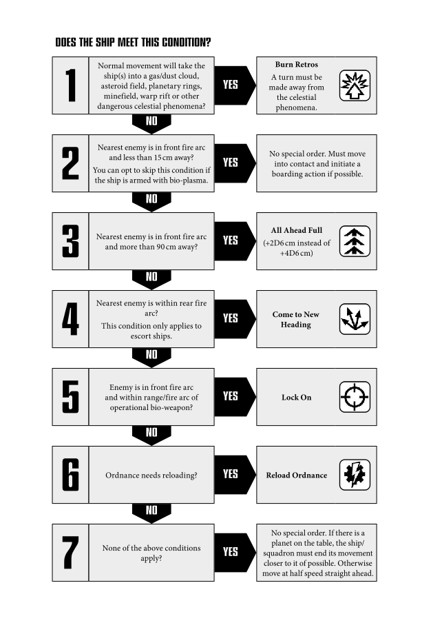

# Tyranids

*This page is a work in progress!*

## Attack Rating

Tyranids have a starting attack or initiative
rating of 3.

## Synaptic Control

Only hive ships have a [leadership](../the-rules.md#leadership) value, which
is purchased at a fixed value from the Hive
Fleet list. During the [Movement phase](../the-movement-phase.md), each
hive ship can make a [Command check](../the-rules.md#taking-command-checks) to
change or ignore [Instinctive Behaviour](#instinctive-behaviour-flowchart) for
themselves or another ship/squadron within
45 cm. If the test is successful the Tyranid
player has control of the ship/squadron and
may place it on special orders if desired,
without requiring a second command check.

Attempts to use synaptic control count as a
Command check. However, if one hive ship
fails a command check this does not prevent
another hive ship attempting to use synaptic
control. In effect each hive ship can make
at least one attempt to override Instinctive
Behaviour.

You may test for synaptic control over a ship
which failed the test the same turn, including
other Hive ships, as long as there is another
Hive ship within range.

Tyranid ordnance (fighters, assault boats,
torpedoes) is not subject to synaptic control or
[Instinctive Behaviour](#instinctive-behaviour-flowchart) – just move them like
normal ordnance.

### Movement & Special Orders

All Tyranid vessels follow Instinctive Orders
unless the Hive Mind (i.e. you, the player!) tells
a ship or squadron to do something different
via the psychic conduit of the hive ships.

For ships or squadrons using Instinctive
Behaviour, read down the flowchart opposite
and give the ship/squadron the first
appropriate action or special order you come
to. No Command check is needed for special
orders, but there may be specific activities that
must be undertaken in the vessel’s movement.

*For example: A Tyranid cruiser wishes to
move towards the enemy fleet in support of
its hive ship but fails the Ld test. We check the
Instinctive Orders table – there are no celestial
phenomena or enemy ships close or in range
but there is a planet on the table. The cruiser
has to move towards the planet even though
this actually takes it further away from the
enemy fleet it wished to close with.*

### Brace for Impact

During either players’ turn, Tyranid
ships/squadrons can go onto [*Brace for Impact*](../the-rules.md#brace-for-impact)
orders by testing against the leadership of
the nearest hive ship within 45 cm. If no hive
ships are within range then bio-ships use a
default leadership of 7 for the test instead.

As normal this order is only removed at the end
of the Tyranids’ next turn. Ships on [*Brace for
Impact*](../the-rules.md#brace-for-impact)orders which are acting instinctively
obey the movement restrictions listed above
but do not change their [special orders](../the-rules.md#special-orders).

### All Ahead Full

If a ship goes [*All Ahead Full*](../the-rules.md#all-ahead-full) under synaptic
control (by leadership test) instead of
[Instinctive Behaviour](#instinctive-behaviour-flowchart), it may move an
additional +4D6 cm instead of +2D6 cm.
Having the Adrenaline Sacs refit adds +1D6
in either case.

### Instinctive Behaviour Flowchart

{style="width:100%;background-color:#fff"}

## Navigation

All Tyranid ships are naturally adapted
void-swimming organisms and make all
Leadership checks to navigate [celestial
phenomena](../the-battlefield.md#celestial-phenomena) on a default [leadership](../the-rules.md#leadership) of 10.

## Shooting

Tyranid ships always target the nearest enemy
ship unless a special Vanguard drone ship
‘highlights’ another enemy within range.
No leadership test is allowed for Tyranid
ships to select a target other than the nearest.
[Ordnance](../the-ordnance-phase.md) markers are always ignored and
may not be fired on at all.

Vanguard drone ships highlight all enemies
(including ordnance) within 15 cm, and these
can be targeted freely by any other vessels
in the Tyranid fleet which are within range,
without requiring a separate command check
to ignore closer vessels.

## Boarding

Tyranids are a horror in [Boarding actions](../the-end-phase.md#boarding-actions).
A fearless, animalistic rush of clawed, fanged
monsters has been the death knell of many
a ship.

Tyranids always count double their boarding
value, plus they roll 2D6 and use the highest
result in boarding actions.

Tyranids ignore all [blast marker](../the-shooting-phase.md#blast-markers) effects when
boarding enemy vessels. They do however lose
a measure of their spore protection for being
in contact with blast markers due to placing
one on the target vessel when boarding; place
the blast marker at the point where the target
and the Tyranid vessel make contact. While
they ignore all blast marker effects when
boarding, the target vessel does not. As such,
Tyranids get a +1 for the enemy being in
contact with blast markers.

### All Is Lost

No crew would ever surrender their vessel to
the Tyranids, or let themselves be consumed
by the horrors one by one, trapped in their
metal tombs. Many times desperate vessels
have destroyed themselves rather than
succumb to that fate. To represent this, Capital
ships can attempt to self destruct when
boarded by Tyranids (not when boarding a
Tyranid vessel) by passing a [Leadership test](../the-rules.md#taking-command-checks)
in the [End phase](../the-end-phase.md). If the test is failed the crew
must face their terrible fate at the hands of the
Tyranids. If the test is passed roll a D6; on a
1–3 the ship suffers the [catastrophic damage](../the-shooting-phase.md#catastrophic-damage)
result of plasma drive overload. On a 4–6 the
ship suffers the warp drive implosion result
instead.

### Hit-&-run Attacks

The nightmarish innards of a bio-ship are an
environment hostile enough to rival the worst
death-worlds. Even finding a target amongst
the organs, nerve centres and arteries is
difficult, and in the face of a horde of enraged
Tyranid bio-constructs it often becomes fatal.

Because of this [Hit-&-Run attacks](../the-end-phase.md#hit-and-run-attacks) against
Tyranid ships roll 2D6 and take the lowest
result.

When conducting Hit-&-Run attacks of any
type against Tyranid escorts, roll 2D6 and
take the lowest D6 for the roll, destroying the
escort on a roll of 4+.

Tyranid ships can make [Hit-&-Run
teleporting attacks](../the-end-phase.md#teleport-attacks) just like other ships in
the End phase. The Tyranid player adds +1 to
the result when making Hit-&-Run raids.

## Tyranid Weapons

### Bio-plasma

Bio-plasma is treated like a [lance](../the-shooting-phase.md#direct-firing-lances) shot – roll
one dice per point of Strength, and it hits
on a 4+ regardless of armour. Because it is a
relatively slow moving attack, like that of a
bomber squadron, bio-plasma ignores [shields](../the-shooting-phase.md#shields),
but cannot be shot down by [turrets](../the-ordnance-phase.md#turrets).

Unfortunately, this factor also limits the range
of bio-plasma to 15 cm.

Bio-plasma is affected by [special orders](../the-rules.md#special-orders) and
[crippling](../the-shooting-phase.md#crippled-ships) just like ordinary lance batteries.

Bio-plasma does not ignore holofields or
reactive hull saves.

### Feeder Tentacles

Many Tyranid ships have huge tentacles which
they use to ‘feed’ on planetary atmospheres,
and which can also be used to punch through
the hull of a ship allowing the Tyranid
organisms inside to assault the enemy. When
the ship moves into contact with an enemy
ship, it attacks with its feeder tentacles. Roll
a D6.

On a score of 1, 2 or 3 it makes this many
[Hit-&-Run attacks](../the-end-phase.md#hit-and-run-attacks) on the target as scattered
broods of Tyranid creatures rampage through
the vessel.

On a score of 4, 5 or 6, enough bio-engineered
nasties are delivered to score one point of
[damage](../the-shooting-phase.md#damage) on the ship and a Hit-&-Run raid (the
damage can cause [critical damage](../the-shooting-phase.md#critical-hits) as normal
too).

The Tyranid ship can continue moving after
making the feeder tentacle attack and shoot/
launch [ordnance](../the-ordnance-phase.md) later in the turn, but may
only attack one ship per turn. Feeder tentacles
are unaffected by [special orders](../the-rules.md#special-orders) of any kind.
If a bio-ship becomes [crippled](../the-shooting-phase.md#crippled-ships), its feeder
tentacles may no longer attack.

Feeder tentacles may not attack a ship that
made contact during the opponents turn.
However, the Tyranid player can elect in its
own turn to immediately attack vessels in
base contact with feeder tentacles instead of
moving normally. Keep in mind that a ship
can still complete its move normally after a
feeder tentacles attack.

*For example: A Tyranid ship equipped with
feeder tentacles is in contact with an Imperial
ship. It rolls a D6 and scores a 4, inflicting a
point of damage and a Hit-&-Run raid on the
target ship. In addition the Tyranid vessel may
continue moving and still fire its weapons in
the Shooting phase.*

### Massive Claws

Tyranid vessels are terrifying in combat at
close quarters. Not only are they packed full
of bio-engineered killing machines, often the
ships themselves have specially evolved claws
designed to rip through the armour of its
target, or crushing mandibles that latch onto
the ship’s prey and then slowly but inevitably
tear through decks and gantries. When the
Tyranid ship moves into base contact with an
enemy, roll 2D6 for each pair of massive claws,
each roll of a 4+ inflicts one hit on the target,
ignoring shields but not holofields.

If the claws hit only once or not at all, the
Tyranid ship can continue moving after making
the attack and shoot/launch ordnance later in
the turn, but may only attack one ship per turn.

If two or more attacks hit, then the vessel
has grabbed the target in its fearsome grip
and will not let go until either it or its prey
is destroyed. Neither vessel can move if they
are of the same class or smaller, a larger class
vessel may still move but only at half rate.

The sizes for the purposes of continuing
movement while grabbed by Massive Claws
are exactly the same as ramming, so from
biggest to smallest:

Defence > Battleship > Cruiser > Escort

*For example, a battleship with a bunch of
Tyranid escorts hanging on should be able to
move (and be cool to see!). An Imperial escort
latched by a Tyranid cruiser should pretty
much behave like a speared fish!*

If a ship is grabbed by Massive Claws it cannot
attempt to disengage until free of them.

Both ships may shoot at half effectiveness
([nova cannon](../the-shooting-phase.md#nova-cannon) and similar special weapons
cannot fire). Either ship may conduct
[boarding actions](../the-end-phase.md#boarding-actions) as normal.

In every [End phase](../the-end-phase.md) roll to attack again.
Additionally, if any two attacks hit when a
vessel is already grappled then it takes a
third additional hit.

Massive Claw attacks can cause [critical hits](../the-shooting-phase.md#critical-hits)
as normal.

Massive Claws are unaffected by [special orders](../the-rules.md#special-orders)
of any kind. If a bio-ship becomes [crippled](../the-shooting-phase.md#crippled-ships) its
Massive Claws may no longer attack.
Massive Claws may not attack a ship that made
contact during the opponents turn. However,
the Tyranid player can elect in its own turn to
immediately attack vessels in base contact with
Massive claws instead of moving normally.

### Pyro-acidic Batteries

These Tyranid weapons work by launching
compact organic shells containing virulent
toxins and pyro-acids. These can cause
considerable damage on impact, but it is the
release of their ravening payloads into the
confines of a ship that can prove the most
deadly. Pyro-acidic battery fire is worked out
in the same way as an ordinary ship’s [weapon
battery](../the-shooting-phase.md#direct-firing-weapons-batteries). Any ship which is hit by pyro-acid
weapons has a chance that they will continue
to be eaten away by the deadly bio-agents.

Ships which suffer a [critical hit](../the-shooting-phase.md#critical-hits) from a
pyro-acid weapon automatically receive an
additional fire critical result as well (it’s not
actually a fire, but the long-term effect is
comparable). Pyro-acid batteries are affected
by [special orders](../the-rules.md#special-orders) and [crippling](../the-shooting-phase.md#crippled-ships) just like
ordinary [weapon batteries](../the-shooting-phase.md#direct-firing-weapons-batteries).

## Spores

Tyranid ships do not have [turrets](../the-ordnance-phase.md#turrets) or [shields](../the-shooting-phase.md#shields) in
the normal sense, and instead rely on emitting
a constantly replenished physical barrier of
spore clouds. Every spore is a Pandora’s box
of viral compounds, acids and even nucleonic
mutagens capable of eating through hull
armour with alarming speed. The combined
effect of the millions of spores produces an
ablative armour effect as they absorb weapons
fire and ordnance directed at the bio-ship they
surround.

Tyranid vessels at the beginning of their turn
have a number of spore clouds equal to their
number of spore cysts, which are specified
in the bio-ship’s characteristics. Spore clouds
are not cumulative and never exceed the
spore cyst strength of a given vessel, they are
also unaffected by the ship’s special orders.
If a Tyranid ship is [crippled](../the-shooting-phase.md#crippled-ships), its spore cyst
strength is not affected as the vessel’s self-defence organisms go into over-time to try to
protect their host creature.

### Spores as Shields

A spore cloud will absorb any hit generated
by weapons fire except from those that
specifically ignore [shields](../the-shooting-phase.md#shields), such as Warp
cannon or Particle Whip rolls of 6. Special
weapons designed to affect shields will affect
spore clouds in an identical manner.

Spore clouds are affected by [Blast markers](../the-shooting-phase.md#blast-markers)
just like shields on an ordinary ship, place
a marker in base contact for each cloud that
absorbs a hit. Spores will also protect a bioship against shooting and potential damage
from [celestial phenomena](../the-battlefield.md#celestial-phenomena) in the same
manner as shields.

If an enemy ship gets in base contact with a
Tyranid vessel it will suffer spore impacts.
Enemy vessels treat this similar to blast
markers. They lose -5 cm speed and ships
with a Shield strength of 0 (i.e. Eldar or ships
suffering the Shields Collapse critical) also
suffers a point of damage on a D6 roll of 6.
However, this test only needs to be done once
per [Movement phase](../the-movement-phase.md), regardless of how many
Tyranid ships make base contact with the
same enemy vessel. If a Tyranid vessel and
an enemy vessel end their movement in base
contact with each other, a blast marker is
placed between the two ships.

### Spores as Turrets

If attacked by [ordnance](../the-ordnance-phase.md) a bio-ship treats its
spore cysts as the number of [turrets](../the-ordnance-phase.md#turrets) it can
bring to bear. Each Blast marker in contact
with the ship will reduce one spore cloud
to hitting on a 6+ instead of 4+. If a spore is
already rolling against ordnance that requires
6+ to hit with turrets (such as against Eldar
attack craft), being in contact with blast
markers has no additional effect.

Unlike normal turret fire, both [torpedoes](../the-ordnance-phase.md#torpedoes) and
[attack craft](../the-ordnance-phase.md#attack-craft) can be targeted by the spores in
the same turn.

Bio-ships can mass their spore cysts in close
formation against ordnance as described for
other ships, but they do not gain any shielding
benefits by doing so. Tyranid spore clouds will
NOT intercept Tyranid ordnance.

The number of spores a ship has is subtracted
from a [bomber](../the-ordnance-phase.md#bombers)'s die roll to determine number
of attacks made like a true turret value. Blast
markers in contact have no effect on this.

## Ordnance

Some Tyranid ships may have launch bays or
torpedo batteries. Tyranids may only launch
[boarding torpedoes](../the-ordnance-phase.md#boarding-torpedoes), [fighters](../the-ordnance-phase.md#fighters) and [assault
boats](../the-ordnance-phase.md#assault-boats), or rather their biological equivalents
in the form of giant hull-boring worms,
ether-swimming brood carriers, protazoid
enzymes, ravening limpet mines and the
like. It is also possible for the Tyranid fleet to
contain ordnance independently of launch bay
equipped vessels. For reference, the ordnance
speeds are as follows:

| ATTACK CRAFT | SPEED |
| :-: | :-: |
| Fighters | 20 cm |
| Assaults Boats | 15 cm |
| Boarding Torpedoes | 15 cm |

Tyranid attack craft consist only of fighters and
assault boats. As they cannot have bombers,
they obviously cannot have torpedo bombers.

### Ordnance Limits

Tyranid bio-ships are virtual living factories,
spawning their ordnance as needed.
Furthermore their broods are virtually
autonomous and do not require maintenance
or refuelling and rearming in the same way as
conventional craft. As such, they may have up
to twice the number of attack craft markers in
play as they have available launch bays.

However, if a bio-ship becomes [crippled](../the-shooting-phase.md#crippled-ships) its
generative capacities will be turned completely
to self preservation and it may no longer
launch ordnance (note that spore clouds will
still be produced as noted above).

## Crippled

To summarise, Tyranid ships suffer the
following penalties when crippled:

* **Speed:** -5 cm
* **Spore cysts:** Full strength
* **Bio-plasma:** Half strength
* **Pyro-acid batteries:** Half strength
* **Feeder Tentacles:** May not be used
* **Massive claws:** May not be used
* **Torpedoes & Attack Craft:** None may be launched

*Designer’s note: I’ve deliberately opted to
trade off Tyranid ships becoming less offensive
when crippled but remaining difficult to finish
off. This is to encourage a greater reliance
on escorts to protect the larger vessels and to
encourage hive ships and cruisers to attempt
disengagement, boarding actions or ramming
when crippled.*

> ### Tyranid Ship Types
> 
> Tyranid ships are much more flexible
> than the ships of other races, as new
> designs are constantly being evolved
> and encountered by the Imperium.
> To represent this, rather than picking
> a fleet from a selection of pre-set
> ship classes, a Tyranid player can
> design certain elements of their ships
> themselves. The ships are broken down
> into several categories, based upon
> their size and role. This gives the ship
> its basic statistics. It may also be given
> some ‘fixed’ weapons (including the
> number of spores it can launch). The
> rest of the entry details the various
> weapon options available, which can be
> purchased at the appropriate points cost
> as shown in the fleet list.
> 
> Each ship is limited as to how many
> weapon choices it may have on a given
> location, but where more than one
> weapon is permitted you may select
> multiples of the same weapon (e.g. a
> Tyranid hive ship which can have up
> to three port/starboard weapons could
> pick three sets of launch bays if you
> wish).

## Critical Hits & Catastrophic Damage

Tyranids do not use the normal critical hit
and catastrophic damage tables. Instead they
use the tables presented here. If a critical hit
is rolled which cannot be applied, for example
a ship with no prow weapons gets a Prow
Armament wounded critical, apply the next
highest critical instead. In this case the ship
would suffer thorax armament damage.

### Tyranid Critical Hits Table

| 2D6 Roll | Extra Damage | Result |
| :-: | :-: | --- |
| 2 | +0 | **Spore cysts injured:** The ship’s spore cysts are badly damaged by the hit. The ship’s spore cysts may not be used until they have been repaired. |
| 3 | +0 | **Starboard armament wounded:** The starboard armament is severely injured by the hit. The ship’s starboard armament may not be used again until it has been repaired. |
| 4 | +0 | **Port armament wounded:** Heavy damage wounds the port side weaponry. The ship’s port armament may not be used until it has been repaired. |
| 5 | +0 | **Prow armament wounded:** The bio-ship’s prow is ripped open. Its prow armament may not be used until it has been repaired. |
| 6 | +1 | **Thorax armament wounded:** A large tear in the vessel’s thorax prevents its weapons discharging. The ship may not use its thorax weapons until the damage is repaired. |
| 7 | +0 | **Heavy wound!** Internal organs are ruptured and massive bleeding weakens the vessel. Roll to repair the heavy wound in the End phase, if the wound is not repaired it causes 1 point of extra damage and keeps bleeding. |
| 8 | +1 | **Discharge vents wounded:** One of the huge biological valves that manoeuvre the ship through the ether are crippled. The bio-ship may not turn until the damage is repaired. |
| 9 | +0 | **Synapse severed:** The nerve bundles which connect the ship to the Hive Mind are badly damaged. The bio-ship cannot have its instinctual orders overridden by the Hive Mind until the damage is repaired. |
| 10 | +0 | **Spore cysts ruptured:** The ship’s spore cysts suffer larvae failure and seal up. The bioship may no longer use its spore cysts. This damage cannot be repaired. |
| 11 | +D3 | **Severe wound:** A huge gash is torn in the ship’s hull, vital fluids freezing instantly as they spill into the void. |
| 12 | +D6 | **Massive haemorrhage:** The armoured hide of the ship suffers immense damage, spraying alien ichor far into the void. Make a bio-plasma attack with Strength 1 against any other target within 2D6 cm. Holofields do not protect against this damage. |

### Tyranid Catastrophic Damage Table

| 2D6 Roll | Extra Blast Markers | Result |
| :-: | :-: | --- |
| 2-7 | +1 | **Drifting carcass:** The limp remains of the bio-ship drift through the void, pushed forward by sporadic death spasms. The wreck moves 4D6 cm forward in each of its subsequent movement phases. Place a blast marker in contact with the corpse’s base after each move. |
| 8-9 | +1 | **Death throes:** The ship is wracked by violent muscle contractions, and ichor seeps from dozens of horrendous wounds. The wreck moves 4D6 cm forward in each of its subsequent Movement phases. Place a Blast marker in contact with the corpse’s base and roll on the Catastrophic Damage table again after its move. |
| 10-11 | Half Damage | **Biological eruption:** The ship spectacularly explodes, hurling gobbets of viral slime and acid over a wide area. Remove the ship from play, leaving behind a number of blast markers equal to half its starting number of hits. Make a pyroacid attack against every target within 3D6 cm, with a firepower equal to the ship’s starting damage. |
| 12 | Starting Damage | **Bio-plasma detonation:** With a blinding flash the ship’s main arteries explode with bio-plasma engulfing the creature and spraying dangerously in all directions. Remove the ship from play, leaving behind a number of blast markers equal to its starting number of hits. Make a bio-plasma attack against every target within 3D6 cm, with a Strength equal to half the exploding vessel’s starting damage. Shields and holofields are not effective against the detonation. |

## Evolution of the Hive Mind

As the hive fleet sails relentlessly on through
space, it is continually evolving to meet the
enemies that it faces. Individual organisms
adapt and refine themselves with each new
encounter, while the hive ships perpetually
alter the morphology of the new organisms
birthed by the fleet. As such, the hive fleet is a
continually changing mass, both individually
and collectively. This natural adaptation is
represented in the Tyranid fleet list in the way
that other races have special refits.

They may gain refits in the course of a
campaign. These refits can only be used in
one-off games if both players agree.

These refits can be incorporated by capital ships
or individual escorts except where specifically
noted otherwise for the cost indicated.

During a campaign, no one ship can gain
more than one different kind of special refit
before each battle. With the exception of
reinforced carapace and extra spore cysts, no
single bio-enhancement may be granted more
than once. No hive ship may ever have more
than three different special refits, no cruiser
more than two and no escort more than one.

These improvements represent the only means
of evolving against increasingly capable
foes, for Tyranids operate under Instinctive
Behaviour or under direction of the Hive
Mind, and thus they cannot take on any crew
skills, even in the course of a campaign.

*Example: A Hive ship can have four reinforced
carapaces, two extra spore cysts and one
other refit, resulting in no more than three
different refits.*

Because the equivalent of Tyranid torpedoes are
always boarding torpedoes, Tyranids cannot use
the torpedo refits available to other races.

If a degree of randomness is desired the
following refits can be rolled against 2D6
using the restrictions listed previously.

<table class=fleet-list><tbody>
<tr><td><strong>2: Solar Vanes</strong></td><td><strong>+15 pts</strong></td></tr>
</tbody></table>

The ship has bio-engineered solar wings that
spread to absorb the smallest amount of ambient
radiated energy from surrounding space. The
ship gains +5 cm speed.

<table class=fleet-list><tbody>
<tr><td><strong>3: Adrenaline Sacs</strong></td><td><strong>+10 pts</strong></td></tr>
</tbody></table>

The primary propulsion valves and constrictor
muscles at the rear of the bio-ship have grown
in size and strength. The ship gains +1D6 when
on [*All Ahead Full*] special orders.

<table class=fleet-list><tbody>
<tr><td><strong>4: Psychic Scream</strong></td><td><strong>+20 pts</strong></td></tr>
</tbody></table>

The bio-ship’s connection to the Hive Mind is so
pervasive that an indelible psychic reverberation
surrounds the ship, marring its visage to one
even more ghastly and fearsome than normal
and instilling visceral terror in any that
approach. Any enemy vessels within 15 cm suffer
-2 Ld. Intended solely for hive ships.

<table class=fleet-list><tbody>
<tr><td><strong>5: More Discharge Vents</strong></td><td><strong>+15 pts</strong></td></tr>
</tbody></table>

The number of discharge vents along the beast’s
length has increased dramatically. The creature
reduces the distance it needs to move before
turning by 5 cm. Not intended for escorts.

<table class=fleet-list><tbody>
<tr><td><strong>6: Extra Spore Cysts</strong></td><td><strong>+10 pts each</strong></td></tr>
</tbody></table>

The ship gains one spore cyst. No more than
two spore cysts can be gained in this manner. As
Tyranid Kraken do not have spores, they cannot
evolve the ability to use spores and thus cannot
take this refit.

<table class=fleet-list><tbody>
<tr><td><strong>7: Reinforced Carapace</strong></td><td><strong>+10 pts each</strong></td></tr>
</tbody></table>

The creature has grown to an inordinate size
with correspondingly reinforced internal
endostructures and additional ablative carapace,
increasing its total mass and capacity to sustain
damage. The ship gains +1 Hit. No more than four
additional Hits may be gained in this manner for
Hive ships, and no more than three for cruisers. If
rolling randomly, a cruiser which attains 10 Hits
in this way matures into a hive ship! Keep in mind
that if the fleet does not desire or by restrictions
cannot have another hiveship, then the fourth
reinforced carapace refit cannot be taken by a
Tyranid cruiser. Not intended for escorts.

<table class=fleet-list><tbody>
<tr><td><strong>8 Mucous Membrane</strong></td><td><strong>+20 pts</strong></td></tr>
</tbody></table>

The bio-ship is covered with a slimy coat
of mucous making it difficult for relatively
slower moving ordnance to attack or damage it
effectively. [Bombers](../the-ordnance-phase.md#bombers) and [assault boats](../the-ordnance-phase.md#assault-boats) suffer a
-1 modifier (in addition to any other modifiers)
when rolling their Attack roll, and all [torpedoes](../the-ordnance-phase.md#torpedoes)
must roll +1 to hit (maximum of 6+). Ranged
weapon hits remain unaffected.

<table class=fleet-list><tbody>
<tr><td><strong>9: Accelerated Healing</strong></td><td><strong>+10 pts</strong></td></tr>
</tbody></table>

The bio-ship has enhanced its ability to heal
critical wounds, enabling capital ships to roll
two extra dice in the [End phase](../the-end-phase.md) when attempting
to repair [critical damage](../the-shooting-phase.md#critical-hits). They are added after
the halving of the dice for having a [Blast Marker](../the-shooting-phase.md#blast-markers)
in contact with a vessel. Not intended for escorts.

<table class=fleet-list><tbody>
<tr><td><strong>10: Drone Link</strong></td><td><strong>+20 pts</strong></td></tr>
</tbody></table>

The creature maintains an unbroken link with
the Vanguard drone ships and hive ships of
the swarm. When within 15 cm of a Vanguard
drone ship, all pyro-acid batteries benefit from
a left shift on the [Gunnery table](../the-shooting-phase.md#gunnery-table) (before all other
modifiers).

<table class=fleet-list><tbody>
<tr><td><strong>11: Tenacity</strong></td><td><strong>+20 pts</strong></td></tr>
</tbody></table>

The creature has evolved the capability of
effectively bringing its weapons to bear on its
enemies even when following the prerogative of
the Hive Mind. When on [*All Ahead Full*], [*Burn
Retros*] or [*Come to New Heading*] special orders,
its pyro-acid batteries and bio-plasma weapons
are unaffected.

<table class=fleet-list><tbody>
<tr><td><strong>12: Mega-Spore Mines</strong></td><td><strong>+10 pts/launch bay</strong></td></tr>
</tbody></table>

Ships equipped with assault boat launch bays can
exchange all their launch bays for spore mine
launchers. Each launch bay can launch one megaspore mine In the [Ordnance phase](../the-ordnance-phase.md) Mega-spore
mines follow all movement and ordnance rules
mines do on [???] of the Remastered Rulebook,
but when rolling against armour to inflict hits,
it inflicts that number of fire criticals instead.
Not intended for escorts.

## Scenario Notes

### Cruiser Clash

Tyranids can use one hive ship and three
cruisers instead of the four cruisers. If this
option is used, refits or escorts cannot be
taken, and the hive ship cannot be higher than
Ld 8. For the purposes of this scenario, Ld
on Brace for Impact orders is 7, and Ld when
navigating celestial phenomenon is 10.

### The Bait

No modifications needed – this will be
typically a single hive ship plus its immediate
escorts either being lured off or ambushing
an enemy away from the main hive fleet. Also
makes a good scenario with Vanguard drone
ships and Kraken.

### The Raiders

No modifications needed, Tyranids work
equally well as attackers or defenders.

### Surprise Attack

A good scenario for either an attack on a Hive
fleet stripping a planet or an unexpected
Tyranid incursion. No modification needed.

### Blockade Run

Either an escape attempt from a doomed
planet trying to get past the encroaching
hive fleet or Tyranid forces trying to return
to the main fleet after scouting a new world
to consume. As such, no modifications are
needed.

### Convoy

Tyranids don’t have convoys, being a voiddwelling race. They make good attackers
though.

### Planetary Assault

The classic Tyranid scenario – an attempt to
invade and subdue a populated world. Tyranid
hive fleets don’t add extra transport ships
but instead score 1 Assault Point for each
spore cyst on ships which get within 30 cm
of the planet’s surface. Each Strength point
of torpedoes and each assault boats marker
which reaches the surface also scores one
Assault Point. On defence the Tyranids can
spend additional points for planetary defences
on Ordnance.

### Escalating Engagement

Tyranid hive fleets tend to remain
concentrated yet their slow speed hive ships
make them vulnerable in this scenario. To
balance this the Tyranid player adds +1 to the
roll for divisions to arrive on the tabletop.

### Exterminatus

Tyranids will never be the attacking forces
in an [exterminatus scenario](../scenarios/exterminatus.md) – substitute
[Planetary Assault](../scenarios/planetary-assault.md) instead if randomly
generated. Worlds infested by Tyranids are
all too often the recipients of Exterminatus,
however, so hive fleets make good defenders.
On defence the Tyranids can spend additional
points for [planetary defences](../fleet-lists/planetary-defences.md) on [Ordnance](../the-ordnance-phase.md).

### Fleet Engagement

Tyranid hive fleets operate with no modification
in a fleet engagement.

## Vanguard Fleet List

Tyranid Vanguard fleets represent elements of the hive fleet snaking out ahead of the main fleet.
Vanguard fleets lack hive ships, but do allow their vessels to have some degree of autonomy.
Vanguard fleets offer an alternative to the full Hive fleet list, and make an ideal raiding force, or
a force for smaller games in campaigns.

### Vanguard Drone Ships

*Your fleet may include any number of Vanguard
drone ships.*

<table class=fleet-list><tbody>
<tr><td><strong>Vanguard drone ship (<a target="_new" title="Open Page 416 in the Fleets PDF" href="../../src/BFG Remastered Official Fleets_WIP.pdf#page=416">pg. 416</a>)</strong></td><td><strong>20 pts</strong></td></tr>
</tbody></table>

A Vanguard drone ship must be armed with one
weapon chosen from the following list:

<table class=fleet-list><tbody>
<tr><td>Pyro-acid battery</td><td>+5 pts</td></tr>
<tr><td>Feeder tentacles</td><td>+5 pts</td></tr>
</tbody></table>

### Kraken

*Your fleet may include any number of Kraken.*

<table class=fleet-list><tbody>
<tr><td><strong>Kraken (<a target="_new" title="Open Page 415 in the Fleets PDF" href="../../src/BFG Remastered Official Fleets_WIP.pdf#page=415">pg. 415</a>)</strong></td><td><strong>25 pts</strong></td></tr>
</tbody></table>

A Kraken must be armed with one weapon
chosen from the following list:

<table class=fleet-list><tbody>
<tr><td>Pyro-acid battery</td><td>+15 pts</td></tr>
<tr><td>Feeder tentacles</td><td>+5 pts</td></tr>
<tr><td>Massive claws</td><td>+10 pts</td></tr>
<tr><td>Bio-plasma discharge</td><td>+10 pts</td></tr>
<tr><td>Torpedoes</td><td>+15 pts</td></tr>
</tbody></table>

### Squadrons

Tyranids do not follow the normal [squadron](../squadrons.md)
rules when forming up the fleet. Vanguard drone
ships and Kraken may be deployed in squadrons
of 6 to 12 models. You may combine the two
types in a single squadron if you wish.

### Leadership

Vanguardf leets contain no hive ships and
instead are acting on a heightened form of
instinct, moving ahead of the main fleet in order
to scout out new worlds ripe for conquest. Escort
squadrons in a Tyranid Vanguard fleet each have
a [Leadership](../the-rules.md#leadership) value equal to the number of vessels
remaining in the squadron (up to a maximum
of 10).

### [Instinctive Behaviour](#instinctive-behaviour-flowchart)

Escort squadrons in a Tyranid Vanguard fleet
may take a [Leadership test](../the-rules.md#taking-command-checks) at the start of each
turn in order to override their Instinctive
Behaviour, just as if they were in range of a hive
ship. Each squadron uses their own Leadership
for the test (you can’t use that of a nearby ship
or squadron) and if failed, uses Instinctive
Behaviour as normal.

You may test to override [Instinctive Behaviour](#instinctive-behaviour-flowchart)
for all your squadrons even if a squadron fails.

## Hive Fleet List

### Fleet Commander

*The Tyranid player may opt to include the direct
influence of the Hive Mind in lieu of having a fleet
commander. These take the form of Hive Mind
Influence re-rolls and Hive Mind Imperatives.
Hive Mind Influence re-rolls work in the same
way as normal fleet commander re-rolls. Hive
Mind Imperatives cause a Command check or
Leadership test to be passed automatically. The
decision to use a Hive Mind Imperative must be
taken before the dice are rolled.*

<table class=fleet-list><tbody>
<tr><td>Hive Mind Influence re-roll</td><td>30 pts</td></tr>
</tbody></table>

A maximum of one Hive Mind Influence re-roll
can be purchased per hive ship in the fleet.

<table class=fleet-list><tbody>
<tr><td>Hive Mind Imperative</td><td>40 pts</td></tr>
</tbody></table>

A maximum of one Hive Mind Imperative can be
purchased per two hive ships in the fleet, though
a single Hive Mind Imperative may be purchased
as long as the fleet contains at least one hive ship.

### Hive Ships

*Each hive ship allows the Tyranid player to
purchase 6–12 escort ships and 0–2 capital ships.*

<table class=fleet-list><tbody>
<tr><td><strong>Hive ship (Ld 8) (<a target="_new" title="Open Page 412 in the Fleets PDF" href="../../src/BFG Remastered Official Fleets_WIP.pdf#page=412">pg. 412</a>)</strong></td><td><strong>200 pts</strong></td></tr>
<tr><td>Increase to Ld 9</td><td>+40 pts</td></tr>
</tbody></table>

A hive ship must be armed with weapons chosen
from the following list:

**One prow weapon**

<table class=fleet-list><tbody>
<tr><td>Pyro-acid battery</td><td>+30 pts</td></tr>
<tr><td>Feeder tentacles &amp; massive claws</td><td>+15 pts</td></tr>
<tr><td>Bio-plasma spines</td><td>+20 pts</td></tr>
<tr><td>Boarding torpedoes</td><td>+25 pts</td></tr>
</tbody></table>

**One thorax weapon**

<table class=fleet-list><tbody>
<tr><td>Pyro-acid battery</td><td>+30 pts</td></tr>
<tr><td>Bio-plasma discharge</td><td>+20 pts</td></tr>
<tr><td>Launch bays</td><td>+20 pts</td></tr>
</tbody></table>

**Up to Three Port/Starboard Weapons**

<table class=fleet-list><tbody>
<tr><td>Pyro-acid battery</td><td>+15 pts</td></tr>
<tr><td>Bio-plasma discharge</td><td>+20 pts</td></tr>
<tr><td>Launch bays</td><td>+20 pts</td></tr>
</tbody></table>

### Capital Ships

*You may include up to 2 capital ships for each
hive ship in the fleet.*

<table class=fleet-list><tbody>
<tr><td><strong>Cruiser (<a target="_new" title="Open Page 414 in the Fleets PDF" href="../../src/BFG Remastered Official Fleets_WIP.pdf#page=414">pg. 414</a>)</strong></td><td><strong>80 pts</strong></td></tr>
</tbody></table>

A Tyranid cruiser must be armed with weapons
chosen from the following list:

**One prow weapon**

<table class=fleet-list><tbody>
<tr><td>Pyro-acid battery</td><td>+20 pts</td></tr>
<tr><td>Feeder tentacles</td><td>+10 pts</td></tr>
<tr><td>Massive claws</td><td>+5 pts</td></tr>
<tr><td>Boarding torpedoes</td><td>+10 pts</td></tr>
</tbody></table>

**One thorax weapon**

<table class=fleet-list><tbody>
<tr><td>Feeder tentacles</td><td>+10 pts</td></tr>
<tr><td>Massive claws</td><td>+5 pts</td></tr>
<tr><td>Boarding torpedoes</td><td>+10 pts</td></tr>
</tbody></table>

**Up to two Port/Starboard Weapons**

<table class=fleet-list><tbody>
<tr><td>Pyro-acid battery</td><td>+15 pts</td></tr>
<tr><td>Bio-plasma discharge</td><td>+20 pts</td></tr>
</tbody></table>

### Escorts

*You may include between 6 and 12 escort class
ships for each hive ship. If no hive ships are chosen,
only Kraken and Vanguard drone ships may be
included in the fleet.*

<table class=fleet-list><tbody>
<tr><td><strong>Vanguard drone ship (<a target="_new" title="Open Page 416 in the Fleets PDF" href="../../src/BFG Remastered Official Fleets_WIP.pdf#page=416">pg. 416</a>)</strong></td><td><strong>20 pts</strong></td></tr>
</tbody></table>

A Vanguard drone ship must be armed with one
weapon chosen from the following list:

<table class=fleet-list><tbody>
<tr><td>Pyro-acid battery</td><td>+5 pts</td></tr>
<tr><td>Feeder tentacles</td><td>+5 pts</td></tr>
</tbody></table>

*The fleet must have at least six escort drones for
every hive ship in the fleet. If desired, this may
be in addition to the 6–12 escorts (of any type)
that may be taken for every hive ship in the fleet.*

<table class=fleet-list><tbody>
<tr><td><strong>Escort drone (<a target="_new" title="Open Page 417 in the Fleets PDF" href="../../src/BFG Remastered Official Fleets_WIP.pdf#page=417">pg. 417</a>)</strong></td><td><strong>10 pts</strong></td></tr>
</tbody></table>

A Tyranid escort drone must be armed with one
weapon chosen from the following list:

<table class=fleet-list><tbody>
<tr><td>Pyro-acid battery</td><td>+10 pts</td></tr>
<tr><td>Feeder tentacles</td><td>+5 pts</td></tr>
<tr><td>Bio-plasma discharge</td><td>+5 pts</td></tr>
</tbody></table>

<table class=fleet-list><tbody>
<tr><td><strong>Kraken (<a target="_new" title="Open Page 415 in the Fleets PDF" href="../../src/BFG Remastered Official Fleets_WIP.pdf#page=415">pg. 415</a>)</strong></td><td><strong>25 pts</strong></td></tr>
</tbody></table>

A Kraken must be armed with one weapon
chosen from the following list:

<table class=fleet-list><tbody>
<tr><td>Pyro-acid battery</td><td>+15 pts</td></tr>
<tr><td>Feeder tentacles</td><td>+5 pts</td></tr>
<tr><td>Massive claws</td><td>+10 pts</td></tr>
<tr><td>Bio-plasma discharge</td><td>+10 pts</td></tr>
<tr><td>Boarding torpedoes</td><td>+15 pts</td></tr>
</tbody></table>

### Squadrons

Tyranids do not follow the normal [squadron
rules](../squadrons.md) when forming up the fleet. Tyranid Escorts
come as squadrons of 1 to 12 vessels, while all
other types are individuals and may not deploy
in squadrons.

### Ordnance

Up to 10 % of the fleet’s points allowance may
be spent on Ordnance markers as long as at least
one hive ship is chosen.

<table class=fleet-list><tbody>
<tr><td>Strength 4 boarding torpedo marker</td><td>12 pts</td></tr>
<tr><td>Assault boat marker</td><td>8 pts</td></tr>
<tr><td>Fighter marker</td><td>7 pts</td></tr>
</tbody></table>

Ordnance may be formed up into waves which
are treated as squadrons for the purposes of
deployment. In a campaign, ordnance does not
form a permanent part of the fleet and is ‘used
up’ in a battle.

### Weapons

Most Tyranid vessels are permitted to choose
their weapons from a number of choices by
paying the additional points cost indicated.
This should all be fairly self-explanatory, but
one thing to remember is that when buying ‘port/
starboard weapons’ the points cost indicated
provides you with one port weapon and one
starboard weapon (of the same type) for the
points cost indicated. So, if you chose port/
starboard launch bays for a hive ship, you should
remember to note down that the vessel has port
launch bays and starboard launch bays. Each
port/starboard weapon uses the profile given
(i.e. don’t ‘split’ their firepower).

