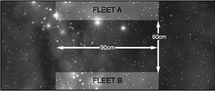

# Scenario One: Cruiser Clash

The Cruiser Clash is an introduction to the Battlefleet Gothic rules. We
suggest you play it several times when you’re learning the rules, adding
in extra rules from the Alternatives section as you become more familiar
with the way the game works. After a couple of games you should hopefully
be able to play a game using just the information on the playsheets.
In this battle, two forces of opposing cruisers have run into each other near to a
system’s jump point. Seeing their hated enemies, they immediately attack. The
side which can inflict the most damage on the enemy will emerge victorious.

## Forces

Each fleet consists of between one and
four cruisers (both sides have the same
amount). Each ship is worth no more
than 185 points and should be chosen
from the appropriate fleet list. Refer to
the fleet lists for characteristics, etc.,
of the different cruiser classes.

## Battlezone

For your first game, we suggest you do
not place any celestial phenomena.

## Set-up

Remember to roll for the [Leadership](../the-rules.md#leadership)
values of your ships before setting
them up, using the Leadership table
on [pg. 45](../the-rules.md#starting-leadership-values) (also on the playsheet).

One player rolls a dice. On a 1, 2 or 3
they set up in the area marked Fleet A
on the map. On a 4, 5 or 6 their ships
must be set up in the Fleet B zone.

Next, both players roll a dice. The player with
the lowest score sets up one of his cruisers
first. The other player then sets up one of
his ships and the players alternate deploying
ships until all the cruisers are on the table.

Ships may be put anywhere in the player’s
own deployment zone, but must be placed
facing towards the opposite long table edge.

## First Turn

Both players roll a dice. The player with
the highest score may choose whether
to have the first or second turn.

## Game Length

The game lasts until the players have
had eight complete turns each or until
one fleet has all its ships destroyed.

## Victory Conditions

Normal [victory points](../scenarios.md#victory-points) are not used in this
scenario. Instead, at the end of the game,
each player scores 1 point for each point of
[damage](../the-shooting-phase.md#damage) they have inflicted on the enemy
ships. A player scores an additional point
for each [crippled](../the-shooting-phase.md#crippled-ships) enemy ship, or 3 additional
points for each [destroyed](../the-shooting-phase.md#catastrophic-damage) enemy ship.

For example, if an enemy ship suffers 5
points of damage this earns the opposing
player 5 points and an additional point
because the ship has been crippled. Note
that you only receive 3 additional points
for destroyed ships – you do not also
get the single point for the ship having
been crippled before it was destroyed.

The player who scores the most
victory points is the winner.

## Cruiser Clash Alternatives

After you have played this scenario once
or twice, you may like to introduce some
of the other Battlefleet Gothic rules.

### Forces

One thing you could do is remove the
restriction on the maximum points value
of the cruisers, which means that you’ll be
able to take cruisers with [nova cannons](../the-shooting-phase.md#nova-cannon)
and [launch bays](../the-ordnance-phase.md#launching-ordnance) if you want. Alternatively,
you could allow each player one cruiser
with launch bays in their fleet, or some
other restriction. Refer to the [Fleet lists](../fleet-lists.md) for
the points values of different cruisers.

As another alternative, the players can pick
any number of cruisers, up to an agreed
points value, using their fleet list. A good size
to start with is 750 points, or 1,000 points
if you want to include fleet commanders in
your game. Fleet commanders are Admirals
and Warmasters who lead the fleets into
battle. The rules for fleet commanders and
the fleet commander options available to a
player are given at the start of the fleet lists.

### Battlezone

Once you’ve got used to moving and shooting
with your ships over an open table, you
can try placing [celestial phenomena](../the-battlefield.md#celestial-phenomena) on the
tabletop. First of all, place a few gas and dust
clouds on the table and after you’ve played
with those a couple of times you might like to
add a planet or some asteroid fields as well.

When you’ve got an idea of how these
basic types of celestial phenomena work
in the game (and the tactics you can use
to make the most of them), you can use
the full [celestial phenomena](../the-battlefield.md#celestial-phenomena) rules. If you
do this, roll a dice – on a roll of a 1, 2 or 3
the battle takes place in the [outer reaches](../the-battlefield.md#5-outer-reaches-generator);
on a 4, 5 or 6 the battle is fought in [deep
space](../the-battlefield.md#6-deep-space-generator). See the [Celestial Phenomena](../the-battlefield.md#celestial-phenomena) section
starting on [pg. 104](../the-battlefield.md#celestial-phenomena) for more details.

### Set-up

You may like to use the Set-up rules for
the [Fleet Engagement on pg. 142](fleet-engagement.md#set-up).

### Victory Conditions

Rather than adding up damage points, you
can use the [victory points](../scenarios.md#victory-points) system in the
introduction to the [Scenarios](../scenarios.md) section.
