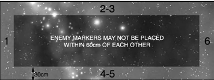

# Scenario Eight: Escalating Engagement

_**Two opposing fleets are in the area, each unsure of the enemy’s size and
disposition. As they split to spread their search wider, two groups come
into contact and signal the rest of their fleets. Whose ships will arrive
first? Will they be able to overcome the enemy? Only time will tell ...**_

## Forces

Both players’ fleets are split into five
divisions. Each player takes five Contact
markers to represent their divisions
and assigns part of their fleet to each
marker. Note down which vessels and
[squadrons](../squadrons.md) are allocated to each marker.

There are no restrictions as to what ships
can be in a division. Once a division moves
onto the table, it is not constrained to stick
together like a squadron. However, all five
Contact markers must be allocated to at least
some ships and they are drawn randomly,
so an even split of forces is best. Also be
warned that the time a division takes to arrive
depends on the speed of its slowest vessel.

## Battlezone

Escalating engagements can occur anywhere
from [deep space](../the-battlefield.md#6-deep-space-generator) to far inside a contested
system, hence any method for placing
[celestial phenomena](../the-battlefield.md#celestial-phenomena) which can be mutually
agreed by the players is acceptable.

## Set-up

At the start of battle, each player has only one
division on the tabletop: the others arrive as
reinforcements later. Each player randomly
chooses one Contact marker for their starting
force. Roll to see who places their marker
first. A marker may be placed anywhere on
the table that is not within 30 cm of a table
edge or within 60 cm of an enemy marker.

Once both markers have been placed, deploy
the ships from the divisions they represent
anywhere within 10 cm of the marker.

## First Turn

Once all ships have been deployed both
players roll a D6 and the player with the
higher score has the choice of whether
to take the first or second turn.

## Special Rules

In the [End Phase](../the-end-phase.md) of each
player’s turn, the player
randomly chooses another
one of their Contact
markers and places it
along a randomly rolled
table edge within the
following restrictions:

* The marker may not be placed within 60 cm
of any enemy ships.

* If there are friendly
ships within 30 cm
of the table edge the
marker must be placed
within 30 cm of them.

At the beginning of a player’s
turn, he can try to bring
additional ships into play by
rolling a D6 for any Contact
marker that is already in
place on a table edge. The
minimum score needed to
bring the ships represented
by that marker into play
depends on the speed of the
slowest ship in the division:

| DIVISION’S SPEED | SCORE NEEDED TO ARRIVE* |
| :-: | :-: | 
| up to 20 cm | 5+ |
| 25 | 4+ |
| 30 cm or more | 3+ |

_*If friendly ships are within
30 cm of the Contact marker
add +2 to the dice roll._

If the roll equals or beats
the number needed, the
ships of that division may
move on to the table from
anywhere along the table
edge that is within 10 cm
of the Contact marker.

If the roll is failed, the
Contact marker may be
moved along the table edge
by up to the speed of the
slowest ship in the division.

## Game Length

The game lasts until one fleet
disengages or is destroyed.

## Victory Conditions

Both fleets score [victory
points](../scenarios.md#victory-points) as normal and the
fleet with the highest
victory points total at the
end of the battle wins.
