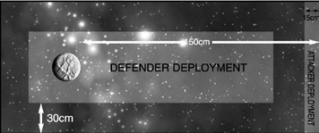
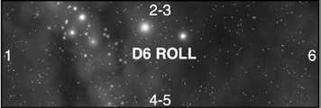

# Scenario Nine: Exterminatus

_**The attacking fleet is escorting Exterminators, ships capable of laying
waste to entire planetary populations or even obliterating all life on a
world in a matter of hours. The Exterminator fleet must be stopped and
every ship in the vicinity is rushing to defend the threatened planet.**_

## Forces

Agree a points total for the game. The attacker
chooses a fleet up to this points value and in
addition may take specialised Exterminator
ships. The attackers may include a ship
modified to become an Exterminator for
every 1,000 points (or part) in his fleet (i.e.
up to 1,000 points = one Exterminator,
1,001-2,000 points = two Exterminators,
etc.). Nominate any capital ship to be an
Exterminator: the ship’s prow armament is
replaced by an Armageddon weapon, which
can only be used against planetary targets (in
effect the prow weapon is lost). An attacking
Chaos fleet may choose to include an active
Blackstone Fortress (with the rules given in
the Chaos Ships fleet list) instead of using
modified capital ships. In this case the fortress
does not sacrifice any of its weaponry to
enable it to carry an Armageddon weapon.

The defender chooses a fleet to defend
the planet and will receive additional
reinforcements throughout the game. The
defender may spend an extra D6×10 points
on planetary defences for every 500 points
(or part) in his fleet (i.e. 10-60 points for
up to 500 points of ships, 20-120 points
for 501-1,000 points of ships, etc.).

## Battlezone

The battle is fought in the [primary](../the-battlefield.md#4-primary-biosphere-generator) or [inner
biosphere](../the-battlefield.md#3-inner-biosphere-generator). Place a [planet](../the-battlefield.md#planets) no more than
150 cm from one of the short table edges
(roll a D6 to determine size: 1 = small,
2-5 = medium, 6 = large), generating [rings](../the-battlefield.md#ringed-planets),
[moons](../the-battlefield.md#moons) etc. as normal. Declare one table
edge as [sunward](../the-battlefield.md#fighting-sunward), as detailed in the [Celestial
Phenomena](../the-battlefield.md#celestial-phenomena) rules and place extra phenomena
following whichever method you choose.

## Set-up

The defender has most of his fleet stationed
near to the planet as the enemy approaches,
but several ships or squadrons are out on
patrol and arrive later in the engagement.
The defender must pick one capital ship
or escort squadron to be on patrol for each
500 points in his fleet. These are kept to
one side, not deployed at the start of the
game. The remainder of the defending fleet
may be deployed anywhere on the tabletop,
but not within 30 cm of a table edge.

The attacker sets up his entire fleet
within 15 cm of the table edge which
is furthest from the planet.

You will also need a separate [low orbit](../the-battlefield.md#fighting-in-low-orbit) table, as
described in the [Celestial Phenomena](../the-battlefield.md#celestial-phenomena) section.

## First Turn

Each player rolls a dice and the player
with the higher score may choose
whether to go first or second.

## Special Rules

The Exterminator/s must enter [low orbit](../the-battlefield.md#fighting-in-low-orbit) and
move to within 45 cm of the planet table edge.
At the start of each turn that an Exterminator
is within 45 cm of the planet table edge, roll
a dice. On a roll of a 4 or more it activates
its Armageddon weapon and triggers a
catastrophic event that will obliterate all life
on the planet! The defenders may always
target an Exterminator – if it is not the closest
target then no [Leadership](../the-rules.md#leadership) test is required.

The defending fleet rolls for the arrival of its
patrols at the start of each of the defender’s
turns. Roll a D6 for each defending capital
ship and escort squadron which is not in
play and compare it to the table below.

| SHIP’S SPEED | SCORE NEEDED TO ARRIVE |
| :-: | :-: |
| up to 20 cm | 5+ |
| 25 | 4+ |
| 30 cm or more | 3+ |

If the roll equals or beats the number
shown, the ship arrives as a reinforcement
on a randomly determined table edge.

_**Note:** If this scenario is being played
as part of a campaign and the planet is
destroyed roll on the table that follows._

| D6 ROLL | RESULT |
| :-: | --- |
| 1-3 | The system becomes uninhabited, mark it as such on the sub-sector map. |
| 4-6 | The system’s primary world is destroyed but one or more other planets still bear life. Roll again to see what the system becomes: 1-3 agri-world, 4-6 mining planet. |

## Game Length

The game ends when one fleet disengages, all
the attacker’s Exterminators are destroyed,
or an Exterminator destroys the planet.

## Victory Conditions

If one fleet disengages then it loses.
If all the attacking Exterminators are
destroyed, the defender wins. If the planet
is destroyed then the attacker wins!
