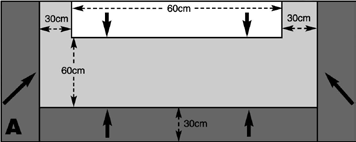
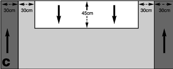
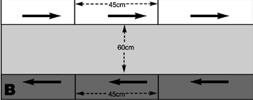
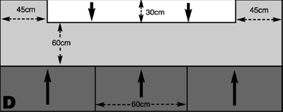

# Scenario Ten: Fleet Engagement

_**Although many space battles are fought between relatively small forces
with very specific objectives – raiding convoys, making surprise strikes
and so on – larger fleets will sometimes bring each other to battle to
protect a system, hold the line or simply to destroy each other.**_

## Forces

Both fleets are picked to an equal points value.

## Battlezone

Fleet actions are normally fought in the
[primary](../the-battlefield.md#4-primary-biosphere-generator) or [inner
biosphere](../the-battlefield.md#3-inner-biosphere-generator) to keep a
particular world outside bombardment
range, but they could take place anywhere.
[Celestial phenomena](../the-battlefield.md#celestial-phenomena) can be set up in
any mutually agreeable manner.

## Set-up

Each player must choose one of the
following fleet formations. Compare
the two formations chosen on the table
below and use the set-up indicated.

**Sphere:** This formation attempts to spread
the fleet broadly so that it envelops the enemy
fleet, surrounding it as the ships close in. The
sphere is vulnerable to a wedge formation
which will break through the closing net.

**Wedge**: A wedge is easily surrounded by more
complex formations such as the sphere and
cross. However a wedge keeps the fleet closely
packed together for mutual support and allows
it to storm through thinly-spread opponents.

**Cross:** A formation which spreads ships
out to run parallel with the enemy
fleet, keeping them on the broadside
for an extended engagement.

<table>
    <thead>
        <tr>
            <th>&nbsp;</th>
            <th colspan="3" align="center">OPPONENT'S CHOICE</th>
        </tr>
        <tr>
            <th align="center">YOUR CHOICE</th>
            <th align="center">Sphere</th>
            <th align="center">Wedge</th>
            <th align="center">Cross</th>
        </tr>
    </thead>
    <tbody>
        <tr>
            <th align="center" scope="row">Sphere</th>
            <td align="center">B</td>
            <td align="center">A(d.grey)/C(d.grey)</td>
            <td align="center">A(d.grey)/D(d.grey)</td>
        </tr>
        <tr>
            <th align="center" scope="row">Wedge</th>
            <td align="center">A(white)/C(white)</td>
            <td align="center">D(d.grey)/D(white) </td>
            <td align="center">B</td>
        </tr>
        <tr>
            <th align="center" scope="row">Cross</th>
            <td align="center">A (white)/D(white)</td>
            <td align="center">B</td>
            <td align="center">B</td>
        </tr>
    </tbody>
</table>

**Notes:** In a split result (i.e. A(d.grey)/D(d.grey)) both players roll a D6 to see which set-up is
used. The player whose fastest ship has a higher speed than any enemy ship adds +1 to his dice
roll. The fleet with the best Admiral (i.e. highest Leadership) adds +1 to its roll. The fleet with
the most escort class ships adds +1. The winner of the dice roll may choose which set-up to use.

Once the set-up has been determined, both players roll a D6 and the player who rolls the lowest
has to deploy a squadron or lone ship in their set-up area first. The players then alternate
deploying ships or squadrons in their set-up areas until all forces have been deployed.

### Divisions

Some set-ups split a fleet’s deployment zone
into several divisions. When this happens
the fleet must deploy at least one ship or
squadron in each division available.

### Approach Angle

The set-up maps have arrows indicating the
approach angle for the opposing fleets. As
ships are deployed, they must be orientated
so that they are travelling in the same
direction as the arrows in their division.

## First Turn

Once all ships have been deployed both players roll a D6 and the player with the
higher score has the choice of whether to take the first or the second turn.

## Game Length

The game lasts until one fleet disengages or is destroyed.

## Victory Conditions

Both fleets score [victory points](../scenarios.md#victory-points) as normal and the fleet with the highest victory points total wins.
