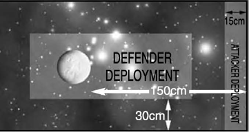

# Scenario Seven: Planetary Assault

_**One fleet is attempting to deploy troops onto a contested planet, either to spearhead
an invasion or reinforce existing armies. They must smash through the defenders
and hold off any counter-attack while they send troops down to the planet’s surface.**_

## Forces

Both fleets are of equal points. The
defender can spend an extra D6×10
points on [planetary defences](../planetary-defences.md) for every
500 points (or part) in his fleet. The
attacker may take two free transports for
every 500 points (or part) in his fleet.

## Battlezone

A planetary assault normally takes place in
the system’s [primary](../the-battlefield.md#4-primary-biosphere-generator) or [inner biosphere](../the-battlefield.md#3-inner-biosphere-generator). Place
a [planet](../the-battlefield.md#planets) no more than 150 cm from one of
the short table edges (roll a D6 to determine
size: 1 = small, 2-5 = medium, 6 = large)
and generate [rings](../the-battlefield.md#ringed-planets), [moons](../the-battlefield.md#moons) etc. as normal.
Declare one table edge as [sunward](../the-battlefield.md#fighting-sunward) and set
up other [celestial phenomena](../the-battlefield.md#celestial-phenomena) as normal.

## Set-up

The defender can choose to place ships and
[squadrons](../squadrons.md) either on patrol or on standby in
high orbit within the planet’s gravity. Roll
a D6 for each defending ship/squadron on
patrol: 1-3 the attacker may set up the ship/
squadron, on a 4-6 the defender may set it
up. Ships on patrol may be set up anywhere
that is not within 30 cm of a table edge or
within an area of [celestial phenomena](../the-battlefield.md#celestial-phenomena). The
defender always decides the facing of ships,
regardless of who set them up. The attacker
deploys his fleet within 15 cm of the short
table edge furthest from the planet. You
will also need a separate [low orbit](../the-battlefield.md#fighting-in-low-orbit) table.

## First Turn

The players roll a D6. Whoever got the highest
may take either the first or second turn.

## Special Rules

Attacking ships must move within 30 cm
of the planet table edge on the low orbit
table to send troops to the surface and
bombard enemy positions. For each turn
an attacking capital ship spends within
30 cm of the planet edge, the attacker scores
1 assault point. For each turn an attacking
transport spends within 30 cm of the planet
edge, the attacker scores 2 assault points. A
ship deploying troops or bombarding the
planet may not do anything else that turn.

## Game Length

The game lasts until one fleet is destroyed
or disengages, or the attacker has
scored 10 or more assault points.

## Victory Conditions

Add up the assault points earned by the attacker and add +1 to the total for every 500 victory
points (rounding down) scored by the attacker for destroying or crippling ships and planetary
defences. Deduct -1 assault point for every 500 victory points (rounding up) scored by the
defender. Look up the adjusted assault point total on the table below.

| TOTAL ASSAULT POINTS | RESULT |
| --- | --- |
| 0-1 | **Defender’s Victory** The attacking forces achieved almost nothing. The pitiful amount of assaulting troops that reached the planet will be quickly annihilated. |
| 2-5 | **Defender’s Marginal Win** The assaulting forces are prevented from making a substantial landing on the planet. Nonetheless, enemy detachments will now have to be hunted down and destroyed. |
| 6-9 | **Attacker’s Marginal Win** The assault dropped enough troops, etc., to capture a large part of the planet’s resources. Ongoing battles for control of the world will rage for months, even years. |
| 10+ | **Attacker’s Victory** The attackers succeeded in sweeping aside the defending forces and staging decisive landings at key points all over the planet. Within a few weeks of mopping up, the attackers will have complete control of the planet. |
