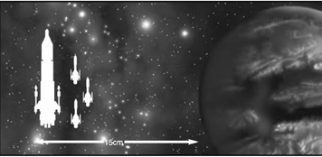
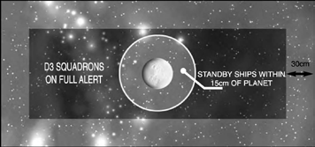

# Scenario Four: Surprise Attack

_**The attacking fleet has launched a pre-emptive strike against the enemy, catching
them unawares while they are still taking on stores in dock. The defenders must try
to muster a defence as quickly as possible, before they are destroyed piecemeal.**_

## Forces

Both fleets are picked to an equal points value.
In addition, the defender may spend an extra
D6×10 points on [planetary defences](../planetary-defences.md) for every
500 points (or part) in his fleet (i.e. 10-60
points for up to 500 points of ships, 20-120
points for 501-1,000 points of ships and so on).

## Battlezone

A surprise attack normally takes place in the
system’s [primary](../the-battlefield.md#4-primary-biosphere-generator) or [inner biosphere](../the-battlefield.md#3-inner-biosphere-generator). Set up a
[planet](../the-battlefield.md#planets) in the middle of the table. The planet’s
size depends upon the size of the battle: up
to 500 points = small, between 500 to 1,500
points = medium, over 1,500 points = large.
Generate [rings](../the-battlefield.md#ringed-planets), [moons](../the-battlefield.md#moons), etc. as normal. Then
determine which table edge is [sunward](../the-battlefield.md#fighting-sunward) and
place other [celestial phenomena](../the-battlefield.md#celestial-phenomena) as normal.

## Set-up

At the start of the game, the defender may
choose D3 ships or [squadrons](../squadrons.md) to be on full
alert. These ships may be set up anywhere
on the table that is at least 30 cm from
a table edge. The rest of the defending
fleet is still on standby. Squadrons on
standby must be deployed with at least
one ship within 15 cm of the planet and
all ships abeam of the planet’s surface.
The attackers move on to the table edge
of their choice in their first turn.

## First Turn

The attacker gets the first turn.

## Special Rules

Ships or [squadrons](../squadrons,md) on standby may not
move, fire weapons or launch ordnance.
They may however attempt to [*Brace for
Impact!*](../the-rules.md#brace-for-impact) and repair [critical damage](../the-shooting-phase.md#critical-hits). [Turrets](../the-ordnance-phase.md#turrets)
and [shields](../the-shooting-phase.md#shields) work normally. To go on alert
status, it must first pass a [Leadership](../the-rules.md#leadership) Test.
Note that this is not a [Command check](../the-rules.md#taking-command-checks), so
failing with one squadron or ship will not
prevent you from testing the others. A ship
or squadron may not use [special orders](../the-rules.md#special-orders) on
the same turn that it goes on alert status.

## Game Length

The game lasts until one fleet
disengages or is destroyed.

## Victory Conditions

Both fleets score [victory points](../scenarios.md#victory-points) as normal
and the fleet with the highest victory
points total at the end of the battle wins.
