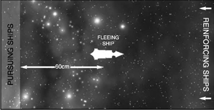

# Scenario Two: The Bait

_**A lone ship has been sent into a system to lure out the defending
forces in an extended pursuit. Unknown to the pursuers, the
fleeing vessel has some friends lying in wait up ahead.**_

## Forces

This scenario is a raid, so it plays well
with forces worth up to 750 points.
These are divided up as shown below.

**Pursuing forces:** Up to 500 points.

**Pursued forces:** One ship or squadron
worth up to 250 points initially, with
up to 500 points of reinforcements.

## Battlezone

This battle is most likely to take place in the
outer reaches at the edge of a system, or in
deep space near the jump point. If you are
using a random battlezone generator, roll a
D6: 1-3 = [outer reaches](../the-battlefield.md#5-outer-reaches-generator), 4-6 = [deep space](../the-battlefield.md#6-deep-space-generator).

## Set-up

The pursued vessel is placed in the
centre of the table first, facing one
of the short edges. The pursuers are
deployed more than 60 cm away behind
it. Reinforcements for the pursued ship
enter from the table edge in front of it.

## First Turn

The fleeing ship takes the first turn.

## Special Rules

Any reinforcements for the fleeing ships may
enter the table on any turn, including Turn 1.
If the reinforcing ships enter after turn 1,
they may be deployed up to 30 cm along the
long table edges for each turn after the first.

*For example, a Slaughter class cruiser
enters as reinforcements on turn 4, so it
may be placed on the short table edge or
up to 90 cm along one of the long edges.*

## Game Length

The game continues until one fleet
disengages or is destroyed.

## Victory Conditions

Standard [victory points](../scenarios.md#victory-points) are earned
for ships crippled or destroyed.
