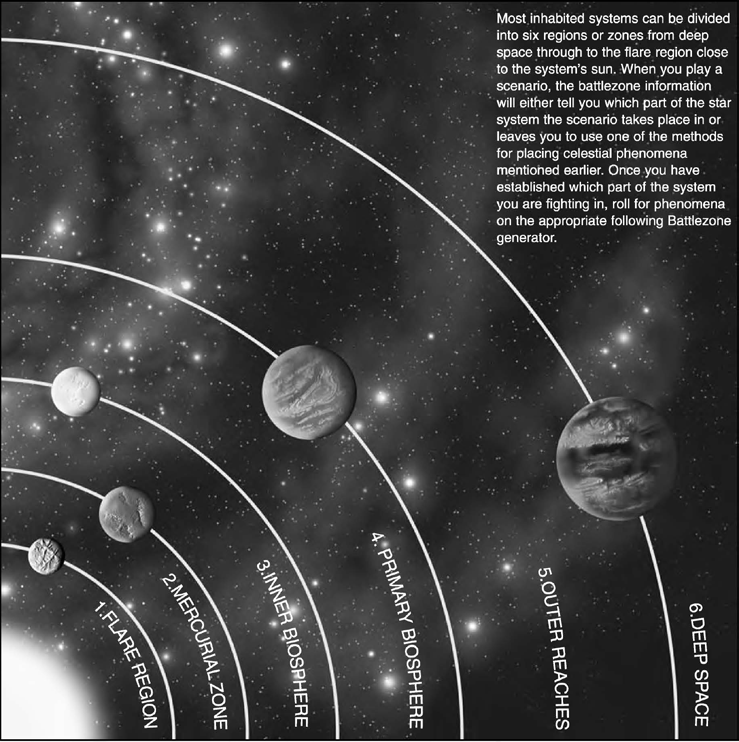
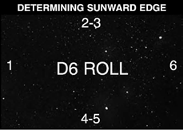
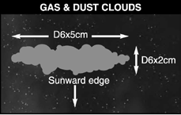
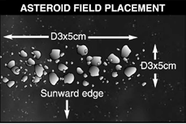

# The Battlefield
In order to fight a battle you will need somewhere to set up
your battlefield – any flat, stable area will do. Some people
make do with a smooth bit of floor but most use a kitchen or
dining table (preferably protected by a cloth or blanket).

By far the best option, if it’s available, is to fight over a gaming board
made up of sheets of chipboard, plywood or MDF laid over another
table. Typically the battlefield should be between 6' to 8' long (around
1.8 metres to 2.4 metres) and 4' to 6' wide (1.2 to 1.8 metres).

You can play on a smaller area quite easily but you’ll need
to keep the forces that are fighting proportionately smaller
to ensure that you’ve got some room to manoeuvre.

## Celestial Phenomena

Space, the void, vacuum.
Sounds empty, but actually
there’s all kinds of stuff
floating around between the
stars. It’s not exactly densely
packed, of course, but it
has its effects on navigation
and combat, so, strategy
being what it is, this means
that battles will usually be
fought around and over it.
For example, dust clouds and
asteroid fields are enough to
force a ship to slow down as
it passes through the area,
making it an ideal spot for an
ambush. Equally, capturing
or raiding worlds will always
be an objective of enemy
ships, ensuring that space
combat will often happen in
close proximity to planets.

Incidentally this section is
called Celestial Phenomena
because terrain simply didn’t
seem like the right word.
Nonetheless this is terrain
for space battles and it forms
an important part of the
game – so don’t skimp on it!

So you’ve got your battlefield,
but it’s a featureless, empty
void. While this might be
appropriate if you’re in the
depths of space it makes for
a rather dull battle. Celestial
phenomena are an important
feature of every battlefield.
A good commander will use
them to his best advantage
during a battle, blocking
the enemy’s lines of fire,
getting his heavy ships into
good firing positions and
concealing his escorts until
they are ready to strike.

Building up a collection of
scenery to represent celestial
phenomena is an important
and enjoyable part of the
hobby, as it enhances your
games. Most types can be
easily represented on the
tabletop at minimal cost
using sand, pebbles, etc.
Beyond this there are almost
limitless opportunities
for making scenery easily
and cheaply. With a little
effort you will soon become
an expert at constructing
planets, moons and other
phenomena out of the most
mundane of household
goods. You can find plenty
of examples of home made
scenery online and the
White Dwarf magazine
often contains articles about
making scenery and can
serve as an invaluable source
of ideas and inspiration.

## Placing Celestial Phenomena On The Battlefield

There are many ways to
set up celestial phenomena
and any method is perfectly
acceptable as long as it creates
a fair battlefield. Remember
that the purpose of setting
up celestial phenomena is
to provide an entertaining
and interesting battlefield,
not to impede movement or
lines of fire so much that it
becomes almost impossible
to actually fight the enemy.
If a piece of scenery is going
to be a major feature of
the battle, such as a wide
asteroid belt spanning the
table, then you need to okay
this with your opponent.
This sort of battlefield is
perfectly fine and might
make for an enjoyable game
but you and your opponent
would have to agree upon
it beforehand. Here are
some different methods
you might employ when
setting up your battlefield.

### Setting Up Celestial Phenomena: Method 1

One of the players positions
all the celestial phenomena
on the table. His opponent
can then pick which table
edge to deploy from. Many of
the scenarios require you to
roll for choice of table edges,
but if one player has set up
the celestial phenomena
then it is only fair that his
opponent chooses which
board edge to deploy from.
This is a good method if you
are playing a game at one
player’s house, as he can set
up the celestial phenomena
before his opponent arrives,
allowing you to get straight
on with the battle.

### Setting Up Celestial Phenomena: Method 2

Divide the table into 60 cm
square areas. Next roll a
D6 for each area. On a 4
or more the area contains
celestial phenomena which
is determined using the
appropriate battlezone
generator. Roll a D6 to
determine which of the
generators to use for this
battlefield (or agree on one
with your opponent) and
then roll on that generator for
celestial phenomena in each
area. Position the phenomena
anywhere within the area,
but don’t place them on top
of each other. We’ve included
a set of sample battlezone
generators over the following
pages, but it’s easy enough
to come up with your own
customised ones that include
all the celestial phenomena
in your own collection.

### Setting Up Celestial Phenomena: Method 3

As a variant, you can use
the fleets’ attack ratings to
determine which battlezone
the battle is fought in. This
represents the two fleets
trying to pick their ground
by offering battle where it
suits them best. Each player
secretly chooses a battlezone
and adds the number of
the battlezone to his fleet’s
attack rating. Both players
then declare their total score.
The player with the highest
score wins and the battle is
fought in the zone he chose.

## Battlezones

### 1. Flare Region Generator

The flare region is closest to the system’s
sun. It is an area scoured by incandescent
flares of super­heated gas from the surface
of the sun and fierce radioactive winds.
Planets this close to the star are almost
always death worlds, places too ravaged
by the sun’s heat to be habitable to life.

| D6 ROLL | RESULT |
| --- | --- |
| 1 | Solar flare |
| 2 | Solar flare |
| 3 | Radiation burst |
| 4 | Asteroid field |
| 5 | D3 gas/dust clouds (generally a solar flare remnant) |
| 6 | Planet (roll again: 1-5 = small, 6 = medium)* |

### 2. Mercurial Zone Generator

At the mercurial zone the sun’s ferocity is
still awesome to behold, but solar flares less
frequently reach out to burn everything
in their path. Occasionally a planet can
be found in the mercurial zone which can
sustain limited life deep underground
or constantly moving around its dark
side to shelter from the sun’s rays.

| D6 ROLL | RESULT |
| --- | --- |
| 1 | Solar flare |
| 2 | Radiation burst |
| 3 | Asteroid field |
| 4 | D3 gas/dust clouds (solar filaments or flare remnants) |
| 5 | D3 gas/dust clouds (solar filaments or flare remnants) |
| 6 | Planet (roll again: 1-5 = small, 6 = medium)* |

### 3. Inner Biosphere generator

As the inner biosphere is reached,
planets become more hospitable, though
often their atmospheres are a noxious
soup of harmful gases. Nonetheless
colonies and hive cities occur in the
inner biosphere of certain systems.

| D6 ROLL | RESULT |
| --- | --- |
| 1 | Roll again: 1-3 = Radiation burst; 4-6 = solar flare |
| 2 | Asteroid field |
| 3 | D3 asteroid fields |
| 4 | D3 gas/dust clouds |
| 5 | D3 gas/dust clouds |
| 6 | Planet (roll again: 1-5 = small, 6 = medium)* |

### 4. Primary Biosphere generator

In the primary biosphere a balance is struck
between the burning heat of the sun and the
icy cold of the void. Most inhabited worlds
lie within this biosphere and it’s here that
the bulk of a system’s defences are built.

| D6 ROLL | RESULT |
| --- | --- |
| 1 | Asteroid field |
| 2 | D3 asteroid fields |
| 3 | Gas/dust clouds |
| 4 | D3 gas/dust clouds |
| 5 | Planet (roll again: 1-5 = small, 6 = medium)* |
| 6 | Planet (roll again: 1-5 = small, 6 = medium)* |

### 5. Outer Reaches Generator

The outer reaches of a system are the
realm of gas giants and worlds generally
too cold and harsh to support life. Many
battles between ships occur here as the
system’s defenders attempt to prevent enemy
ships reaching the primary biosphere.

| D6 | ROLL RESULT |
| --- | --- |
| 1 | D3+1 asteroid fields |
| 2 | D3 asteroid fields |
| 3 | D3 gas/dust clouds |
| 4 | Gas/dust cloud |
| 5 | Planet (roll again: 1-3 = small, 4-6 = large)* |
| 6 | Planet (roll again: 1-3 = small, 4-6 = large)* |

### 6. Deep Space Generator

Ships coming out of the warp must appear
some distance away in deep space or risk
destruction among the graviton surges
in-system. Many civilised worlds have
specific jump points marked by beacons to
assist navigation. An ambushing fleet will
often lurk near a jump point in the hope
of catching an emerging foe unaware.

| D6 | ROLL RESULT |
| --- | --- |
| 1 | D3 asteroid fields |
| 2 | Asteroid fields |
| 3 | D3 gas/dust clouds |
| 4 | Gas/dust cloud |
| 5 | Warp Rift |
| 6 | Small planet (a rogue planet in a highly eccentric orbit)* |

*\*In all cases a maximum of one planet will
be present on the tabletop: if a second planet
is generated roll again. Remember to roll
to see whether a planet has any moons.
If a large planet is generated, it will have
rings around it on a D6 roll of 4 or more.*

## Tabletop Features

The following features are
celestial phenomena that
are placed onto the tabletop.
Remember to leave plenty of
empty space between them.

Tabletop features are
generally placed in relation
to the nearest star. This is
because nearly everything
caught in the inconceivably
gross gravitational pull
of a star will be in some
kind of orbit around it.

When placing these features,
start by determining which
table edge is closest to the
nearest star, described as
“sunward” in Battlefleet
Gothic. To do so roll a D6.

Once you have established
which way is sunward, you
can start to place celestial
phenomena. Each of the
types is listed as follows with
suggested sizes and methods
of placement. However, if
you have phenomena made
up on bases of a particular
size or something similar
just use them the way they
are. Likewise, don’t let the
following suggestions stop
you from doing something
interesting or exciting: they
are just there as guidelines to
take some of the brain ache
out of setting up the tabletop,
not as definitive rules.

Any celestial phenomena
affect a ship as soon as
it contacts a ship’s base.
However, it does not
block fields of fire unless
it physically blocks line
of sight from the stem of
the shooting ship to the
stem of the target ship.

As warp drive implosions
are not affected by celestial
phenomena for purposes of
line of sight, this includes
when it takes place inside
celestial phenomena such
as asteroid fields. Being
inside, outside or the other
side of an asteroid field
from an exploding ship
does not affect whether or
not it is in the explosion’s
3D6 cm blast radius.

### Gas And Dust Clouds

Gas and dust clouds represent
areas of space with a notably
greater density of (mostly)
hydrogen gas or tiny particles
of matter. These clouds may
be fragments left over from
the formation of stars and
star systems, the outer fringes
of nebulae or protostars, or
even gasses ejected by solar
flares. They represent a
moderate navigational hazard
to shipping: basic shielding
is sufficient to prevent
damage occurring but ships
are slowed somewhat by
passing through them. Gas
and dust clouds impair
targeting by weapon batteries
and may destroy ordnance
which passes through them,
making them potentially
useful areas to exploit in
ship-to-ship combat.

#### Effects

Gas and dust clouds have
the same effect as a single
Blast Marker in all respects
(i.e. on firing, movement,
shields, Leadership and
ordnance). Eldar and their
kin can make a leadership
check to ignore all effects of
gas clouds, and their escorts
may re-roll this result for
free. If passed, it will take no
damage nor suffer any effects
of being in contact with it.

If a ship having 0 shield
strength explodes due to
contact with a gas/dust
cloud, the explosion will
originate at the point the
ship entered the cloud.

#### Placement

Use flock or cotton wool
to show gas & dust clouds,
usually found in bands or
streamers running parallel
to the sunward table edge.
Each band is D6×2 cm
wide and D6×5 cm long.

### Asteroid Fields

Asteroid fields orbit most
stars at varying distances.
They are generally thought
to be debris fragments left
over from collisions between
planets during the formation
of a star system. Asteroid
fields may also be left over
after the destruction of a
planet or moon, or represent
an area of wreckage resulting
from a space battle.

#### Effects

An asteroid field blocks line
of fire and any torpedoes
that strike it are detonated.

Ships moving through an
asteroid field, or coming
into base contact with the
edge of one, must pass a
Leadership test on 2D6 to
navigate it successfully.

Ships using *All Ahead
Full* special orders make
the test on 3D6 instead.

Escort ships may re-roll the
Leadership test if they fail
it, but the second roll stands
whether it is successful or
not. A ship that fails the
Leadership test suffers
D6 damage from asteroid
impacts, but its shields will
block damage as normal.

Escort and capital ship
squadrons make this
leadership test normally, once
for the whole squadron. In the
case of capital ship squadrons
that fail this test, each ship
that comes in base contact
with the asteroid field in
any way suffers D6 damage.
Escort squadrons re-roll this
leadership test for free. In
the case of escort squadrons
that still fail this re-roll, D6
damage is distributed among
the escorts that actually
contacted the asteroid field,
in the order that the ships
were moved. In all cases,
shields (but not holofields)
work normally against hits.

Blast Markers are not
placed when asteroid
impacts take shields down,
however the ship will be
slowed down 5 cm as if it
has moved through Blast
Markers that turn.

Hulks which drift into an
asteroid field are destroyed.

Attack craft squadrons
which move through an
asteroid field are destroyed
on a D6 roll of 6.

Ships cannot shoot into
or out of an asteroid field.
However, shooting between
ships inside an asteroid field
can take place only if both
the shooting and target ships
are both inside an asteroid
field. Lances and weapons
batteries have no more than
10 cm range, nova cannons
don’t work and torpedoes
of any type cannot be used.
Shooting at enemies within
10 cm range does not impart
a left column shift when
inside an asteroid field.

Attack Craft work normally
but must make a D6 roll
every Ordnance Phase they
remain in the field, with
every wave or individual
marker removed on a roll
of 6. Ships that are braced
or crippled may not shoot
inside an asteroid field.

If you wish to shoot at an
asteroid field, you must first
pass a leadership test even if
it is the only possible target.
Treat it as an Ordnance
marker. For every roll of
6, place a Blast Marker in
contact with the asteroid
field facing the direction
the shooting came from. In
each end phase, each asteroid
field will lose D6 Blast
Markers and these do not
count towards the number
of other Blast Markers that
can be removed that turn.

#### Placement

Asteroid fields can be
represented by an area of
rocks, pebbles, gravel or
kitty litter (unused!). Like
gas and dust clouds, asteroid
fields are placed so that they
run parallel to the sunward
table edge. Typically,
asteroid fields are D3×5 cm
wide and D3×5 cm long.

### Warp Rifts

Occasionally, a temporary
rift can occur between
normal space and warp
space, particularly during
a powerful warp storm
or after a large fleet has
dropped out of the warp.
Moving into such a rift is
highly dangerous, but may
well provide an edge for a
desperate or foolish captain.

#### Effects

A warp rift blocks line of fire
and any torpedoes that strike
it are detonated. Hulks which
drift into a rift disappear,
never to be seen again, so
they may not be salvaged
after the battle. Attack craft
squadrons which move
into a rift are destroyed.

Ships moving into a warp
rift must pass a Leadership
test on 3D6 to navigate it
successfully. If the ship
passes the test, it may
be repositioned up to
2D6×10 cm away from
the rift, pointing in any
direction. If it fails, the ship
disappears from the battle
altogether – lost in the warp!

Roll a D6 for each ship lost
in the warp after the game:
on a 1 it is lost in the warp
forever, doomed to drift on
the tides of the immaterium
until its crew die, on a 2-6
it is only temporarily lost
and will eventually find
its way back to the fleet.

#### Placement

Use a strip of white paper,
cloth or cotton wool to
represent a warp rift.
The rift is D3×5 cm wide
and D3×10 cm long.

## Planets

Less than 1% of systems
have planets orbiting a
solitary star in the manner
of ancient Terra. Even so,
there are millions of star
systems containing billions
of worlds scattered across
the galaxy. Most planets are
either desolate, empty and
airless, or surrounded by an
atmosphere too noxious to
support life. In the Gothic
sector there are over two
hundred inhabited worlds
and tens of thousands
of other planets. Planets
often become the focus of
space battles as opposing
fleets attempt to establish
forward bases or extend
their control throughout
a contested system.

#### Effects

Planets are represented by
a template or model (ball)
placed on the tabletop.

When a ship’s stem is actually
on a planetary template (as
opposed to behind it), the
template does not block its
line of sight or any ships line
of sight to it. If multiple ships
are on a planetary template,
they can all see each other.

A ship counts as being upon
a planetary template if its
stem touches the template,
not merely if it is in base
contact or if its base partially
overlaps the template.

Torpedoes are destroyed
when they come into contact
with the template’s edge,
either when launching them
toward the planet or from
it by ships in high orbit
upon the template itself. It is
possible to launch torpedoes
while on a planetary template
but they will be removed
when they touch its edge.

Hulks which drift into a
planet are also destroyed.
Ships may move ‘through’
a planet (by passing
over or under it).

Every planet is surrounded by an area of space
where its gravitational pull is strong enough to
affect shipping. This area is referred to as its
gravity well. The gravity well extends out a set
distance from the edge of the planet template
and affects a ship’s manoeuvring as follows.

#### Typical planetary templates:

* Small planet (eg the size of Mercury, Pluto or Mars) – up to 15 cm diameter.
* Medium planet (eg equivalent to Venus or Earth) – 16-25 cm diameter.
* Large planet (eg the size of Saturn or Jupiter) – 26-50 cm(!) diameter.

#### Typical gravity wells:

Small planet – up to 10 cm from template edge.

Medium planet – up to 15 cm from template edge.

Large planet – up to 30 cm from template edge.

Ships within the gravity well of a planet may
make a free 45° turn at the beginning and end
of their move, but the turn must always be
made towards the planet. The ship does not
have to move its minimum distance before
it is able to make its free turn. Free turns
provided by gravity wells can be used even
when the ship cannot normally turn, such
as when under [*All Ahead Full*](the-rules.md#all-ahead-full) or [*Lock On*](the-rules.md#lock-on)
special orders. They can also be combined
with [*Come To New Heading*](the-rules.md#come-to-new-heading) special orders.

This does not change the fact that the free
turn can only be used before the start of
the move and again only at the end of the
move. In either or both instance(s) the
ship must actually be in the gravity well
to use it, and the free turn is only toward
the centre of the planet’s or moon’s gravity
well or toward a space hulk’s stem or no
more than 45 degrees, whichever is less.

A ship within a planet’s gravity well may
elect to enter high or low orbit. A ship does
not have to move whilst it is in high orbit,
but such a stationary ship uses the defences
column for gunnery purposes if it elects to
remain stationary. A ship that enters low
orbit, however, is removed from play and
(where the scenario requires it) is placed
on a separate low orbit table. Ships moving
up from low orbit are placed touching
the outer edge of the planet template.

#### Placement

Planets are usually so far apart that only
one will be placed on the tabletop, although
in spectacular ‘When Planets Collide’
scenarios you might want to place two
planets in shockingly close proximity.

### Ringed Planets

Occasionally planets (usually the larger
ones) have rings made up of gas, dust and
asteroids. These are represented by gas
and dust clouds and/or asteroid fields
placed in a ring around the planet.

#### Placement

If there is a large planet on the table roll a
D6. On a 5 or 6 it has rings around it. Place
D3 rings around the planet, then roll a
D6 to see what sort each ring is: 1-4 = gas/
dust, 5-6 = asteroid. Each ring is D6 cm
wide and begins D6×5 cm away from the
planet’s edge. Note that some may end up
merging into one another, but that’s fine.

### Moons

Most planets have many small moons around
them and most of these are no larger than
generously sized asteroids. These rules
are confined to dealing with larger moons
several thousand kilometres in diameter.

#### Effects

Moons count as small planets in all respects,
including when deciding the effects of
their gravity wells on turning ships.

#### Placement

Medium planets typically have D3-1
moons, large planets have D6-2 moons.
Moons are up to 5 cm in diameter. A
planet’s moons are placed 2D6×10 cm from
the planet: roll randomly to see which
direction they are from the planet.

## Tabletop Effects

The following features affect the entire
battlefield. They may be combined with
tabletop features to produce, for example, a
battle around a planet close to a sun.

### Fighting Sunward

In battles close to the centre of a system, the
presence of the local star has powerful effects
on the ship’s ability to detect other vessels.
At extreme ranges, the glare of the sun will
tend to obscure the energy signature of enemy
vessels, making them difficult to target
accurately. In close proximity, an opposing
ship with the sun behind it is easier to pick
out and track using reflection surveyors and
image capture devices.

#### Effects

In the outer reaches, deep space and the
primary biosphere the light from the distant
star has no effect on combat. Fighting
sunward is only of consequence in the Flare
Region, Mercurial Zone and Inner Biosphere,
and has the following effects:

Any firing conducted towards the sunward
table edge doubles the column shifts for long
and short range.

To determine if you are shooting sunward
place the bearing compass over the firing ship
with the arrows parallel with the sunward
edge (see pg. 109 for the sunward edge). If the
target is within the arc facing the sunward
edge you are shooting sunward.

At long range (over 30 cm) the powerful
photosphere blinds long range sensors, so take
two column shifts right on the Gunnery table
instead of one. At short range (15 cm or under)
targets are ‘silhouetted’ instead, so make two
column shifts left instead of one.

### Solar Flares

Most stars periodically release explosive
bursts of energy over small areas of their
surface. Of course small, in solar terms,
means areas hundreds of millions of
kilometres across! These huge flares of energy
rush outward at tremendous speeds, flooding
the vicinity with highly charged particles and
magnetic shock waves. A shielded vessel can
find its protection virtually overwhelmed by
these events and a vessel without shields is
sure to suffer damage.

#### Effects

Roll a D6 at the start of each turn. If more
than one flare was generated as part of the
celestial phenomena roll a D6 per flare
generated. On any roll of a 6 a flare occurs,
but a flare will only manifest itself once per
game. Once a flare occurs, this roll no longer
needs to be rolled. Each ship on the tabletop
has one Blast Marker placed sunward of
them. Any ship without shields will suffer
one hit and will take critical damage on
a roll of 4 or more on a D6. Roll a D6 for
each Ordnance marker – on a 4 or more it
is removed from play. Eldar and their kin
can make a leadership check to ignore all
effects of solar flares, and their escorts may
re-roll this result for free. If passed, it will
take no damage but instead turn directly
away from the solar flare and move 2D6 cm.

### Radiation Bursts

As well as solar flares and often in conjunction
with them, a sun will frequently emit bursts
of radiation, including electromagnetic and
radio waves. These temporarily scramble any
communications traffic between ships and even
disrupt ship-board commnets. Commanding a
ship in these conditions is extremely difficult and
for this reason most commanders assiduously
avoid the flare region of the local star.

#### Effects

Roll a D6 at the start of each turn. If more
than one radiation burst was generated as
part of the celestial phenomena, roll a D6 for
each one generated. For each roll of 5 or 6 a
radiation burst occurs. Only one radiation
burst can happen per turn even if multiple
radiation burst were rolled for. Roll a D6 to see
what the interference level of the burst is and
all ships on the table reduce their Leadership
value by the interference level for that turn. For
example, if a radiation burst occurs and a 3 is
rolled for the interference level, all ships suffer
-3 to their Leadership for the rest of the turn.

In addition to the reduced Leadership for the
interference, Fleet Commanders may only use
their re-rolls for Command checks for their
own ship or squadron during radiation bursts.

## Fighting in low Orbit

In certain scenarios, ships can enter low
orbit to attack a planet. Achieving low
orbit is essential to any such attack, since
a drop ship’s range is very limited and any
attempt to bombard ground forces from a
greater distance is purely up to chance.

You will need a separate table (or section
at one end of the main table) to represent
low orbit. This doesn’t need to be very
large – 45-60 cm wide × 90-135 cm long
should be sufficient. One long table edge
should be nominated as the planet edge and
represents the planet itself. Ships within
the gravity well of a planet may elect to
enter low orbit at the start of any of their
turns – place the ship on the low orbit table,
touching the edge furthest from the planet.

Ships in low orbit do not have to move and
capital ships do not have to move a minimum
distance before they can turn. To represent
interference from the planet’s gravity well
and the outermost edges of its atmosphere,
all firepower shooting in low orbit suffers
one column shift to the right, lances and
nova cannons require a 4+ roll to fire and
torpedoes may not be fired by ships at all.

Ships which move within 45 cm of the
planet edge will be gripped in the heart of
the gravity well and must use their engines
to keep station if they don’t wish to crash.
At the start of each player’s turn, all ships
within 45 cm of the planet table edge are
moved directly towards the planet (without
changing facing or turning in any way).

The distance that they move depends
upon the size of the planet: small = 5 cm;
medium = 8 cm; large = 10 cm. Any ship that
moves off of the planet table edge in this way
is totally destroyed. Escorts and transports
which voluntarily move off the planet edge
are said to have landed and are removed from
play; capital ships cannot land. If a ship in
low orbit moves off the table from any other
edge, it is assumed to have left low orbit and
is placed back on the main table, touching the
edge of the planet. A ship may not enter low
orbit and then leave it again in the same turn.

Apart from this, movement and combat is
resolved in each player’s turn as normal.

If you’re limited for space, you can represent
the low orbit table with a sheet of paper and
markers, using a scale of 1 mm : 1 cm on the
Deep Space table. Alternatively, you could
use graph paper to plot moves in low orbit,
again changing the scale as appropriate.
