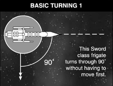
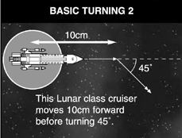
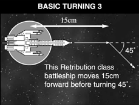
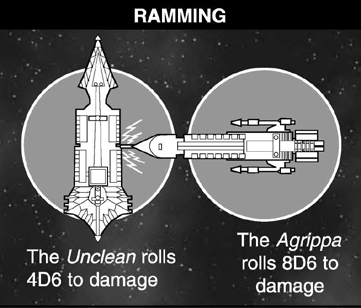

# The Movement Phase

**During the Movement Phase, vessels manoeuvre into position to
begin battle. Moving your battlefleet into the right position to rain
destruction upon your opponent is vital – some ships need to keep
their distance while others need to come to grips at close quarters. The
Movement Phase is filled with opportunities. By moving your ships
you can surround a target and destroy it, smash through the heart of
an opposing fleet, lurk behind planets and moons, flee from powerful
enemies, even set traps to lure unwary foes to their destruction. A wise
admiral can achieve all this and more in the Movement Phase.**

## Basic Moves

A player may move each
ship up to its standard move
distance each turn. Once
one ship has completed
its movement, the player
selects another and moves
that one and so on until
he has moved all the ships
he wishes to move.

This can be summarised as:

1. Choose a ship to move.
2. Move the ship up to its maximum move distance.
3. Choose another ship to move.

Note that a player has to
move his ships unless they
use the [*Burn Retros*](the-rules.md#burn-retros) special
order to remain stationary.
A ship has to move at least
5 cm to not count as defences
against the Gunnery Table.

### Move Distance

Ships are pushed through
the firmament by the
most powerful engines
anywhere in the galaxy. In
space combat, the thrust
available to a vessel can
mean the difference between
survival and destruction.
All ships can move at up
to their normal speed.
Speed varies from one
ship to another, but by way
of example, an Imperial
Lunar class cruiser has
a speed of 20 cm.
A ship’s normal move may
be increased by using the
[*All Ahead Full*](the-rules.md#all-ahead-full) special order
that follows. A vessel’s move

can also be decreased in
some circumstances during
a battle. Damage to the ship
may inhibit the efficiency
of its engines and reduce its
top speed, and a ship which
moves through Blast Markers
will be slowed slightly by the
shockwaves and explosions.

#### Minimum Move Distance

Ships moving under engines
retain enormous amounts
of momentum. If a vessel
slows down without the
correct preparations, it is so
big that there is a very real
chance that its structure
will be damaged because the
whole of its vast length isn’t
moving at the same speed.
Because of this, ships must
always move at least half
of their speed unless they
use the [*Burn Retros*](the-rules.md#burn-retros) special
order, detailed below. Ships
who are unable to move
half their speed (due to
damage, Blast Markers, etc.)
must move the maximum
possible distance instead.

> #### Special Order: *All Ahead Full*
> 
> A ship can move faster
> than its basic cruising
> speed by using the
> [*All Ahead Full*](the-rules.md#all-ahead-full) special
> order. Using * orders means that
> a ship cannot turn and
> its firing ability is less
> effective, as explained
> in the [Shooting rules](the-shooting-phase.md).
> [*All Ahead Full*](the-rules.md#all-ahead-full) orders
> are most useful for
> closing in on a distant
> foe or escaping from
> a deadly situation.
> See [pg. 46](the-rules.md#all-ahead-full) for all effects.

 

> #### Special Order: *Burn Retros*
> 
> A ship can move
> slower than half its
> basic cruising speed by
> using the [*Burn Retros*](the-rules.md#burn-retros)
> special order, or even
> remain stationary
> (hold station). A ship
> can make a single turn
> without having to move
> forward first but its
> firing is less effective.
> [*Burn Retros*](the-rules.md#burn-retros) orders
> are handy for holding
> back, when moving at
> full speed would bring
> you within range of
> an enemy’s guns, or
> would cause a ship to
> crash into asteroids.
> See [pg. 46](the-rules.md#all-ahead-full) for all effects.

## Turning

The bigger a ship, the slower
it will turn. While light
escort ships are quite agile,
larger cruisers are ponderous
beasts. The time lag between
a cruiser applying thrust
and turning is considerable.
Battleships take even
longer to manoeuvre.

When ships move they have
to travel in a straight line,
directly ahead. However,
ships may make one turn
as part of their movement
unless they are using special
orders which prevent
them from doing so.

A ship can turn by a
maximum of either 45°
or 90°, how sharp a turn
it can make is included in
the ship’s characteristics. A
ship can only count forward
movement made in the
current Movement Phase
as part of its minimum
movement before turning. By
way of example, the Imperial
Lunar class cruiser is able
to make turns of up to 45°.

Large ships have to move a
certain distance before they
are allowed to make a turn.
The distance they must travel
depends on their type:

* A battleship must
move 15 cm before it
can execute a turn.
* A cruiser must move
10 cm before it can
execute a turn.
* An escort ship can
execute a turn at any
point in its move.

> #### Special Order: *Come To New Heading*
> 
> A ship can turn more
> sharply by using the
> [*Come To New Heading*](the-rules.md#come-to-new-heading)
> special order. It may
> make an extra turn
> during its movement.
> Using *Come To New
> Heading* means that
> a ship is less effective
> in the [Shooting Phase](the-shooting-phase.md)
> as explained in the
> Shooting rules. *Come
> To New Heading* orders
> are best used either
> for turning to get a
> more favourable attack
> angle on an enemy as
> it attempts to escape,
> or to outmanoeuvre
> a larger enemy ship.
> See [pg. 46](the-rules.md#all-ahead-full) for all effects.
 

## All Ahead Full – Ramming Speed!

A ship moving at [*All Ahead Full*](the-rules.md#all-ahead-full) may attempt
to ram an enemy vessel. As Battlefleet Gothic
is a 2D representation of 3D space, a ship
cannot attempt to ram more than one ship
per Movement Phase, even if multiple enemy
vessels are in its range of movement.

When the [*All Ahead Full*](the-rules.md#all-ahead-full) command check is
passed, the owning player must declare which
ship it is attempting to ram and make the
appropriate leadership test to do so before rolling
the number of additional D6 cm it will move
[*All Ahead Full*](the-rules.md#all-ahead-full). This choice cannot be changed
if the ramming ship ends its movement in base
contact with more than one vessel or does not
reach the intended vessel. The number of ships
it “moves through” or ends in contact with does
not change or alter this.

Take a [Leadership](the-rules.md#leadership) test for the ramming ship:
if the test is passed, the captain skillfully
manoeuvres his ship into a ramming position.
If the test is failed, the would-be rammer
misses the target and moves normally (under
[*All Ahead Full*](the-rules.md#all-ahead-full)).

Obviously, it’s easier for an escort to ram a
battleship than the other way round.
There are four sizes concerning the separate
leadership check to ram. From biggest to smallest:
Defence > Battleship > Cruiser > Escort

If the target vessel is of a smaller type than the
ramming one, the Leadership test is taken on 3D6.

If the target vessel is of the same type than the
ramming one, the Leadership test is taken on 2D6.

If the target vessel is of a larger type than the
ramming one, the Leadership test is taken on 1D6.

*For example, the Imperial Lunar class cruiser
Agrippa would take a Leadership test on
2D6 to ram another cruiser, on 3D6 to ram
an escort or 1D6 to ram a battleship.*

A ship does not have to make a separate
leadership check to ignore closer targets to
ram one further away.

The ship now must move its FULL distance,
including any extra distance moved for being
[*All Ahead Full*](the-rules.md#all-ahead-full).

Ramming is determined by base-to-base
contact. If any part of the ramming ship’s
base contacts any part of the rammed ship’s
base in the course of its movement, the ram
is considered to be successful. Pause the
movement and resolve the ram attempt.

Roll 1D6 for each point of its starting damage
capacity (not the damage capacity it has
left). Any dice that equal or beat the target’s
armour value score a point of damage on it.
Damage from rams is not deflected by [shields](the-shooting-phase.md#shields).

The ramming ship may well suffer damage
too, so the vessel being rammed rolls a
number of D6 equal to half its starting
damage. Any dice which equal or beat the
ramming ship’s front armour rating score
a point of damage. If the vessels are hitting
head on (i.e. front to front) the rammed
or defence vessel rolls a number of dice
equal to its full starting damage capacity.

Once the ram attempt is resolved, the
ramming ship continues its movement.

*<strong>Ramming example:</strong> The Agrippa, a Lunar
class cruiser, rams the Unclean, a Murder class
Chaos cruiser in the starboard side. The
Agrippa had a starting damage capacity of 8 so
it rolls 8D6 to damage the Unclean (which has
Armour 5), rolling 1, 2, 3, 3, 4, 5, 5, 6 and
scoring 3 points of damage. By way of return
the Unclean (with a starting damage capacity
of 8) rolls 4D6 to damage the Agrippa (which
has armour 6 on the front thanks to its
armoured prow) rolling 3, 3, 5, 6 and scoring 1
point of damage.*

If either ship is destroyed and explodes
due to ramming, the explosion (and any
subsequent hits) is resolved at that moment.
The ramming and rammed ship will both
always be in the explosion. If it was the
rammed ship that exploded it is easier to
finish the ramming ships movement as
normal, but unless it has special rules to
navigate Blast Markers it will be slowed
by Blast Markers from the explosion.

While a ramming vessel may later attempt
to board or shoot, it may only attempt
to board a vessel if it ends up in base
contact with one at the end of its full
movement. This does not necessarily have
to be the same vessel it just rammed.

When ramming [defences](planetary-defences.md), they always roll
their full number of starting damage capacity
to damage the ramming ship as if prow-on, as
defences are more solidly built than ships are.

> #### Ramming Summary
> Ramming ship: Roll a number of
> D6 equal to its starting damage.
>
> Rammed ship hit from the side or
> rear: Roll a number of D6 equal
> to half its starting damage.
>
> Rammed ship hit from the front
> or Defence: Roll a number of D6
> equal to its starting damage.

## Disengaging from Combat

Sometimes it’s better to run away and fight
another day. A ship may be crippled with
no hope of defeating its attackers, or just
outnumbered so heavily that its captain
decides that it’s hopeless to fight on. The
classic approach to disengaging is to make
a sudden course alteration and then cut all
power so that the ship cannot be detected by
its energy emissions. With luck the vessel will
simply drift out of the immediate battle area
and can set course for home once it’s clear
of the fighting. Sometimes it even works ...

A vessel that moves off of the table edge
during play for any reason counts as being
disengaged. Or, in order to disengage,
a ship or escort squadron must pass a
[Leadership](the-rules.md#leadership) test at the end of its Movement
Phase with the following modifiers:

| CIRCUMSTANCE | MODIFIER |
| --- | --- |
| Each Blast Marker within 5 cm | +1 |
| Any celestial phenomena within 15 cm | +3* |
| Each enemy ship or Ordnance | marker within 15 cm | -1 |

*\*This is for a [tabletop feature](the-battlefield.md#tabletop-features) such as
an asteroid field or planet. If a [tabletop
effect](the-battlefield.md#tabletop-effects) such as a radiation burst or
solar flare is taking place this bonus
applies anywhere on the tabletop.*

All positive and negative modifiers must
be added together before determining
the [leadership](the-rules.md#leadership) check, even though check
rolls of 11 or 12 still automatically fail.

*For instance, a ship or escort
squadron with Ld9 attempts
to disengage after moving
within 5 cm of three Blast
Markers and an asteroid field
(+4Ld) with no enemy ships
or ordnance markers within
15 cm (no negative modifier).
Even though the effective
leadership to disengage is
now Ld13 because these
must all be added together
BEFORE the roll, the player
must still roll no higher than
10 to not fail the check.*

If the test is passed, the
disengaging ship is removed
from the tabletop and may
not return during the game.
If the test is failed the ship
remains in play but may
not fire, launch ordnance
or attempt to use special
orders (except *Brace for
Impact!*) during the turn.

Any ship or squadron that,
through a combination
of effects, is reduced to
Leadership 1 or less must
attempt to disengage or move
toward the closest table edge.

A vessel not hulked that
moves off of the table edge
during play for any reason
counts as being disengaged.

An escort squadron that
successfully disengages
only counts as being 10%
destroyed against the full
value of all the escorts in
the squadron. It counts
as 25% destroyed if the
squadron was crippled
before disengaging, as in if
at least half the escorts in
the squadron were destroyed
(rounding down) before
the squadron disengaged.

If any single ship in an escort
squadron disengages, the
whole escort squadron must
then immediately and in
subsequent turns attempt
to disengage following
normal rules. This prevents
an escort squadron from
disengaging one or two
vessels to keep leadership or
victory point benefits, then
pushing the rest of them in
a suicide run at the enemy.

Capital ships in a squadron
may disengage separately,
relying on their individual
base leadership to do so, not
the highest leadership in the
squadron. If it attempts to
disengage and fails, it falls
out of the squadron and
may not attempt to re-join
it. This is in addition to
all other effects for ships
that fail to disengage when
attempting to do so.

A ship that disengages
successfully counts as 10% of
its point value for the enemy,
or 25% if it is crippled before
it disengages. This is NOT in
addition to the 25% victory
point value if it remains
on the table at the end of
the game but is crippled.

## Flying Bases Overlapping

As ships can overlap by flying
over/under one another it is
possible to stack ships. When
ships overlap it is common
practice to remove the models
from their flying bases. To
keep things clear, it is usually
best to have a few stemless
flying bases around with
a straight line drawn from
the central hole to the bases
edge to indicate direction. If
desired, numbered contact
markers can be used for
this as well. The drastic
weakening of their shield
strength usually discourages
this as described in the
section on [Blast Markers](the-shooting-phase.md#blast-markers),
but it is completely legal.

## Stacking Ships And Escort Squadrons

Cruisers and escorts can
be stacked to follow the
movement of battleships
and other models that use
a large base. If the models
do not physically fit where
they should be located, a
contact marker or similar
can be used for this purpose.
As a rule, ships should only
be stacked or overlap as an
unavoidable consequence
of movement or to attain a
particular shooting solution
and should not be used
solely because it is allowed.

When a ship is forced
to stand still, it counts
as being targeted as
Defences. Minimum move
distance to not count as
defences is at least 5 cm.

At no time do ships count
as moving simultaneously
(even if in a squadron) and
must always be moved one at
a time, in any order desired
by the owning player.
