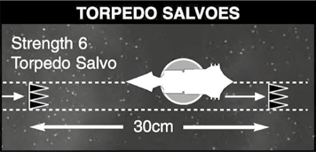

# The Ordnance Phase

**Ordnance includes missiles the size of skyscrapers to swarms
of small attack craft such as fighters and bombers.**

All ordnance attacks are represented
by markers that are moved across the
tabletop during each Ordnance Phase.
If an Ordnance marker comes into
contact with a ship or another Ordnance
marker it will make an attack.

## Launching Ordnance

Ships armed with torpedoes and/or launch bays can use ordnance.

Ordnance is declared, placed on the table and
launched at the end of the Shooting Phase (the
marker is put on the ship's base to show it has
fired its ordnance) but the ordnance moves
and attacks during the ordnance phase.

Launching ordnance of any amount
expends ordnance for that turn and must
be reloaded to launch again. For example,
a carrier with four launch bays that due to
ordnance limits cannot launch more than
two attack craft cannot “save” the other two
markers and must [*Reload Ordnance*](the-rules.md#reload-ordnance) again
before it can launch more attack craft. This
same concept applies to torpedoes, though
there are no launch limits for torpedoes.
Launching only torpedoes does not affect
launching attack craft later, and vice versa.

If a ship equipped with both torpedoes and attack
craft launches only one or the other, it may still
launch the other before having to reload again.

*For example, if an Imperial Dictator launches its
attack craft but not its torpedoes in a turn and
in the subsequent turn fails to [*Reload Ordnance*](the-rules.md#reload-ordnance),
it may still launch its torpedoes in that turn.*

Any ship that has either never launched
ordnance or has successfully reloaded
ordnance is considered to have its ordnance
reloaded for as many turns as it does not
launch, regardless of what subsequent special
orders it takes. Keep in mind that being
crippled and/or braced still affect torpedo
launchers and attack craft bays normally.

> #### Fleet Ordnance Limits
> No more attack craft markers can
> be put in play than the number of
> available launch bays, even if it has
> successfully reloaded. Any model or
> fleet described as not able to run out
> of ordnance (such as Ork Space Hulks,
> the Tyranid fleet, etc.) may launch
> up to twice this number and provide
> double their number of launch bays
> to the total amount of markers the
> fleet may have in play. This total limit
> applies to the fleet as a whole and not
> to individual ships in the fleet. Any
> individual carrier may launch attack
> craft if they have successfully reloaded
> (even a partial amount) as long as
> the total amount of attack craft in
> play does not exceed the number of
> available launch bays. This total must
> take into account reductions caused by
> ships being crippled or lost in battle.
> 
> If more attack craft remain in play
> than there are available launch bays,
> the owning player may not launch
> any ordnance that turn. However,
> ordnance in play may be “recalled” by
> immediately removing it from play
> in order to launch new markers from
> the ship’s stem, if it has successfully
> reloaded ordnance. Attack craft recalled
> in this manner must be removed
> immediately and not expended on other
> targets, including enemy ordnance.
> This prevents a carrier from attacking a
> target to expend its attack craft in play
> and then launching a new attack craft
> wave in a single turn. This rule does
> not apply to torpedoes, which do not
> run out and do not have launch limits.

 

> #### Special Order: *Reload Ordnance*
> 
> Ordnance needs to be loaded and
> armed in order to be launched. Ships
> are considered to start the game
> with torpedoes in tubes and attack
> craft fuelled and ready to go.
> 
> However, once the ship has launched
> its ordnance it must use the *Reload
> Ordnance* special order before it
> can launch ordnance again. If the
> ordnance is successfully reloaded
> and it may launch ordnance in the
> Shooting Phase, or keep the ordnance
> ready for launch in a later turn. Use
> the fleet roster to keep track of which
> vessels have ordnance loaded.

## Moving Ordnance

In the Ordnance Phase players move and
attack with any ordnance they have launched
including ordnance launched on previous
turns. Sometimes both players will have to
move ordnance so it’s important to know who
moves first. In this case the player whose turn
it is moves all their ordnance first.

All ordnance has a speed value that dictates
how far it moves during each Ordnance Phase.
Ordnance attacks are represented by markers
which are moved on the tabletop. Ordnance
markers in a wave or salvo must be spread in
contact with each other and cannot be stacked.

### Ordnance and Blast Markers

Ordnance weapons are not shielded like
larger ships, so they may be destroyed if they
pass through [Blast Markers](the-shooting-phase.md#blast-markers). If an Ordnance
marker passes through Blast Markers during
its movement, roll a D6. The Ordnance
marker is removed from play on a roll of 6.
Ordnance attacking ships with Blast Markers
in base contact must also pass this test, as
the ship’s base is under the effect of the Blast
Marker touching its base (as described earlier).
Only one roll is made regardless of the
number of Blast Markers passed through.
Ordnance waves or salvoes only need to make
this test once per movement, regardless of the
number of Blast Markers moved through.

## Shooting at Ordnance

Ordnance may be fired at in the [Shooting
Phase](the-shooting-phase.md) with direct fire weapons. A ship firing at
ordnance does not have to make a [leadership](the-rules.md#leadership)
check to ignore closer targets, nor does it have
to make a leadership check to ignore enemy
ordnance if it is the closest target. It must still
make a leadership check to split its fire between
ordnance targets, just as it would have to split
fire normally. It also must make a leadership
check to fire on an enemy ordnance marker,
wave or salvo if it is not the closest enemy
ordnance marker in range.

[Weapon batteries](the-shooting-phase.md#direct-firing-weapons-batteries) firing at ordnance use the
Ordnance column on the Gunnery table. This
is because ordnance targets are relatively small
and fast moving. Target aspects are not taken
into account, but column shifts for range and
Blast Markers do apply. [Lances](the-shooting-phase.md#direct-firing-lances) and weapons
batteries both need 6s to hit ordnance because
they are such difficult targets. If an Ordnance
marker is hit it is removed from play. Any
Ordnance markers caught in a [nova cannon](the-shooting-phase.md#nova-cannon)
detonation are also removed from play.

## Ordnance Attacks

If an Ordnance marker comes into contact
with a ship's base or another Ordnance
marker the effect is resolved immediately,
including in the [Movement Phase](the-movement-phase.md) when a ship
moves into enemy ordnance.

All Ordnance attacks ignore the target's [shields](the-shooting-phase.md#shields).

Ordnance markers must always attack the
first ordnance or vessels they come in contact
with (when applicable). They are not required
to attack the closest target.

*For example, a fighter squadron marker may
not ignore a small torpedo salvo it is actually in
contact with to attack a larger one nearby, or
an attack craft wave may not ignore an escort it
is in contact with to attack a nearby cruiser.
This also allows small torpedo salvoes from
escorts to be used to clear the way of enemy
fighters in the Ordnance Phase so that larger
salvoes can get through, etc.*

If two ships with the same base size are so
aligned that they for all intents and purposes
are occupying the same 2D position on the
table when they are attacked by ordnance,
the attacking player can pick which ship
he or she is attacking. Put simply, if there
is no way to visually identify which of two
stacked or overlapping ships is actually closer
to attacking ordnance, the attacker decides
which target is being attacked.

## Types of Ordnance

### Torpedoes

The term ‘torpedo’ has
always been used to describe
any long-range missile
carried by a spaceship. A
typical anti-ship torpedo
is over 200 feet long and
powered by a plasma
reactor, which also acts
as a sizeable portion of its
warhead, turning it into a
devastating plasma bomb.
The area of a ship given
over to the torpedo tubes
is a massive space crisscrossed by lifts, hoists and
gantry cranes for moving
the huge missiles from
the armoured magazine
silos where they are stored
to the launch tubes.

Once a torpedo is launched,
the plasma drive propels
the torpedo forward at high
speed, whilst beginning an
energy build-up which will
culminate in its detonation.
Torpedoes have a limited
ability to detect a target
and will alter course to
intercept if they pass
within a few thousand
kilometres of a vessel.

#### Torpedo Rules

Torpedoes may be launched
by a ship with torpedo
tubes. These are normally
fitted to the prow of a
ship. In Battlefleet Gothic,
torpedo salvoes have a
Strength value and a Speed
value, which are shown on
the ship’s characteristics.
The higher the Strength,
the more torpedoes there
are in a salvo. The higher
the speed, the faster
the torpedoes travel.

A torpedo salvo (regardless
of strength) is represented
with a the original Strength
3 marker with one or
more D6 indicating the
actual salvo strength.
For specific dimensions,
this marker should be no
more than 2.5 cm wide.

Place the torpedo marker at
the end of its movement in
the turn of launch so that it is
completely within the correct
fire arc. Now retrace the
markers movement, reducing
its strength and conducting
ordnance interactions as
appropriate to prevent
targeting vessels out of fire
arc due to proximity, etc.

Standard torpedoes move in
a straight line once they have
been launched, travelling
a distance equal to their
speed each Ordnance Phase
until they have detonated
or leave the playing area.
Unlike ships, torpedoes may
not vary their speed and
must make their full move
in each Ordnance Phase.

If the Torpedo marker
contacts a ship’s base (friend
or foe) it attacks. Roll a D6
for every point of Strength
in the torpedo salvo. Each
dice which equals or beats
the ship’s Armour value scores one point of
damage. Torpedoes will pass through shields
before they impact, so ignore any shields when
applying damage. The torpedo salvo continues
moving after the attack but its Strength
is reduced by 1 for every hit it inflicted.
Torpedoes that can re-roll misses must do
so, even if the target is already destroyed.

*In the diagram above, a Strength 6 torpedo
salvo moves in the Ordnance Phase and hits
a ship. 6D6 are rolled to attack and three dice
score hits on the target. The salvo is reduced
to Strength 3 and continues moving up to its
full move of 30 cm. If any other ships were
in its path they would also be attacked.*

#### Premature detonation

An entire salvo of torpedoes can be triggered
prematurely by the following circumstances:

* On a D6 roll of 6 if it moves through any Blast Markers.
* If the salvo is fired on by direct fire weapons and any hits are scored.
* If it comes into contact with another Torpedo or Fighter marker.

If a Torpedo marker is prematurely
detonated it is removed from play.
No torpedo marker can attack a target
more than once per full turn, even if they
are already in contact with it at the start
of the [Movement](the-movement-phase.md) or Ordnance Phase. For
example, a torpedo marker is launched
toward a battleship with a large base, ending
its movement just inside base contact
with the battleship. The attack is resolved
immediately, with turrets rolled and hits
allocated. While any surviving markers
remain in play, they do not once again attack
the same ship at the beginning of that ship’s
[Movement Phase](the-movement-phase.md), and that ship is allowed to
assume the torpedoes have flown off behind
it and move off the torpedo marker. The
marker will however immediately attack
any other ship that comes in contact with
it, even if the other ship is moved before
the ship that was attacked originally.

When launching torpedoes, the torpedo
marker will technically be in all arcs and may
be in multiple arcs until its final position
this movement, especially when targeting
ships in close proximity. However, it may not
interact with anything out of the torpedoes’
actual firing arc, no matter how close the
target vessel is to the shooting vessel.

When moving a torpedo salvo the
centre must always be in the same
point along the line of fire.

When launched, torpedoes do not normally
ignore any targets in front of them, including
friendly units! However, a ship that is actually
in base contact with another friendly vessel
may “shoot through” the friendly ship’s base,
even if they are not in a squadron. Ships
not in a squadron cannot use this effect to
combine torpedo salvoes in any way and
must always launch torpedoes separately.

Torpedoes that have an automatic re-roll to
hit MUST use their re-roll to hit a target,
even if that target was already destroyed by
other hits generated in the same salvo.

#### Splitting Torpedo Salvoes

Single ships capable of launching six or less
torpedoes cannot split torpedo salvoes at
all. Single ships capable of launching salvoes
larger than six may split their salvoes in
two, representing them with two separate
markers. If this option is taken, the salvoes
must go in different directions (no double attacks on the same target or in the same
direction), and no single salvo can contain
less than three torpedoes. Squadrons of
capital ships or escorts are not obligated
to fire their torpedoes in a single salvo.
Torpedoes do not normally ignore hulks
in their line of movement. Boarding
torpedoes may do so if desired, and guided
torpedoes may be steered away from them
but will still attack if they make contact.

#### Turning Torpedoes

When turning torpedoes
(that are allowed to do so),
turn from the centre of the
marker at the beginning
of the Ordnance Phase.
Under no circumstances can
torpedoes turn in the same
Ordnance Phase they were
launched. This means they
can only be launched in the
same arc normal torpedoes
would be. If a salvo turns,
it must be turned so that no
edge moves more than the
salvo’s maximum speed in
any way. This also means
the side facing the inside
edge of the turn may end
up moving less than the
maximum allowed distance.

### Boarding Torpedoes

Boarding torpedoes are
designed to punch through
the outer hull of an enemy
vessel and plunge a squad
of heavily armed troops
inside to sabotage the
target ship’s systems.

Boarding torpedoes are
launched like ordinary
torpedoes and ships that can
carry them are noted in the
fleet lists. It is not possible to
launch ordinary torpedoes
and boarding torpedoes
from a ship in the same turn.
Unlike ordinary torpedoes,
boarding torpedoes can
make a single 45° turn at
the start of every Ordnance
Phase, measured from the
centre of the marker.

They cannot turn 45°
in the same turn they
are launched. They may
elect to ignore hulks.

If boarding torpedoes move
into contact with a ship’s
base, they attack just like
ordinary torpedoes (roll for
turrets and to hit). Each one
that hits makes a [Hit-and-Run attack](the-end-phase.md#hit-and-run-attacks) in the Ordnance
Phase rather than inflicting
a point of damage. [Hit-and-Run attacks](the-end-phase.md#hit-and-run-attacks) are discussed
in the [End Phase](the-end-phase.md) section.

When boarding torpedoes
come in contact with any
other torpedoes except
other friendly boarding
torpedoes, they will be
removed as normal.

Boarding torpedoes do
not attack friendly ships
(including hulks) they come
in contact with, nor are
they removed by friendly
fighters in contact.

### Attack Craft

Attack craft are launched from a ship’s launch
bays and may include any mix of fighters,
bombers or assault boats. In combat, they
are launched to assist their mother ship or
make long range strikes against the enemy.

Attack craft vary in size from sleek one-man
fighters to lumbering heavy bombers. Attack
craft make difficult targets for warships:
their small size and high speed enables
them to evade the worst fire. However,
all attack craft have an extremely limited
endurance and can only operate away from
their mothership for a short time before
they must return to rearm and refuel.

Attack craft are represented by
20 mm square markers.

#### Attack Craft Rules

Attack craft are launched from a ship’s launch
bays and may include fighters, bombers or
assault boats. Launch bays are rated by the
number of squadrons they can launch at once,
for example a Dictator class cruiser with
four bays can launch four squadrons. Each
squadron is represented by a single marker.

At the time of launch, the player may select
which attack craft to use from amongst those
available to his ship. The launch could include
fighters and bombers, or be made exclusively
of one type. Each type is represented by a
different marker.

Unlike torpedoes, attack craft can turn freely
and move in any direction, up to the distance
indicated by their speed on the ship’s profile.

Any attack craft that come into contact
with enemy Ordnance markers or ships,
or Fighters coming in contact with any
torpedo marker, must attack as explained in
their relevant sections that follow. They are
assumed to be able to avoid or ignore closer
targets or obstructions unless the course of
their movement unavoidably brings them in
contact, such as [Blast Markers](the-shooting-phase.md#blast-markers), other ordnance
or [celestial phenomena](the-battlefield.md#celestial-phenomena).

Attack craft can ignore any targets they are not
actually in contact with, but they cannot “fly
through” enemy ship bases to attack a desired
target behind them. However, attack craft
can choose to target vessels with small bases
“hiding” inside the footprint of a large ship
base as long as the attack craft actually have
the range to reach the smaller base (this is the
only manner in which attack craft may ignore
the first ship’s base they come in contact with).
Torpedoes still behave normally and cannot
select targets in this manner (this includes
boarding torpedoes or any other “special”
torpedo type). Ships with bases stacked in this
manner may mass turrets against ordnance as
described in the relevant section.

When attacking ships, an assault boat or bomber
wave that destroys a ship expends the entire
wave to do so and is removed, even if individual
markers have not yet rolled their attacks.

### Turrets

#### Ordnance Defences

Most fighting ships mount numerous weapon systems and turrets for shooting
down torpedoes and attack craft during their final attack run. A ship’s main
armament is simply too huge and slow to track ordnance at such close ranges.
However turrets will fire immediately when Ordnance touches the ship’s base.

**Vs Torpedo salvoes:** Roll a D6 for each turret: each dice that
scores a 4, 5 or 6 reduces the salvo’s strength by 1.

**Vs Attack craft squadrons:** Roll a D6 for each turret: each
dice that scores a 4, 5 or 6 destroys one squadron.

A ship’s turrets can fire against every torpedo salvo that attacks it in an
Ordnance Phase. Alternatively the turrets may fire at every attack craft
wave that attacks it in an Ordnance Phase. Note that turrets can be used
to defend against torpedoes or attack craft but not both in the same phase.
This makes it possible to overwhelm a target with combined attacks.

> #### Massing turrets
> 
> Ships in base contact may mass turrets together, each increasing the turret strength
> of a ship under attack by 1. Regardless of how many ships are in base contact
> with each other, no single ship can mass turrets with more than three others,
> providing a maximum of +3 dice when rolling turrets. The ships that mass turrets
> with a ship under attack take on the same ordnance restrictions as the ship under
> attack, such as using turrets to defend against either attack craft or torpedoes
> (not both) in a given Ordnance Phase. Only the ship actually being attacked can
> apply its own turret value as a negative modifier to bomber attack dice rolls.
> Ships that are braced can mass turrets and have turrets from other
> ships massed to defend it. Ships that are crippled cannot mass turrets
> but can have turrets from other ships massed to defend it.
> 
> A ship with 0 turret strength (such as Eldar or hulked vessels) cannot offer
> a bonus to massed turrets, but may itself benefit from massed turrets from
> a ship with turret strength 1 or more. This applies both to ships desiring
> to defend a friendly hulk or a fleet defending an allied Eldar vessel.
> 
> No more than one ship can be moved at a time for any reason; ships will only be
> able to benefit from massed turrets after or before the Movement Phase is complete
> but not during. This does not affect how and in what order ships escorted by CAP
> are moved. An extremely unusual circumstance may occur where a ship extremely
> near to but not actually touching an enemy ordnance marker has a friendly
> ship move in base contact with it while it simultaneously contacts the ordnance
> marker. In this and ONLY this case can it then mass turrets while moving!

### Fighters

Fighters are small, fast and extremely agile.
They are only armed with weapons suitable
for destroying ordnance, including other
attack craft. In combat, the fighter’s job is
to intercept enemy ordnance and protect
the vulnerable bombers and assault craft
on their way to and from their target.

#### Fighter Rules

Fighter attacks have the following
effects when they come into contact:

**Vs Ordnance Markers:** The defenders are
scattered or destroyed in the fighting. The
victorious fighters return to their mother ship
for rearming and refuelling. Remove both the
defending and attacking markers from play.
Fighters must always interact with ordnance
they come in contact with for any reason. This
includes attack craft that behave as fighters
but fulfil other roles, such as Space Marine
Thunderhawks or Ork fighta-bommas.
Fighters ignore friendly ordnance, but will
destroy any torpedoes, unless otherwise
noted (e.g. friendly boarding torpedoes).

**Vs Ships.** The fighter squadron’s puny
weapons make no impression on the ship
at all, but they steer clear of the ship’s
turret defences. Leave the Squadron
marker in play. Fighters in base contact
with friendly ships may move with them
to screen against enemy ordnance. If they
do so, they go on Combat Air Patrol.

#### Combat air Patrol (CAP)

Fighters in base contact with friendly
ships may elect to screen them against
enemy ordnance. If they choose to do so,
they go on Combat Air Patrol (CAP).

One or more fighter markers on CAP move
with its ship in the [Movement Phase](the-movement-phase) (thus
remaining in base contact), but it may
NOT then move in the Ordnance Phase. In
other words, no double moves. Fighters on
CAP then stay on CAP for that turn unless
removed. If when doing so they move farther
than the attack craft can move normally
in a single Ordnance Phase (such as 20 cm
Thunderhawks escorting a Cobra that
moves 30 cm), they then cannot move in the
opposing player’s Ordnance Phase as well,
though they are still capable of defending the
ship they are in base contact with normally.

An ordnance marker or wave is considered
to move with the ship it is escorting
and will protect the ship against enemy
ordnance it encounters even in the
midst of the ship’s movement.

Multiple fighters on CAP in base contact
with a single ship function as independent
markers in all respects and are not a wave.
When encountering [Blast Markers](the-shooting-phase.md#blast-markers), roll once
per squadron marker. This includes if the
ship is subsequently destroyed, at which
time the fighter markers roll separately
against the effects of the explosion. Any
markers that survive subsequently act as
separate ordnance markers and may move
again in the subsequent Ordnance Phase.

Only fighters and ordnance markers that
behave as fighters can be used as CAP.
Bombers and attack craft cannot be used as
CAP to protect against ramming or [Hit-and-Run attacks](the-end-phase.md#hit-and-run-attacks) by other ships the escorted ship
encounters in its own Movement Phase. For
example, a bomber can’t be placed on CAP
to escort a cruiser so that it immediately
makes attacks upon an enemy ship the
cruiser moves in base contact with. This
includes resilient bombers such as Mantas.

Multi-role ordnance markers that can
still act as fighters on CAP are capable of
attacking ships (such as Fighta-Bommas and
Thunderhawks) can only attack ships during
the Ordnance Phase unless an attacking
ship moves into contact with them during
the enemy’s [Movement Phase](the-movement-phase.md). They may
not otherwise attack a ship until they leave
CAP first. See the following two examples:

*An Ork Terror Ship with two fighta-bommas
in base contact serving as CAP rams and/
or boards an Imperial cruiser. The fightabommas it dragged along in the course of its
movement do not automatically attack the
Imperial cruiser as well but must wait until the
Ordnance Phase, and even then may only do so
if the attacking ship ends its movement in base
contact with the target vessel because attack
craft that escort a ship in the [Movement Phase](the-movement-phase.md)
cannot also move in the Ordnance Phase. If
engaged in a boarding action and the Terror
Ship ends its movement in base contact with
the Imperial cruiser, the fighta-bommas may
attack it in the Ordnance Phase before the
boarding action takes place in the [End Phase](the-end-phase.md).*

*An Imperial cruiser rams and/or boards an
Ork Terror Ship that has two fighta-bommas
in base contact serving as CAP. In this case
the Imperial cruiser must follow all rules
for moving in contact with enemy ordnance.
After resolving the ram attack (if successful),
the fighta-bommas immediately attack the
Imperial cruiser and are removed. If engaged
in a boarding action and the Imperial cruiser
ends its movement in base contact with the
Terror Ship, the fighta-bommas still resolve
their attack immediately, before the boarding
action takes place in the [End Phase](the-end-phase.md).*

**Note:** The same example would apply for other
multi-role attack craft that behave as fighters
on CAP, such as Thunderhawks. Note that
because the markers are not in a wave, if a ship
is destroyed by markers in CAP, no further
markers are lost to attacking the destroyed ship.

Fighters and attack craft that behave as
fighters can, at any time in their normal
movement, be placed on a friendly ship
as CAP. However, only these types of
attack craft can behave as CAP. Fightertype attack craft must be split from
attack craft in a mixed wave of ordnance
that don’t have the fighter rule before
they can subsequently serve as CAP.

There are only two situations where fighters
can leave CAP excluding their destruction.

1. At the beginning of the owning player’s [Movement Phase](the-movement-phase.md).

2. During the owning player’s part of their opponent’s Ordnance Phase. Note: If the attack craft on CAP
is resilient, it still moves with the ship even if it has made a save.

**Fighters on CAP and Other Friendly Attack
Craft:** It is possible to defend friendly attack
craft by putting them within the perimeter
of a ship’s base that has fighters on CAP.
Note: If enemy fighters intercept attack
craft that are ‘hiding’ on a ship’s base in this
manner, they will not be repelled by turrets.

Fighters on CAP don’t attack torpedoes
or mines being launched from a friendly
ship it is protecting or from friendly
ships in base contact including when
launching a massed torpedo salvo. However,
they will defend against torpedoes and
enemy mines in any other instance.

Resilient attack craft such as Manta bombers
and Thunderhawks that end their movement
in base contact with a ship escorted by CAP
(meaning they are already in base contact with
a ship when stopped by the fighter), use their
4+ save to survive the attack and subsequently
survive against turrets may no longer move
or attack other ordnance markers. However,
they may complete their attack run against the
target vessel normally as long as they do not
have to move any more to do so. For example,
two Mantas attack an Ork Terror Ship with a
fighta-bomma in base contact serving as CAP.

> #### Turret Suppression
> Each fighter in a wave of bombers
> actually attacking a ship will add
> +1 attack to the total attack run of
> the wave, regardless of whether they
> are shot down by turrets or not. The
> maximum number of bonus attacks
> that can be added in this way cannot
> exceed the number of surviving
> bombers in the wave. There must
> be at least one surviving bomber
> in the wave after turret fire to gain
> these bonus attacks, and fighters are
> removed before any other type of
> ordnance. Fighters that never made
> it because they were intercepted by
> defending fighters (even those on
> CAP) don’t add to this suppression
> bonus. See the following examples:

*An Emperor battleship (foolishly) launches a
single wave of three bombers and five fighters
against a Devastation cruiser with three
turrets and no CAP. The Devastation’s turrets
roll 4, 5, 6 to knock down three fighters. The
three bombers now each roll 1D6-3 (minimum
zero) attacks regardless of whether or not any
of the fighters survived against turrets. Now
only three of the five fighters that escorted
the bombers provide an additional +1 attack
because there are only three bombers in the
wave, for a single total addition of +3 attacks.*

*An Emperor battleship launches a single wave
of four bombers and four fighters against a
Devastation cruiser with three turrets and
no CAP. The Devastation’s turrets roll 4,
5, 6 to knock down three fighters. The four
bombers now each roll 1D6-3 (minimum
zero) attacks regardless of whether or not
any of the fighters survived against turrets.
Now all four of the fighters that escorted the
bombers provide an additional +1 attack
because there are four bombers in the wave,
for a single total addition of +4 attacks.*

### Bombers

Bombers are slower, heavier craft with
destructive anti-ship weapons. Though
vulnerable to enemy fighters, bombers can be
a serious threat to ships.

#### Bomber Rules

Bomber attacks have the following effects
when they move into contact:

**Vs Enemy Fighters:** The fighters quickly
eliminate the lumbering bombers before
returning to their mother ship for rearming
and refuelling. Remove the defending and
attacking markers from play.

**Vs Other Ordnance Markers:** The bombers
succeed in getting out of the way but nothing
more. Leave both markers in play. These
include bombers with a 4+ save.

**Vs Enemy Ships:** The bombers make an attack
run on the ship. Make D6 rolls to hit against
the ship’s lowest Armour value for each
attacking bomber squadron. The number of
attacks the squadron makes reduces by one for
each turret on the ship. Remove the Squadron
markers once the attack has been made.

Turrets always reduce bomber attack runs,
even if they have been used to defend against
torpedoes and thus cannot be used against
attack craft.

Ships massing turrets with the one under
attack do not affect this number.

*For example, a wave of two bomber squadrons
attack a Murder class cruiser that has two
turrets. The cruiser gets two dice rolls to shoot
at the incoming bombers with, and any that
survive will make D6-2 attacks and then be
removed from play.*

### Torpedo Bombers

Torpedo bombers are ordinary bombers
reconfigured to carry a payload of (relatively)
small anti-ship torpedoes. This gives them
the ability to stand off from their target
at greater range and launch an attack.

#### Launching

Torpedo bomber squadrons are launched
just like other attack craft squadrons, they
are simply differently armed. Torpedo
bombers have a speed of 20 cm and count
as bombers for interception purposes.

#### Attacks

A torpedo bomber squadron can be
replaced with a Strength 2 torpedo salvo
at the beginning of any ordnance phase.
The torpedoes function according to the
standard torpedo rules once launched but
have a more limited fuel supply, so they are
removed at the end of the same ordnance
phase they are launched in. A wave of torpedo
bombers can combine their salvoes together
in the same way as a squadron of ships.

Torpedo bombers may not launch their
torpedoes (convert to a torpedo salvo marker)
in the same Ordnance Phase they were
launched from their parent carrier. This
includes if they make contact with their target
in the same turn they were launched. In such
cases, use normal bombers instead if desiring
to attack an enemy ship in close range.

### Assault Boats

Assault boats are designed to clamp on to
a target vessel and breach its outer hull,
allowing squads of elite warriors to storm
on board. Once aboard, the boarders plant
demolition charges, massacre the crew,
poison the air and generally cause as much
damage as possible before retreating.

#### Assault Boat Rules

Assault boat attacks have the following
effects when they move into contact:

**Vs Enemy Fighters:** The fighters overwhelm
the assault boats and then return to
their mother ship for rearming and
refuelling. Remove both the defending
and attacking markers from play.

**Vs Other Ordnance Markers:** The assault
boats simply manoeuvre around the enemy
ordnance. Leave both markers in play.

**Vs Enemy Ships:** The assault boats make an
attack run on the ship. Immediately conduct
a Hit-and-Run raid against the ship for each
assault boat squadron. Hit-and-Run raids
are detailed in the End Phase section. After
the attack the assault boats return to their
ship to be reloaded with troops and refuelled.
Remove the Squadron marker from play
when the attack is made in the End Phase.

### Launching Waves Of Attack Craft

When a ship launches its attack craft
squadrons it can despatch them as
individual squadrons or combine them
into waves of squadrons. Regardless of
the choice, attack craft interactions are
always resolved marker to marker.

To show a wave place the Attack Craft markers
so they’re touching (they cannot be stacked)
and keep them together as they move. If a
wave contains attack craft moving at different
speeds, they move at the speed of the slowest.

Attack craft waves must be assembled
into the smallest circumference possible,
such as a block of four, two rows of three,
etc. For example, a single wave of eight
ordnance markers cannot be stretched out
into a single-file line eight markers long.

If enemy fighters/turrets attack a
wave they must remove any fighter
squadrons before moving onto the
bigger ships. You can use this rule to put
your wave together so that it contains
fighters who will defend the vulnerable
bombers or assault boats, sacrificing
themselves to save the bigger vessels.

Waves of attack craft can split up during their
move if you wish. However, once squadrons
have split up they may not recombine into
waves. A wave may only be formed when the
craft are launched from their mother ship.

The greatest benefit of attacking in a wave
is that a defending ship’s turrets only fire
once at the whole wave, so there is a better
chance of the ships in the wave surviving
the defences than individual squadrons
have. On the downside, if a wave of attack
craft is hit by direct-fire weapons (such
as gunnery, lances or Nova Cannons) the
whole wave is destroyed. Likewise, if the
wave rolls a 6 while moving through Blast
Markers, the entire wave is removed. An
entire wave is removed after attacking a
ship, even if the target is destroyed before all
ordnance markers complete their attacks.

### Resilient Attack Craft

Some attack craft such as Thunderhawks or
Eldar fighters are “resilient”, meaning they
have a 4+ save against other ordnance.

They can only attempt this save once
per Ordnance Phase, regardless of
attacking or being attacked.

If they roll a 4+ to remain in play, they
have to stop movement where the ordnance
interaction took place and cannot move
further for that Ordnance Phase, and
they lose their 4+ save for the rest of
that phase as well (or Movement Phase if
save is made while in CAP). In all cases,
resilient attack craft that fail to make
their save are immediately removed.

Ordnance that use this save and end
their movement in contact with an
enemy vessel may attack it normally.
Resilient attack craft that behave as fighters
must always do so when in contact with other
ordnance, even if they may serve another
function as well, such as Thunderhawks.

Attack craft that do not function as fighters
but have a save against fighter attacks, such
as Tau Manta bombers, ignore any other
type of ordnance except fighters in the same
manner other bombers or assault boats do.

#### Multiple attacks

Any second interaction in the same Ordnance
Phase such as attacking multiple markers
in the same phase will cause the marker
to be automatically removed, as normal
fighters would be were they not resilient.
The attacking player always decides the
order of the ordnance interaction.

*For example, if two Thunderhawks move in
contact with two Chaos Swiftdeath fighters,
the Space Marine player decides in which
order the ordnance interacts. He can decide
Thunderhawk #1 removes one fighter,
makes its 4+ save and remains in play, then
decide Thunderhawk #1 removes the second
Swiftdeath, in which case Thunderhawk #1
is automatically removed but Thunderhawk
\#2 remains in play without using its save and
can thus move full distance. Conversely, the
Space Marine player may decide to engage
the Swiftdeaths one apiece, in which case
both Thunderhawks remain in play if they
both make their saves, but both expend
their saves for that Ordnance Phase in the
process. In this case, both Thunderhawks
end their movement where they came in
contact with the Swiftdeaths and may
not continue to move full distance.*

#### Opposing resilient ordnance

If two markers that both have a 4+ save
attack each other and both remain in play
by successfully rolling their saves, they stop
movement and remain in contact until the
next turn’s Ordnance Phase. However, if
any marker that saves is attacked again in
the same phase, it (along with the marker
that attacked it) is automatically removed.

#### Resilient saves in attack craft waves

If a wave containing resilient attack craft
attacks or is attacked and a save is made,
ordnance markers that make saves may no
longer move. However it may be split from the
wave to allow the rest of the wave to continue
its movement. Attack craft in the wave that
were not attacked (and thus didn’t use their
4+ save) complete their movement normally.

*For example, instead of ignoring it, a wave
of four Thunderhawks in the course of their
movement attacks a single Ork Fightabomma not in base contact with a ship (rules
for attacking ships with fighters on CAP
remain unchanged). One Thunderhawk
attacks the fighta-bomma, removing it. If
it rolls its 4+ save it may remain in play,
but it must stop where it made contact with
the fighta-bomma and not move until the
next Ordnance Phase. The remainder of the
Thunderhawk wave may continue to move its
full distance. In essence, the Thunderhawk
marker that engaged the fighta-bomma
peeled off the wave to engage it while the
rest of the wave continued on to its target.*
