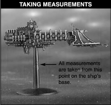
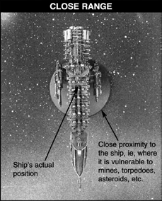
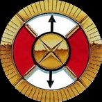
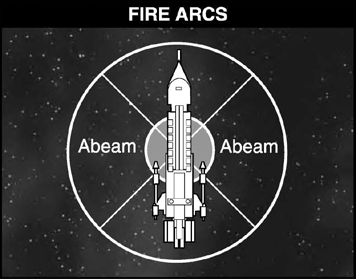
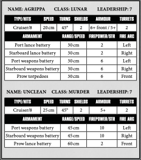
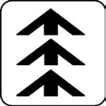
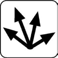
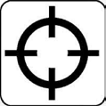
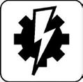

# The Rules

## What You Will Need

As well as the Battlefleet
Gothic rulebook, there are a
number of other things you’ll
require to be able to play. For
a start, you will need two or
more players, with models to
represent their [ships](#ship-types). You will
also need a battlefield to fight
over. Any firm, level surface
will do, such as a tabletop
or an area of floor – most
kitchen tables will do fine!
It’s a good idea to use an old
sheet or blanket to protect
the table from scratches
and chips. Some players
make a special gaming
board from chipboard or
other similar material,
which they can place on
top of a table to extend
their playing area. Onto
this surface, you can then
place the [celestial objects](the-battlefield.md#celestial-phenomena)
around which the battle
is fought, such as [planets](the-battlefield.md#planets),
[moons](the-battlefield.md#), [asteroid fields](the-battlefield.md#asteroid-fields) and
[dust clouds](the-battlefield.md#gas-and-dust-clouds). You can find
out more about fleets and
[the battlefield](the-battlefield.md) later on.

As well as players, ships
and a battlefield there are
a few other things you will
need. At least one measuring
device marked in centimetres
(such as a retractable tape
measure or ruler). All
distances in this book
are given in centimetres.
You will also need some
ordinary six-sided dice and
a pen and some paper for
noting down damage to
ships and other details.

## First Principles

At this early stage in the book
it’s worth establishing some
initial principles about the
Battlefleet Gothic game.

### Scale

First of all – space is big!
Very, very big. Take your
conception of a long way (i.e.
down to the shops when it’s
raining hard) and multiply
it by a million, then by
another million ... and then
by another million and you’re
still not even close to how far
apart things are in space. In
order to include interesting
and exciting features such
as planets and moons on
the battlefield and have ship
models which are not the
size of molecules, Battlefleet
Gothic takes some liberties
with scale. In short, the ship
models are designed to look
good and be nice to paint, but
they are not intended to be in
scale with planets. To prevent
this becoming a problem in
the game it is assumed that
the ships actually occupy
the point in space shown
by the stem of their base.

In keeping with this
principle, movement
distances are measured from
the stem on the ship’s base
and distances for firing are
measured from the stem
of the ship’s base to the
stem of the target model.

The actual base of a ship
model represents very close
range around the ship, no
more than a few thousand
kilometres. At this distance
all kinds of dangers can
affect the ship itself such
as torpedoes, deep space
bomber squadrons, other
ships exploding or asteroids
striking. Hence, for the
purposes of the game, if
something affects an area
of the battlefield, like the
markers used to represent
torpedo salvoes or the
boundaries of an asteroid
field, a ship is affected if
its base is touched, or if
a ship moves so that its
base comes into contact
with the hazard.

### 3D or not 3D?

As well as being very big,
space is also infinitely wide,
high, deep etc. Despite this,
Battlefleet Gothic is played
on a flat tabletop. To allow
for the vagaries of three
dimensions and the vast
distances involved, ships
can move and fire past each
other without any risks.
It’s easy to imagine that
individual ships are just
a few hundred kilometres
higher or lower than each
other and so have plenty of
clear space to manoeuvre in.

The reason for the lack of
3D movement is twofold.
Firstly, making the game
work in three dimensions
would add little to the tactics
of it, because unlike aircraft
combat, where the force of
gravity means whoever is
highest has an advantage,
combat in the zero gravity
of space would turn fighting
in three dimensions into
little more than a range
modifier. Secondly, for
the practical mechanics
of the game, working in
3D would complicate
the rules immensely.

## Dice Rolls

There are lots of occasions in a battle when
you have to roll dice to see how a ship’s
actions turn out – how effective shooting
is, what damage is done to an enemy
ship, how well captains and their crews
react to the stress of battle and so on.

All dice rolls in Battlefleet Gothic use a
standard six-sided dice (usually shortened
to D6). Sometimes you will need to modify
the result of the dice roll. This is noted as
D6 plus or minus a number, such as D6+1 or
D6-2. Roll the dice and add or subtract the
number indicated to get the final result.

*For example, D6+ 2 means roll a dice and add
2 to the score, giving a total between 3 and 8.*

You may also be told to roll a number of
dice together, which is written as 2D6, 3D6
and so on. Roll the indicated number of
dice and add the scores together, so that
with a 2D6 roll, two dice are rolled and
added together for a score between 2-12,
3D6 adds together the scores of three dice
for a total between 3 and 18 and so on.

*For example, a 2D6 roll of a 5 and a
3 are added together to score 8.*

Another method used is to multiply a
dice by a certain amount. Thus, D6×5
means the result of a D6 roll multiplied
by 5, giving a total between 5 and 30.

Sometimes a combination of these
methods may be used, such as 2D6+5
giving a score between 7 and 17, or
3D6-3 which will total 0-15.

In a few rare circumstances you may be
told to roll a D3. Since there’s no such thing
as a three-sided dice, use the following
method for determining a score between
1 and 3. Roll a D6 and halve the score,
rounding up. Thus a 1 or 2 equals 1, a
3 or 4 equals 2 and a 5 or 6 equals 3.

### Re-rolls

In some situations the rules allow you a re-roll
of the dice. This is exactly as it sounds – pick
up the dice you wish to re-roll and roll it/them
again. The second score counts with a re-roll,
even if it means a worse result than the first.
No single [Special Order](#special-orders) or other [leadership](#leadership)
test can be re-rolled more than once,
regardless of the source of the re-roll.

## The Bearing Compass

A vital instrument in
the game is the bearing
compass, a circular card
template with a hole
punched through the
middle. It is used for two purposes. Firstly
to check the fire arcs of your own ships to
see which weapons they can bring to bear
against the enemy. Doing so is simple: place
the template over your ship so that the hole
in the centre is above the centre of the flying
stand and the two arrows are pointing along
the length of the ship: This places the 90°
quadrants so that one is in front, one is
behind and one is to each side of the ship.
Fire arcs and ship’s gunnery are explained in
more detail in the Shooting Phase section.

Secondly, it is used to find out what aspect
a target is presenting to a ship firing at
it. In this case the bearing compass is
placed over the target in the same way as
described above. The aspect of the target is
shown by which quadrant faces the firer.

## Set-up

**Definition of Game Turns:** A game [turn](the-turn.md)
is both player turns, so a game that lasts
eight turns has sixteen player turns.
Pre-measurement: You may pre-measure
movement and range unless all players agree
not to. Note: To aid in pre-measuring, use a
couple of empty flying bases with bearing
compasses dropped over the stems.

**Secrecy of Fleet Lists:** Fleet lists are not
normally secret. However, to add a degree
of subtlety to a campaign, fleet lists may
be kept secret until the end of the game (or
campaign) if both players agree. However,
it must be written down, complete with
all refits and point totals. If at any time
your opponent wishes to see your fleet
list, both players must then immediately
reveal their fleet lists to each other.

**Secrecy of Sub-plots:** Sub-plots are normally
rolled for in front of both players at the
beginning of the game. However, sub-plots
may be kept secret in the same manner
as described previously for fleet lists if
both players agree. However, they must
be written down at the beginning of the
game, and if at any time your opponent
wishes to see your sub-plot(s), both players
must then immediately reveal them to each
other. If kept secret, they must nonetheless
be revealed at the end of the game.

## Ship Types

Battlefleet Gothic allows
you to fight space battles
amidst the cold, bright stars
of the Gothic Sector during
the period of raging war
and unbridled destruction
heralded by the ninth Black
Crusade of Abaddon early
in the 41st millennium.
At this time Imperial,
Chaos, Ork and Eldar
ships of all sizes clashed in
deadly conflict. Massive
beweaponed battlecruisers
joust with lances of fusion
fire, lumbering battleships
duel with coruscating
salvoes of destruction while
their agile escort ships dart
through the fray to slash at
the battling leviathans.

The Citadel miniatures used
to play Battlefleet Gothic
are referred to as ships (or
sometimes vessels) in the
rules that follow. Each ship is
an individual playing piece
with its own capabilities.

Different ships can have
very different capabilities, so
they are separated into the
following types: battleships,
cruisers and escorts.

**Battleships** are the largest
fighting ships in space. They
can absorb a tremendous
amount of damage and
mount weapon batteries
capable of laying waste to
entire continents. These
vessels are so huge that
they are comparatively
slow and ponderous to
manoeuvre, so they need
support from other vessels
to bring the enemy to battle.

**Escort Ships** are the
commonest warships in
any fleet. They are fast,
lightly armed and capable of
running rings around heavier
ships, which they accompany
to protect them against
torpedo attacks and to fight
off enemy escorts. They are
also used for independent
actions such as scouting,
raiding, protecting transport
ships, and chasing pirates.

**Cruisers** are the workhorses
of any fleet. They are
manoeuvrable, well-armed
ships, capable of operating
away from a base for
extended periods. This means
that cruisers are used for
extended patrols, blockades
and raiding deep into enemy
held space. In a major battle,
cruisers screen the approach
of the fleet in support of the
escorts and form the gun
line once battle begins.

Note that for reasons of
brevity, battleships and
cruisers are often grouped
together under the general
heading of capital ships,
a term which applies to
all ships of both types.

### Ship Data Sheets

Each vessel available
in Battlefleet Gothic
has a complete set of
characteristics. These
characteristics will tell you
how fast, manoeuvrable,
well-armoured and
hideously armed they are.

*The table above
represents the characteristics
for an Imperial Lunar
class cruiser and a Murder
class Chaos cruiser.*

**Name:** All ships deserve a
name! Well, except escorts
maybe. Ship entries often
have a list of some of the
most famous ships that
fought in the Gothic War,
so feel free to use those
or make up your own.

**Class:** Ships are not all the
same, so they are listed as
belonging to a particular
class. Different classes may
be approximately the same in
terms of size and weight but
vary a lot in details. What is
basically the same hull may
carry different weapons,
bigger engines, more or less
armour, etc. Ships may even
be converted from one class
to another in the course of
a major refit. The two ships
shown on the previous page
are a Lunar class Imperial
cruiser and a Murder class
Chaos cruiser. You will
notice that while they are
the same type their actual
characteristics are different.

**Leadership:** A ship’s
[Leadership](#leadership) value indicates
how experienced and well
trained its crew are and/or
how clever and decisive its
captain is in combat. In a
one-off game of Battlefleet
Gothic the Leadership
value of ships is randomly
generated. If the ship fights
in an ongoing campaign its
Leadership can improve or
worsen depending on how
well the ship performs.

**Type/Hits:** A ship’s Type
tells you if it is a battleship,
cruiser or escort. Its number
of Hits indicates how big
and strongly built its hull
is and how large a crew it
has. In Battlefleet Gothic, a
ship’s Hits represents how
many times it can be hit and
damaged before it is reduced
to a floating wreck (note
that Hits are also referred to
as damage points: don’t be
confused – both mean the
same thing). Both cruisers
in our example have 8 Hits,
which is average for a cruiser.

**Speed:** The Speed
characteristic tells you how
far a ship moves in one
turn. Vessels can potentially
move faster than this but
the additional power output
needed will divert energy
from weapon systems. The
Chaos cruiser has a slight
edge over the Imperial one
in terms of speed, which
gives it an important
advantage in combat.

**Turns:** Ships can usually turn
just once during their move.
This characteristic shows
how sharply it can turn. In
this case both ships can turn
up to 45°, which is again
about average for cruisers.

**Shields:** Nearly all ships
are protected by powerful
force field generators that
can absorb or shunt aside
incoming hits. Shields are
rated according to how many
hits they can absorb in a
turn before they temporarily
collapse. Both the ships
shown have shields capable
of absorbing two hits.

**Armour:** The ship’s Armour
rating shows how well
protected it is and/or how
difficult it is to damage.
When the ship is fired upon,
the attacker needs to roll
equal to or over its Armour
rating on a D6 in order to
score a hit. The Chaos cruiser
has Armour of 5+ all round,
but the Imperial cruiser has
a heavily armoured prow
which makes its Armour 6+
against shots from its front.

**Turrets:** In addition to
their main armament,
most ships carry numerous
small, quick-firing turrets.
These are mounted over
the length of their hull
to shoot down incoming
torpedoes and fighters. Both
cruisers mount enough of
these lighter weapons to
have a Turrets value of 2.

**Armament:** This section
lists the ship’s main
armament and its location.

**Range/Speed:** The maximum
range of weapons is shown
in centimetres. In the case
of ordnance weapons which
move towards their target,
such as torpedoes or fighters,
the speed of the weapon
is shown rather than its
maximum range. As you can
see, the Lunar class cruiser
mounts more weapon systems
than the Murder class but
they all have a shorter range.

**Firepower/Strength:** This
number represents how
effective a weapons system is
when it shoots – the higher
the number the better.
Special weapons systems like
torpedoes and lances have
a Strength rating instead of
a Firepower value. In this
case the greater firepower
of the Murder class cruiser
is counter-balanced by
the lances and torpedoes
of the Imperial ship.

**Fire Arc:** Weapon systems
may only fire in particular
directions depending on
where they are mounted on
the ship. Both the cruisers
shown mount most of their
weaponry in broadsides on
either side of the ship. Few
vessels mount any rear facing
weapons – their engines are
too massive and the thermal
‘backwash’ they create makes
targeting almost impossible.

### Base Size

There are two base sizes:
small (32 mm diameter) and
large (60 mm diameter). Any
ship or defence with either 3
or more shields OR greater
than 10 Hits must use a
large size base. However, any
capital ship can elect to use a
large base and is considered
to have Tractor Fields for
free. Tractor fields have no
effect except making it easier
for the ship to ram and/or
board due to its larger base
size, in exchange for being
a larger ordnance target.

## Leadership

Even the smallest stellar craft is a marvel of
engineering, packed with machinery and
technology of the highest sophistication. The
truly massive stellar warships are almost
impossible to comprehend in their complexity,
with thousands of crew members performing
millions of tasks to keep the whole vessel in
working order. It is said that no single man
could fully understand all of the machinery
and systems that work together to make such
a vessel function. Nonetheless, it is ultimately
the captain and crew who will determine
how well a ship performs in combat. A ship
under the command of an inspiring captain
with a dedicated, well-trained crew can
consistently outrun or outgun enemy vessels.

In Battlefleet Gothic, the expertise of a
captain and his crew is shown by the ship’s
Leadership value: the higher it is, the better
the captain and crew. Leadership is very
important, because ships must test against
it if they wish to use special orders.

### Starting Leadership Values

As mentioned earlier, in one-off games
you roll a D6 to determine each ship’s
Leadership value before the start of the
game. Look up the result of the dice roll
on the table below to see what Leadership
value the ship has. Escorts roll once per
squadron, with the whole squadron sharing
the leadership value rolled. Each capital
ship rolls individually for leadership,
even if it is in a squadron. Squadrons
are explained fully later in the rules.

| D6 ROLL | LEADERSHIP         |
| ------- | ------------------ |
| 1       | Untried (Ld 6)     |
| 2-3     | Experienced (Ld 7) |
| 4-5     | Veteran (Ld 8)     |
| 6       | Crack (Ld 9)       |

## Special Orders

There are six different special orders and
each one allows a vessel to perform better at
something, such as gunnery or navigation,
during its turn. A ship or squadron can only
ever be on one special order at a time.
Special orders are declared during the
[Movement Phase](the-movement-phase.md) by choosing a vessel
or squadron, declaring the order and
rolling leadership, then moving it.

### All Ahead Full

A ship going All Ahead
Full directs more power
to its engines to produce
an extra burst of speed.

**Effect:** Increased speed, but must
move the full movement distance.
Requirement for attempting to ram.

**Speed:** Cruising speed +4D6 cm (make
one roll for the whole squadron).

**Turns:** None.

**Armament:** Half effect. No Nova Cannon.

**Ordnance:** Full effect.

### Come to New Heading

The ship sacrifices
opportunities to fire
its weapons in order to
turn more sharply.

**Effect:** Extra turn. All the normal
restrictions for turning apply to the
second turn. This means a cruiser that
moves 10 cm before turning must move at
least 10 cm more before turning again.
Speed: Half to full cruising speed.

**Turns:** Up to two.

**Armament:** Half effect. No Nova Cannon.

**Ordnance:** Full effect.

### Burn Retros

The ship directs additional
energy to its retro thrusters
in order to kill some of
its forward momentum
and hold position.

**Effect:** Decreased speed. Can make a single
turn without having to move forward first.

**Speed:** Zero to half cruising speed.

**Turns:** Up to one.

**Armament:** Half effect. No Nova Cannon.

**Ordnance:** Full effect.

### Lock On

The ship maintains a
steady course and draws
additional energy from its
engines to fire its armament
in multiple salvoes.

**Effect:** Re-roll hit rolls for [lances](the-shooting-phase.md#direct-firing-lances) and [weapon
batteries](the-shooting-phase.md#direct-firing-weapons-batteries) during the [Shooting Phase](the-shooting-phase.md).

**Speed:** Half to full cruising speed.

**Turns:** None.

**Armament:** Full effect.

**Ordnance:** Full effect.

### Reload Ordnance

Ships start the game with
their [ordnance](the-ordnance-phase.md), such as
[torpedoes](the-ordnance-phase.md#torpedoes) and [attack craft](the-ordnance-phase.md#attack-craft),
fully loaded and armed.
However, once the ordnance
has been fired or launched the vessel must
reload before it can use its ordnance again.

**Effect:** All ordnance is reloaded.

**Speed:** Half to full cruising speed.

**Turns:** Up to one.

**Armament:** Full effect.

**Ordnance:** Full effect.

### Brace For Impact!

The captain of the vessel
orders his crew to brace for
impact; power is redirected
to the shields, blast doors
are slammed shut and
the crew hang onto something secure.

*Brace For Impact!* special orders can be
undertaken ANY time a ship faces taking
damage before the actual to-hit result is rolled,
including when ramming or being rammed
or against damage from asteroid fields.

It may be used to protect against critical
damage from any kind of [Hit & Run attack](the-end-phase.md#hit-and-run-attacks).
*Brace For Impact!* DOES NOT protect
against [critical damage](the-shooting-phase.md#critical-hits) caused by hits
that were not saved against normally, nor
any damage caused during a [boarding
action](the-end-phase.md#boarding-actions) (including critical damage).
A ship is placed on *Brace For Impact!* orders
until the end of its next turn, replacing any
other special orders it may be on currently.

**Effect:** The ship gains a saving throw of
4+ on a D6 against any damage. Can’t use
any special orders at all in its next turn.

**Speed:** Half to full cruising speed.

**Turns:** Up to one.

**Armament:** Half effect. No Nova Cannon.

**Ordnance:** Half effect.

If a ship fails to take *Brace For Impact!*
orders, it cannot attempt to take them again
until the ship, squadron or ordnance wave
currently attacking has completed its attacks.

## Taking Command Checks

In the midst of battle a captain may order his
ships to perform special manoeuvres or direct
more of his ship’s power to weapons or engines.
However, in order to do this the ship undertaking
special orders must first pass a Command check.

To make a Command check, roll 2D6 and
compare it to the ship’s Leadership value (Ld).
If the roll is equal to or under the ship’s Ld
value it has passed the check and goes onto
special orders. Then move the ship or squadron
as appropriate before moving on to place your
next special order. Place a special order dice
next to the model with the appropriate symbol
face uppermost as a reminder. A ship or defence
can never be on more than one special order at
a time unless specifically described otherwise
in its special rules, such as a Ramilies Star Fort.

With all of the orders except *Brace For
Impact!* you must make the check in
the [Movement Phase](the-movement-phase.md) before moving the
ship. Each ship or squadron may make a
Special Order until all are under Special
Orders or a Command Check fails.

If the roll is higher than the ship’s Ld value,
it fails the test and may not go onto special
orders. Furthermore, once you have failed a
Command check for one ship in your fleet you
may not make any further Command checks
to use special orders in the same turn. It can be
imagined that the delays and confusion in trying
to get that particular ship to perform special
orders means that the opportunity has passed
for any further special orders to be issued.

When rolling special orders, a decision to
use free command checks (such as with an
Elite Command Crew or when Orks use *All
Ahead Full* special orders) must be taken
before a special order is failed. Once special
orders are failed, no more special orders
can be declared except [*Brace For Impact!*](#brace-for-impact)

Only one re-roll can be spent on a vessel
or squadron per leadership check. In other
words, if a vessel or squadron fails a leadership
check and then fails a re-roll, another reroll cannot be expended on it for the same
leadership check or special orders on that
vessel, even if more re-rolls are available.

### Command check modifiers

Some circumstances will make it easier or
harder for a vessel to use special orders.
To represent this, there are two modifiers
that can apply to Command checks,
one positive and one negative. Under no
circumstance can a ship’s Leadership be
modified higher than Leadership 10. A
leadership check roll of 11 or 12 always fails
unless SPECIFICALLY stated otherwise.

#### Under Fire -1

If a ship has [Blast Markers](the-shooting-phase.md#blast-markers) in contact with
its base, it is under fire and suffers a -1
modifier to its Leadership. Blast Markers
are described more fully in the [Shooting](the-shooting-phase.md)
section of the rules. For now it’s simply worth
knowing that they represent weapon impacts,
debris clouds, and other impediments
to calm and orderly ship operation.

#### Enemy Contacts + 1

Enemy ships on special orders create
anomalous energy emissions which make
it much easier for the ship to detect them
and react quickly. For this reason the ship
gains a +1 modifier to its Leadership value
if any enemy ships are on special orders.

*For example, the Imperial cruiser Agrippa
(Leadership 7) wants to use [*All Ahead Full*](#all-ahead-full)
orders to catch up with the Chaos cruiser
Unclean. The Chaos cruiser used [*Lock On*](#lock-on)
orders last turn so the Agrippa gets a +1
modifier to its Leadership value. Rolling
2D6 the Imperial player gets a 2 and 6 for a
total of 8 and passes its Command check by
equalling its modified Leadership value.*

### Other Leadership Tests

Sometimes a ship will have
to test against its Leadership
value for something other
than using special orders.
In these cases the test is for
the captain and his crew
to pull off a courageous or
difficult undertaking.

For example, a successful
test against Leadership is
required for a ship to [ram](the-movement-phase.md#all-ahead-full-ramming-speed)
an enemy, safely navigate
an asteroid field or target a
specific vessel. These tests
are taken like Command
checks by rolling a number of
dice and comparing the total
score to the ship’s Leadership
value. If the score is equal
to or less than the ship’s
Leadership, the test is passed.

Leadership tests can be
undertaken even if a
Command check for special
orders has been failed
earlier in the turn. No
modifiers apply to leadership
tests – such modifiers
are unique to command
checks for special orders.
