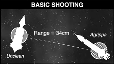
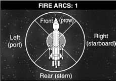
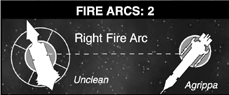
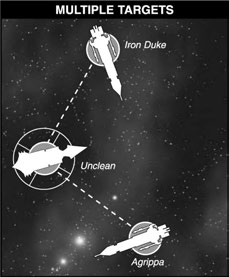
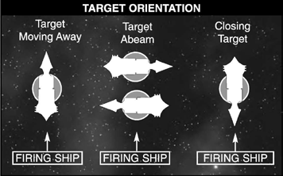
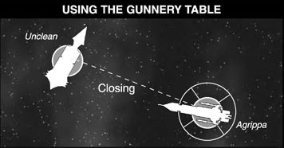
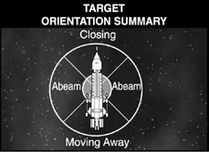
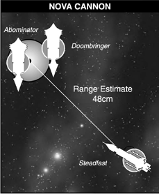
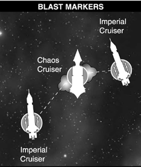
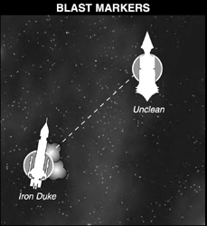

# The Shooting Phase

**In the Shooting Phase, your ships get to unleash their weaponry
against the enemy. The attacks that ships make are divided into two
sorts: direct firing and ordnance attacks. Direct fire attacks include
weapons such as lasers, fusion beams and plasma launchers which
when fired hit almost immediately, even across tens of thousands
of kilometres. Ordnance attacks include torpedoes and fighters,
which are launched during the Shooting Phase but are not resolved
until they hit their target in a subsequent Ordnance Phase.**

## Direct Fire

Direct firing uses a ship’s
[weapons batteries](the-shooting-phase.md#direct-firing-weapons-batteries), [lances](the-shooting-phase.md#direct-firing-lances)
and [nova cannon](the-shooting-phase.md#nova-cannon). A player
can make direct fire
attacks with each of his
ships during his turn.

In order to make direct fire
attacks, the firing ship must
have at least some weapons
within [range](the-shooting-phase.md#range) and [fire arc](the-ordnance-phase.md#fighters) of
the enemy. Once one ship
has done all its firing, the
player selects another and
fires that one and so on
until the player has fired all
of the ships he wants to.

This can be summarised as:

1. Choose a ship to fire.
2. Check the ship has targets within range.
3. Check the ship has weapons within fire arc of the target.
4. Resolve firing.
5. Choose another ship to fire.

### Range

Measure the range from
the firing ship to the
target vessel. Then look
up the range of the firing
ship’s weapons on its
characteristics: any weapons
which are out of range
may not fire. Because ships
vary immensely in size and
shape, we use the stems
of the models’ bases as a
pair of convenient centre
points for checking range.

*In the example above the
Unclean is firing on the
Agrippa. The Unclean is
34 cm away so its weapons
batteries (range 45 cm) are
within range.*

## Fire Arcs

Weapons have a limited field
of fire depending on where
they are mounted on the
vessel. The different fire arcs
are: front, left, right and rear.

*A weapons system must
have a target ship within
its fire arc in order to fire.*

*The Unclean has the Agrippa
in its right fire arc, so it
may fire at it with any of
its weapons which can be
brought to bear in that arc.*

Some weapon systems can
shoot into more than one fire
arc. For example, many cruisers
have weaponry in a dorsal
mount (i.e. along the top of
the vessel) and dorsal mounts
can fire left, front or right.
Some weapons can even fire all
round. Some special weapon
systems are area-effect weapons
that do not aim nor are directed
at a particular target. These
weapons or effects always affect
all around the firing vessel.

When shooting and the line of
fire is on the line in-between
arcs, the shooting player
chooses which arcs to use,
whether it is the attacking or
defending ship.

### Target Priority

Enemies at close range
pose a much greater threat
than those thousands of
kilometres away, so a ship will
normally target the nearest
enemy ship or [squadron](squadrons.md).
However, a ship can always
fire at whatever targets you
like if it takes and passes a
[Leadership test](the-rules.md#taking-command-checks) on 2D6 first.

#### Multiple Targets

Normally a ship will be in a
position where only some of
its weapon systems can be
brought to bear against the
closest enemy. Unengaged
weapons may still be fired
at other targets, providing
that the closest enemy is shot
at as a matter of priority.

*In the example above
the Unclean may fire
its left arc weaponry
against the Iron Duke
and its right arc weaponry
against the Agrippa.*

### Direct Firing: Lances

Lances are incredibly
high-powered energy
weapons that are capable of
burning straight through
an armoured hull or cutting
an escort ship in two. On
[Imperial](fleet-lists/imperial-navy.md) and [Chaos](fleet-lists/chaos.md) ships,
lances are usually mounted
in huge turrets with quad or
triple energy projectors that
focus into a concentrated
beam of destruction.

#### Lance Rules

If a lance weapon system is
within range and fire arc of
the target simply roll 1D6
per point of lance Strength.
Any dice which score a 4, 5
or 6 hit the target regardless
of the target’s Armour value
and cause 1 damage point.
Ships with multiple lances in
a given [fire arc](the-ordnance-phase.md#fighters) may split their
weapon strength between
targets but must still make
a [leadership check](the-rules.md#taking-command-checks) to fire on
any target besides the closest.

*For example, the Agrippa has
lances that have a Strength
of 2. If the vessel were to fire
them, it would roll 2D6 and
score one hit for each dice
which rolled a 4 or more.*

*A target’s orientation depends upon which [fire
arc](the-ordnance-phase.md#fighters) the firing vessel is in, as shown in the
diagram. Match this with the target’s type to
find out which column of the [Gunnery table](#gunnery-table) to
use.*

*The Unclean opens fire with its starboard (right)
weapons batteries. The weapons have a firepower
of 10 and the Agrippa is a closing capital ship
which on the [Gunnery table](#gunnery-table) means that the
Unclean rolls 7D6. The Agrippa’s front armour
rating is 6 so the Unclean needs to roll 6s to hit.*

### Direct Firing: Weapons Batteries

Weapons batteries form
the main armament for
most warships, ensuring
that much of their hull is
pock-marked by gun ports
and weapon housings. Each
battery consists of rank
upon rank of weapons:
plasma projectors, laser
cannons, missile launchers,
rail guns, fusion beamers
and graviton pulsars.
Weapons batteries fire by
salvoes, using a coordinated
pattern of shots to catch
the target in the middle of a
maelstrom of destruction.

#### Weapons Battery Rules

If a ship’s weapons battery
is within range and fire
arc of the target, look up
the battery’s firepower on
the ship’s data sheet. Then
look up the target’s type
and orientation on the
[Gunnery table](#gunnery-table) that follows.

If a ship or [squadron](squadrons.md) is firing
multiple weapons that rely
on the gunnery, they may
be fired simultaneously.
Calculate the dice on the
[gunnery table](#gunnery-table) separately
for each type of gunnery
weapon. This means you do
not suffer gunnery shifts
due to [Blast Markers](the-shooting-phase.md#blast-markers) caused
by other members of the
same squadron in the same
Shooting Phase. The order
in which these weapons
hit is up to the shooting
player, so Bombardment
Cannons can hit after
weapons batteries have taken
down shields for instance,
or vice versa if desired.

Find your total firepower
on the column on the left
of the table. Next look
across the top of the table
to find the target type
you are shooting at.

*The target’s orientation is
worked out by tracing the line
of fire to its base and using the
bearing compass to see which
aspect is facing the firer.*

Which way the target is
travelling is important for
gunnery purposes as it is
much harder to hit a target
moving across your sights
(i.e. abeam) than one closing
or moving away from you.

By cross referencing the
total firepower of the attack
with the target type and
orientation you will find
out how many dice to roll
to hit. Each dice roll which
equals or beats the target’s
Armour value scores a hit and
inflicts 1 point of [damage](the-shooting-phase.md#damage).

Any battery weapon that
always counts targets as
closing on the gunnery
table still uses the far left
column when targeting
defences, applying any
modifiers as applicable.

If a combination of ships in
a [squadron](squadrons.md) has a firepower
value greater than 20, look
up 20 and the remaining
firepower values separately
and add them together. For
example, a squadron of two
Carnages can have up to
firepower 32 in one broadside,
or firepower (20+12).

#### Gunnery Modifiers

Sometimes conditions will affect how difficult
a target is to hit. Ships at very long range
will be hard to hit and at close range they
will be easy to hit. Debris, radiation, etc.,
can obscure a target and are represented by
[Blast Markers](the-shooting-phase.md#blast-markers). These are described in more
detail later, but for now it’s worth knowing
that they can make a target harder to hit.
Even weapon batteries that always count as
closing can be affected by these modifiers.

Modifiers are applied in the form of column
shifts. A good modifier (such as being at
close range) means that you move across
the [Gunnery table](#gunnery-table) one column to the left
when you work out how many Hit dice to
roll. A bad modifier (such as being at long
range) means you move across one column
to the right. No target aspect or modifier can
adjust shooting beyond the far left or right
columns on the [gunnery table](#gunnery-table). The gunnery
modifiers are summarised as follows:

#### Modifiers:

Target within 15 cm – shift one column left

Target more than 30 cm away
– shift one column right

Target behind intervening [Blast
Markers](the-shooting-phase.md#blast-markers) – shift one column right

For example, as shown earlier, the *Unclean*
firing at the *Agrippa* rolls 7D6. If the *Agrippa*
were within 15 cm you would shift one column
left on the [Gunnery table](#gunnery-table) and the *Unclean*
would roll 9D6 instead. If the *Agrippa* was
over 30 cm away the column shift to the right
would mean the *Unclean* rolled 5D6 instead.

#### Gunnery Table

<table>
  <thead>
    <tr>
      <td colspan="2">CLOSING</td>
      <td align=center>&nbsp;</td>
      <td align=center>CAPITAL SHIPS</td>
      <td align=center>ESCORTS</td>
      <td align=center>&nbsp;</td>
      <td align=center>&nbsp;</td>
    </tr>
    <tr>
      <td colspan="2">MOVING AWAY</td>
      <td align=center>&nbsp;</td>
      <td align=center>&nbsp;</td>
      <td align=center>CAPITAL SHIPS</td>
      <td align=center>ESCORTS</td>
      <td align=center>&nbsp;</td>
    </tr>
    <tr>
      <td colspan="2">ABEAM</td>
      <td align=center>&nbsp;</td>
      <td align=center>&nbsp;</td>
      <td align=center>&nbsp;</td>
      <td align=center>CAPITAL SHIPS</td>
      <td align=center>ESCORTS</td>
    </tr>
    <tr>
      <td colspan="2">SPECIAL*</td>
      <td align=center>DEFENCES</td>
      <td align=center>&nbsp;</td>
      <td align=center>&nbsp;</td>
      <td align=center>&nbsp;</td>
      <td align=center>ORDNANCE</td>
    </tr>
  </thead>
  <tbody>
    <tr>
      <td rowspan="20" style="writing-mode: vertical-rl;text-orientation: mixed;">Firepower</td>
      <td align=center>1</td>
      <td align=center>1</td>
      <td align=center>1</td>
      <td align=center>1</td>
      <td align=center>0</td>
      <td align=center>0</td>
    </tr>
    <tr>
      <td align=center>2</td>
      <td align=center>2</td>
      <td align=center>1</td>
      <td align=center>1</td>
      <td align=center>1</td>
      <td align=center>0</td>
    </tr>
    <tr>
      <td align=center>3</td>
      <td align=center>3</td>
      <td align=center>2</td>
      <td align=center>2</td>
      <td align=center>1</td>
      <td align=center>1</td>
    </tr>
    <tr>
      <td align=center>4</td>
      <td align=center>4</td>
      <td align=center>3</td>
      <td align=center>2</td>
      <td align=center>1</td>
      <td align=center>1</td>
    </tr>
    <tr>
      <td align=center>5</td>
      <td align=center>5</td>
      <td align=center>4</td>
      <td align=center>3</td>
      <td align=center>2</td>
      <td align=center>1</td>
    </tr>
    <tr>
      <td align=center>6</td>
      <td align=center>5</td>
      <td align=center>4</td>
      <td align=center>3</td>
      <td align=center>2</td>
      <td align=center>1</td>
    </tr>
    <tr>
      <td align=center>7</td>
      <td align=center>6</td>
      <td align=center>5</td>
      <td align=center>4</td>
      <td align=center>2</td>
      <td align=center>1</td>
    </tr>
    <tr>
      <td align=center>8</td>
      <td align=center>7</td>
      <td align=center>6</td>
      <td align=center>4</td>
      <td align=center>3</td>
      <td align=center>2</td>
    </tr>
    <tr>
      <td align=center>9</td>
      <td align=center>8</td>
      <td align=center>6</td>
      <td align=center>5</td>
      <td align=center>3</td>
      <td align=center>2</td>
    </tr>
    <tr>
      <td align=center>10</td>
      <td align=center>9</td>
      <td align=center>7</td>
      <td align=center>5</td>
      <td align=center>4</td>
      <td align=center>2</td>
    </tr>
    <tr>
      <td align=center>11</td>
      <td align=center>10</td>
      <td align=center>8</td>
      <td align=center>6</td>
      <td align=center>4</td>
      <td align=center>2</td>
    </tr>
    <tr>
      <td align=center>12</td>
      <td align=center>11</td>
      <td align=center>8</td>
      <td align=center>6</td>
      <td align=center>4</td>
      <td align=center>2</td>
    </tr>
    <tr>
      <td align=center>13</td>
      <td align=center>12</td>
      <td align=center>9</td>
      <td align=center>7</td>
      <td align=center>5</td>
      <td align=center>3</td>
    </tr>
    <tr>
      <td align=center>14</td>
      <td align=center>13</td>
      <td align=center>10</td>
      <td align=center>7</td>
      <td align=center>5</td>
      <td align=center>3</td>
    </tr>
    <tr>
      <td align=center>15</td>
      <td align=center>14</td>
      <td align=center>11</td>
      <td align=center>8</td>
      <td align=center>5</td>
      <td align=center>3</td>
    </tr>
    <tr>
      <td align=center>16</td>
      <td align=center>14</td>
      <td align=center>11</td>
      <td align=center>8</td>
      <td align=center>6</td>
      <td align=center>3</td>
    </tr>
    <tr>
      <td align=center>17</td>
      <td align=center>15</td>
      <td align=center>12</td>
      <td align=center>9</td>
      <td align=center>6</td>
      <td align=center>3</td>
    </tr>
    <tr>
      <td align=center>18</td>
      <td align=center>16</td>
      <td align=center>13</td>
      <td align=center>9</td>
      <td align=center>6</td>
      <td align=center>4</td>
    </tr>
    <tr>
      <td align=center>19</td>
      <td align=center>17</td>
      <td align=center>13</td>
      <td align=center>10</td>
      <td align=center>7</td>
      <td align=center>4</td>
    </tr>
    <tr>
      <td align=center>20</td>
      <td align=center>18</td>
      <td align=center>14</td>
      <td align=center>10</td>
      <td align=center>7</td>
      <td align=center>4</td>
    </tr>
  </tbody>
</table>

*<strong>Notes:</strong> To save space, both cruisers and battleships are referred to as [capital ships](the-rules.md#capital-ships) on the [Gunnery table](#gunnery-table).
If a [squadron](squadrons.md) has a firepower value greater than 20, look up 20 and the remaining value separately and add them together. For example, a squadron of two Carnage cruisers can have up to firepower 32 in one broadside, or firepower (20+12).*

*\*[Defences](planetary-defences.md) (for example ground based defences and satellites) and ordnance targets are not affected by orientation. A ship must move at least 5 cm to not be targeted as defences.*

#### Splitting Fire

A ship can elect to split the
firepower of its [weapon
batteries ](the-shooting-phase.md#direct-firing-weapons-batteries)or [lances](the-shooting-phase.md#direct-firing-lances) between
several enemy vessels, but
only after halving the effect
of the weaponry as a result
of [special orders](the-rules.md#special-orders), [crippling
damage](the-shooting-phase.md#crippled-ships) and so on.

You cannot split weapons
battery or lance fire of any
type at a single target!

Ships with multiple weapons
in a given fire arc may
split their weapon strength
between two or more
targets but must still make
a [leadership check](the-rules.md#taking-command-checks) to fire on
any target besides the closest.

> #### Special Order: [*Lock On*](the-rules.md#lock-on)
> 
> A ship can increase
> the accuracy of its
> firing by using the
> [*Lock On*](the-rules.md#lock-on) special order.
> The ship may [re-roll](the-rules.md#re-rolls)
> any dice to hit for
> [lances](the-shooting-phase.md#direct-firing-lances) and [weapons
> batteries](#direct-firing-weapons-batteries), during the
> [Shooting Phase](the-shooting-phase.md). Any
> dice which missed
> are simply picked up
> and rolled again. A
> ship using [*Lock On*](the-rules.md#lock-on)
> orders may not turn
> during its [Movement
> Phase](the-movement-phase.md) because it must
> maintain a steady
> course and direct
> additional power to its
> weapon systems. *Lock
> On* orders are really
> useful when an enemy
> vessel is within range
> and no course changes
> will be needed to bring
> weapons to bear.
> See [pg. 46](the-rules.md#lock-on) for all effects.

### Nova Cannon

A nova cannon is a huge
weapon, normally mounted
in the prow of a ship so
that the recoil it generates
can be compensated for
by the vessel’s engines.
It fires a projectile at
incredible velocity, using
graviometric impellers
to accelerate it to close to
light speed. The projectile
implodes at a preset distance
after firing, unleashing a
force more potent than a
dozen plasma bombs.

#### Nova Cannon Rules

The correct dimensions of
the Nova Cannon template
are a 5 cm outer diameter
with the hole’s diameter at
1.2 cm. The Nova Cannon
template’s dimensions can be
found on Games Workshop’s
small green blast template
where the perimeter is
marked with a 2; this does
not include the width of the
line. Use the larger hole in
the centre of the template
if there are two sizes.

When firing, the template is
placed anywhere desired so
that its edge is between 30-150 cm from the firing vessel
in its specified firing arc.

It does not have to be centred
on a single enemy vessel
and can be placed so that it
touches more than one ship.

When the template is placed,
check the range. If placed
within 45 cm, roll a scatter
die and 1D6. Roll 2D6 if the
range is between 45 cm to
60 cm, and 3D6 if the range
is beyond 60 cm. Move the
template a number of cm
rolled by the dice in the
direction of the scatter
die roll. If the scatter die
rolls a “hit”, the template
remains where placed.

After the attacking player
designates which target
is being fired on, the
defending player must
decide whether or not to
[brace](the-rules.md#brace-for-impact) ships or [squadrons](squadrons.md)
BEFORE the weapon is
fired. This includes targets
the weapon may hit due to
miss distance or scatter.

Any target that is in base
contact of the template after
it is moved takes one hit. Any
target in base contact of the
centre hole of the template
takes D6 hits, regardless of its
Armour value. Any [ordnance](the-ordnance-phase.md)
touching the template is
automatically removed.
Replace the template with a
single [Blast Marker](the-shooting-phase.md#blast-markers) if it does
not contact a target after
being moved.

*In the diagram above the
Steadfast, a Dominator class
cruiser, fires its nova cannon
at the Abominator, at a range
of 48 cm. The hole in the nova
cannon template partially
covers the Abominator’s
base, inflicting D6 hits on it.
The nearby Doombringer is
also caught in the blast and
suffers one automatic hit.*

#### Important Note:

The Nova Cannon is a line
of sight weapon and cannot
fire through obstacles or
[celestial phenomena](the-battlefield.md#celestial-phenomena) that
act as normal line of sight
obstructions, such as [planets](the-battlefield.md#planets),
[moons](the-battlefield.md#moons), [asteroid fields](the-battlefield.md#asteroid-fields), etc. If
desired however, these can
nonetheless be fired upon. If
a direct hit is scored on the
scatter dice, place D6 [Blast
Markers](the-shooting-phase.md#blast-markers) in contact with the
planet or asteroid field edge.

Nova Cannon are unaffected in
any way by [*Lock On*](the-rules.md#lock-on) or [*Reload
Ordnance*](the-rules.md#reload-ordnance) special orders.

#### Nova Cannon vs. Holofield

[Holofields](fleet-lists/eldar.md#holofields) and similar systems
save against the shell hit,
not the subsequent damage
rolls. For example, if an [Eldar](fleet-lists/eldar.md)
vessel is hit by a Nova Cannon
round and fails to save, it
must immediately take as
many hits as the damage roll
allocates unless it successfully
braced beforehand.

Holofield saves are taken
against a direct hit from a
Nova Cannon where the hole
is over the base as well as
against the single automatic
hit for coming in base contact
with the blast template. If this
save is successful the effect of
the Nova Cannon is negated,
and a [Blast Marker](the-shooting-phase.md#blast-markers) is placed
normally for the save. Being
braced saves against any
damage taken normally.

### Area Effects And Special Weapons

Some weapon systems such as
the Necron Nightmare Field
and [Star Pulse Generator](fleet-lists/necrons.md#star-pulse-generator)
are area-effect weapons
that do not aim nor are
directed at a particular
target. Such weapons or
effects are not blocked by
line of sight obstructions
such as hulks, [minefields](fleet-lists/planetary-defences.md#low-orbit-defences_1)
or [celestial phenomena](the-battlefield.md#celestial-phenomena), nor
can they be saved against
by [holofields](fleet-lists/eldar.md#holofields). See [pg. 70](#catastrophic-damage) for
more on [catastrophic damage](#catastrophic-damage)
and exploding ships.

[Chaos Marks](fleet-lists/chaos.md#marks-of-chaos) that affect
nearby ships based on area
as well as [catastrophic
events](the-shooting-phase.md#catastrophic-damage) such as Warp Drive
implosions, [Solar Flares](the-battlefield.md#solar-flares),
etc. are also not affected by
[celestial phenomena](the-battlefield.md#celestial-phenomena) and
other such line-of-sight
obstructions. See [pg. 110](the-battlefield.md#asteroid-fields)
concerning [asteroid fields](the-battlefield.md#asteroid-fields).

Exterminatus vessels used
in scenarios that require
them normally replace their
standard prow weapon
with an Exterminatus
one. Vessels that do not
normally have prow weapons
(such as Vengeance grand
cruisers) cannot be used
as Exterminatus vessels.

Armageddon Gun and
[Holofields](fleet-lists/eldar.md#holofields): Holofield saves
are taken against a direct
hit from the Armageddon
Gun where the hole is over
the base as well as against
the single automatic hit for
coming in base contact with
the blast template. If this save
is successful the effect of the
Armageddon Gun is negated,
and a [Blast Marker](the-shooting-phase.md#blast-markers) is placed
normally for the save. Being
[braced](the-rules.md#brace-for-impact) saves against any
damage taken normally.

> #### Special Order: [*All Ahead Full*](the-rules.md#all-ahead-full) / [*Burn Retros*](the-rules.md#burn-retros) / [*Come To New Heading*](the-rules.md#come-to-new-heading)
> 
> A ship using [*All Ahead
> Full*](the-rules.md#all-ahead-full), [*Burn Retros*](the-rules.md#burn-retros) or
> [*Come To New Heading*](the-rules.md#come-to-new-heading)
> special orders sacrifices
> firing opportunities
> in order to squeeze
> more performance
> out of its engines. In
> the Shooting Phase,
> ships on these orders
> halve their weapons
> batteries’ Firepower
> and [lance](the-shooting-phase.md#direct-firing-lances) Strength,
> rounding up. Nova
> cannon may not be
> fired at all. [Ordnance](the-ordnance-phase.md)
> is unaffected.
> See [pg. 46](the-rules.md#special-orders) for all effects

## Damage

The weapons carried by some
ships are powerful enough
to reduce whole cities to
plains of radioactive glass.
Ships are armoured and
shielded in order to resist
their savage caress, hulls are
heavily reinforced so that
they can survive the horrific
pounding of gigawatts of
energy. But within every ship
is a crew all too vulnerable
to the fires of battle and the
deadly cold of the void. Ships
are often crippled by crew
casualties long before hulls
crack or drives explode.

### Taking Hits

When a ship is damaged,
note the number of hits it has
taken on your fleet roster.

Once a ship has lost half its
damage points it is crippled.
When a ship has lost all its
hits, it is out of action and
a roll needs to be made on
the [Catastrophic Damage](the-shooting-phase.md#catastrophic-damage)
table to see if it explodes
in a spectacular fashion or
simply drifts helplessly.

#### Crippled Ships

A ship which loses half its
damage points is crippled.
Being crippled halves
[shields](the-shooting-phase.md#shields), [turrets](the-ordnance-phase.md#turrets), [ordnance](the-ordnance-phase.md),
all weapons and affects
[boarding](the-end-phase.md#boarding-actions). This effect is
cumulative if the ship is
[braced](the-rules.md#brace-for-impact), meaning if a ship is
both braced and crippled, its
weapons and ordnance are
halved (rounding up) again!

Crippled ships also reduce
their [move](the-movement-phase.md) by 5 cm and
will not be able to fire
their [nova cannon](the-shooting-phase.md#nova-cannon).

*For example, a standard
Lunar class cruiser has
8 hits and is therefore
crippled when it has suffered
4 points of damage.*

> #### Special Order: [*Brace For Impact!*](the-rules.md#brace-for-impact)
> 
> [*Brace For Impact!*](the-rules.md#brace-for-impact) special orders can be undertaken ANY time a ship faces taking
> damage before the actual to-hit result is rolled, including when [ramming](the-movement-phase.md#all-ahead-full-ramming-speed) or being
> rammed or against damage from [asteroid fields](the-battlefield.md#asteroid-fields). It may also be used to protect
> against [critical damage](the-shooting-phase.md#critical-hits) from any kind of [Hit-and-Run attack](the-end-phase.md#hit-and-run-attacks). A decision to brace
> for impact must be made before any attempt to shoot (rolling dice) by the opponent
> is made, including modifier rolls for variable weapons such as Ork Gunz. When
> being attacked by [ordnance](the-ordnance-phase.md), the decision must be made before rolling [turrets](the-ordnance-phase.md#turrets).
> 
> [*Brace For Impact!*](the-rules.md#brace-for-impact) DOES NOT protect against [critical damage](the-shooting-phase.md#critical-hits) caused
> by hits that were not saved against normally, nor any damage caused
> during a [boarding action](the-end-phase.md#boarding-actions) (including critical damage).
> 
> A ship is placed on [*Brace For Impact!*](the-rules.md#brace-for-impact) orders until the end of its next turn,
> replacing any other [special order](the-rules.md#special-orders) it may be on currently. However, the special
> order previously in effect remains so, in that ships that [reloaded ordnance](the-rules.md#reload-ordnance) are
> still reloaded, a ship or [squadron](squadrons.md) moving [*All Ahead Full*](the-rules.md#all-ahead-full) must continue to do so,
> etc. Ships and squadrons still cannot take special orders in the next turn.
> 
> A ship using [*Brace For Impact!*](the-rules.md#brace-for-impact) orders gains a saving throw of 4+
> on a D6 against actual damage taken by the ship itself, NOT hits
> absorbed by [shields](the-shooting-phase.md#shields), reactive armour, [holofields](fleet-lists/eldar.md#holofields), etc.
> 
> A ship which uses this special order may not use special orders at all in its next turn
> and its Firepower, [ordnance](the-ordnance-phase.md) (this effect is cumulative if a capital ship is crippled) and
> armament Strength is halved, while [Nova Cannons](the-shooting-phase.md#nova-cannon) may not be fired at all. [Turrets](the-ordnance-phase.md#turrets) and
> [shields](the-shooting-phase.md#shields) are unaffected. [*Brace For Impact!*](the-rules.md#brace-for-impact) only comes into effect against attacks whose Hit
> rolls are made after the special order has been declared. In other words, you cannot wait
> to see how accurate a salvo or Nova Cannon shot is before declaring [*Brace For Impact!*](the-rules.md#brace-for-impact)
> 
> A ship that fails an attempt to [*Brace For Impact!*](the-rules.md#brace-for-impact) cannot attempt to brace again
> until the ship, [squadron](squadrons.md), [ordnance](the-ordnance-phase.md) wave or other event causing damage to it
> completes its attacks, finishes causing damage, resolves its effects, etc. It can
> however again attempt to brace before the next ship, squadron or ordnance
> wave attacks it, it faces another potentially damaging event, etc.

### Critical Hits

The weapons used in space are so destructive
that when a ship is hit there is a chance
that a vital location will be critically
damaged. Critical hits can temporarily
knock out a ship’s weapons and engines,
start fires or even breach its hull.

Roll a D6 for each hit scored on a ship (but
not against its shields). On a roll of 1-5 the
hit causes no extra effects. On a roll of 6 the
hit causes critical damage. Roll 2D6 on the
table below to see what effect it has. Note
that you do not roll for further critical hits
for any damage caused by a critical hit.

#### Critical Hits on Escorts

[Escort ships](the-rules.md#escorts) which suffer a critical hit for
any reason, such as during a boarding
action, are automatically destroyed.

**Note:** Whenever ships are damaged,
there’s a good chance that it will be serious.
Therefore a check for critical damage is
made for every point of damage scored
on a ship, no matter what its source is.

Critical hits that can be repaired are
cumulative; meaning ships that take a
multiple number of the same critical damage
must repair all incidences of that critical
damage before the system is fully operational.

A ship’s speed is only affected once by
multiple Thrusters Damaged criticals.
However, the number of times it takes
effect are still cumulative, and all Thrusters
Damaged criticals must be repaired for
the ship to regain its normal speed.

Damage from multiple fire
criticals is cumulative.

*Example: if a ship had 3 fire criticals and
failed to repair any of them in the End
Phase, it would suffer 3 points of damage
and all three fires would keep burning.*

If a critical hit is rolled which cannot be
applied, or multiple criticals are rolled for
a location that cannot be repaired (such as
Shields Collapse), apply the next highest critical
hit instead. For example a ship with no dorsal
weapons gets a Dorsal Armament Damaged
critical hit. In this case the ship would suffer
damage to its starboard armament.

#### Critical Hits Table

| 2D6 Roll | Extra Damage | Result |
| :-:      | :-:          | --- |
| 2 | +0 | **Dorsal Armament Damaged:** The ship’s dorsal armament is badly damaged by the hit – power lines are severed, traverse mechanisms crippled and many gunners are killed. The ship’s dorsal armament may not fire until it has been repaired. |
| 3 | +0 | **Starboard Armament Damaged:** The starboard armament is taken off line by the hit. The ship’s starboard armament (right) may not fire until it has been repaired. |
| 4 | +0 | **Port Armament Damaged:** Heavy damage silences the port side weaponry. The ship’s port armament (left) may not fire until it has been repaired. |
| 5 | +0 | **Prow Armament Damaged:** The ship’s prow is ripped open. Its prow armament may not fire until it has been repaired. |
| 6 | +1 | **Engine Room Damaged:** The engine room is rocked by explosions, forcing all hands to tend to the reactors. The ship may not make any turns until the damage is repaired. |
| 7 | +0 | **Fire!** Oxygen lines are broken, leading to fires in many compartments. Roll to repair (extinguish) the fire in the End Phase, if it is not put out it causes one point of extra damage and keeps burning. |
| 8 | +1 | **Thrusters Damaged:** The ship’s thruster assembly is disabled. Reduce the ship’s speedby 10 cm until the damage is repaired. |
| 9 | +0 | **Bridge Smashed:** The armoured fortress around the ship’s captain and his officers is smashed. The ship’s Leadership is reduced by 3. This damage may not be repaired. If this is the Fleet Commander's flagship, any remaining Fleet Commander re-rolls are lost for the remainder of the battle. |
| 10 | +0 | **Shields Collapse:** The shield generators overload and burn out, leaving the ship virtually defenceless. The ship’s shield Strength is reduced to zero. This damage may not be repaired. |
| 11 | +D3 | **Hull Breach:** A huge gash is torn in the ship’s hull, causing carnage among the crew. |
| 12 | +D6 | **Bulkhead Collapse:** Internal pillars buckle and twist, whole compartments crumple with a scream of tortured metal. Just pray that some of the ship holds together! |

### Blast Markers

When ships are fired on,
some of the results are shown
by Blast Markers. Blast
Markers represent all kinds
of events – huge explosions,
expanding shockwaves,
intense radiation clouds,
tumbling debris, unexploded
warheads, plasma bursts, etc.

#### Placing Blast Markers

Blast Markers are shown
on the tabletop by placing
counters where the event
occurs. They remain in play
until they are removed in a
subsequent [End Phase](the-end-phase.md). Most
Blast Markers are placed
to show the hits taken on a
vessel’s shields as described
later, but exploding ships
and especially apocalyptic
weapons can also cause Blast
Markers to be placed. Blast
Markers are placed in the
following circumstances:

* For each hit absorbed
by a ship’s shields.
* For ships which
are reduced to 0
damage as specified
on the [Catastrophic
Damage](the-shooting-phase.md#catastrophic-damage) table.
* For each missed [nova
cannon](the-shooting-phase.md#nova-cannon) attack.

Blast Markers that are
caused by [shield](the-shooting-phase.md#shields) impacts,
the first Blast Marker is
placed directly in the line
of fire from the shooting
vessel, with subsequent
Blast Markers fanning out
around it. Blast Markers
cannot be stacked unless
there is physically no more
room to place Blast Markers
around a target’s base.

When a ship has multiple
bases in contact when taking
fire, the Blast Marker is
placed between the base of
the ship taking fire and the
ship closest in the line of fire
to the ship taking fire. In
other words, a single round
of shooting from a ship or
squadron cannot place Blast
Markers in base contact
with more than one other
vessel besides the vessel it is
shooting at (for two in total)
except in the following cases:

1. A ship with multiple
[shields](the-shooting-phase.md#shields) (like a [battleship](the-rules.md#battleships))
takes three or four Blast
Markers that when fanned
out normally contact more
than one vessel in actual
base contact (as opposed
to “close to but not actually
touching”). In other words,
if a ship in base contact with
the ship under fire comes in
contact with Blast Markers
being normally fanned
around the base of the ship
taking fire, then it comes in
contact with a Blast Marker
as well. When merely in
base contact with the ship
fired upon, the Blast Marker
must physically touch
the bases of the ships it is
affecting in this manner.

2. Any and all ships with
bases that are actually
stacked or are in any
way overlap on the base
of a ship in contact with
Blast Markers, which
is different from mere
base contact and is
explained separately.

A ship in base contact with a
Blast Marker means the whole
base is affected. It counts as
being in contact all around it
and in every arc for purposes
of [leadership](the-rules.md#leadership), [movement](the-movement-phase.md),
[shooting](the-shooting-phase.md), [ordnance](the-ordnance-phase.md) attacks,
being [boarded](the-end-phase.md#boarding-actions), or every other
respect where Blast Markers
have an effect. This includes
if it ended its movement in
contact with a Blast Marker
for any reason. A vessel is
considered to be moving
through Blast Markers even
if it is moving away from
Blast Markers it is in contact
with at the beginning of the
[Movement Phase](the-movement-phase.md), such as
Blast Markers in its rear arc
or in base contact due to a
previous round of shooting.

When ships have [stacked or
overlapping bases](the-movement-phase.md#stacking-ships-and-escort-squadrons), there is no
limitation to the number of
ship’s shields a Blast Marker
can take down if one of them is
in contact with Blast Markers.
A ship overlapping a ship in
contact with a Blast Marker also
counts as being in contact with
it. However, in situations where
multiple ships are overlapping
each other, this does not
cascade to other vessels.

*For example, Ship #2 overlaps
on Ship #1, which has a Blast
Marker in contact with it. Ship #3 overlaps on Ship #2 but not
on Ship #1. Ship #2 counts as
having a Blast Marker on it,
but as long as the Blast Marker
does not physically touch Ship #3, it does not count as being
in contact with a Blast Marker.*

Blast Markers placed in base
contact with a ship that took
fire do not affect ships near to
but not actually in base contact
with that ship. Place Blast
Markers so they do not touch
the bases of ships nearby but
not actually in base contact.
This is not a “counts as” rule;
one cannot declare a ship is
actually not in base contact if
it is making physical contact.

If a ship moves into base
contact with another ship that
already has a Blast Marker but
the blast maker does not touch
its own base, it does not count
as having a Blast Marker in
contact as well. In other words,
a ship in contact with a Blast
Marker does not in and of itself
count as being a Blast Marker
for purposes of being in base
contact with other ships.

Note that Blast Markers
do not move once they
have been placed on the
tabletop. They show an
area of tumultuous, strifetorn space and temporarily
become part of the [battlefield](the-battlefield.md)
once they are in play.

*In the example below, two
Imperial cruisers are firing
on a Chaos cruiser. Each
Imperial ship scores one hit,
so a Blast Marker is placed in
contact with the edge of the
Chaos cruiser’s base facing
each of the Imperial ships.*

#### Blast Marker Effects

**Movement:** A vessel is
considered to be moving
through Blast Markers even
if it is moving away from
Blast Markers it is in contact
with at the beginning of
the [Movement Phase](the-movement-phase.md).

If a ship moves through any
Blast Markers, it reduces
its speed that phase by 5 cm
regardless of the number
of markers actually moved
through. This affects each
separate Movement Phase for
[Eldar](fleet-lists/eldar.md) vessels.

If a ship cannot elect to slow
down (such as when on [*All
Ahead Full*] special orders) and
comes into contact with a Blast
Marker within the last 5 cm of
its movement, it must instead
stop no farther than the point
it comes in contact with the
Blast Marker (and not before).

A ship with a [Shield](the-shooting-phase.md#shields) strength
of 0 (i.e. Eldar or ships
suffering the Shields Collapse
[critical](the-shooting-phase.md#critical-hits)) which moves through
any Blast Markers also suffers
a point of damage on a D6 roll
of 6. This test only needs to
be made once, regardless of
how many Blast Markers they
encounter in their movement.

Ships with shields overloaded
by taking fire but are otherwise
functional do not risk taking
damage on a D6 roll of 6.

An [Ordnance](the-ordnance-phase.md) marker such
as a [torpedo](the-ordnance-phase.md#torpedoes) salvo or [bomber
squadron](the-ordnance-phase.md#bombers) is removed on a
D6 roll of 6 if it moves over a
Blast Marker.

**Shooting:** Blast Markers
interfere with [gunnery](the-shooting-phase.md#direct-firing-weapons-batteries), as
mentioned earlier, disrupting
firing and causing plenty
of ‘ghost’ images on the
firing ship’s sensors. Hence
if a ship’s line of fire passes
through any Blast Markers
(including those in contact
with a ship’s base) or it or its
targets are in base contact
with Blast Markers, it suffers
a column shift to the right on
the [Gunnery table](#gunnery-table). [Lances](the-shooting-phase.md#direct-firing-lances) and
[nova cannon](the-shooting-phase.md#nova-cannon) are unaffected.
Note that Blast Markers come
into effect immediately and
so can affect subsequent
shooting in the same turn
in which they are placed.

**Shields:** If a ship’s base
is in contact with any
Blast Markers when it
is fired upon, its [shield](the-shooting-phase.md#shields)
Strength is reduced by
1 per Blast Marker.

### Shields

Ships are protected by
powerful energy shields,
so that they can survive
travelling through space.
The shields form a wavering
band of energy around the
vessel, a teardrop of invisible
force that can absorb or
deflect the worst excesses
of stellar radiation and
meteor showers or a series of
weapons hits. The amount
of damage shields are able
to absorb is limited and they
will be overwhelmed by a
sustained attack, forcing a
temporary shutdown while
the shield generators vent
off the excess energy.

Each shield will block one
point of [damage](the-shooting-phase.md#damage) from
hitting the ship in a single
Shooting Phase. A [Blast
Marker](the-shooting-phase.md#blast-markers) is placed touching
the ship’s base for each hit
blocked by the shields, to
show how much energy
has been absorbed.

Once the number of [Blast
Markers](the-shooting-phase.md#blast-markers) in contact with
a ship’s base is equal to
its number of shields, no
further damage may be
absorbed by the shields that
turn. Any further hits will
inflict [damage](the-shooting-phase.md#damage) on the ship
itself. Once they have been
overloaded the shields may
not be raised again until
the ship escapes the storm
of energy blasts and shock
waves represented by the
Blast Markers. The shields
remain down until the ship
moves away from the Blast
Markers in a subsequent
[Movement Phase](the-movement-phase.md).

Shields are only effective
against [lances](the-shooting-phase.md#direct-firing-lances), [weapons
batteries](the-shooting-phase.md#direct-firing-weapons-batteries) and [nova cannon](the-shooting-phase.md#nova-cannon).
Attacks made by [ramming](the-movement-phase.md#all-ahead-full-ramming-speed),
[bombers](the-ordnance-phase.md#bombers) and [torpedoes](the-ordnance-phase.md#torpedoes) get
inside a ship’s shields, so
they provide no protection.

*In the example above the Iron
Duke (which has two shields)
is fired on by the Unclean
and receives three hits. Two
hits are absorbed by the Iron
Duke’s shields so two Blast
Markers are placed in contact
with its base to show that it
has already stopped two hits
with its shields this turn. The
third hit scores one point of
damage on the ship itself.
Any further hits against the
Iron Duke this turn will score
damage on the ship itself
because its shields are down.*

## Catastrophic Damage

A ship with no hits left is effectively out of
action. There may be some crew left alive,
trapped in compartments which have not
been breached yet, there may even be power
available in some sections of the ship, but the
ship can no longer fight.

When an [escort](the-rules.md#escorts) is destroyed, replace it with a [Blast
Marker](the-shooting-phase.md#blast-markers) placed as centrally as possible to where
the escort was, to represent the expanding cloud
of debris left by their passing. As a Blast Marker
is smaller than a small flying base, the only way
it is possible to take down a ship’s [shield](the-shooting-phase.md#shields) with this
Blast Marker is if their bases actually overlapped.

With a mighty [capital ship](the-rules.md#capital-ships), there is a chance
that the vessel will be destroyed by catastrophic
damage as its plasma drive overloads or
its warpdrive triggers. Roll 2D6 on the
[Catastrophic Damage table](the-shooting-phase.md#catastrophic-damage-table) to see what happens.

Blazing or drifting hulks will block lines of
fire that pass over their base, due to the clouds
of venting gasses and debris they produce.

Ships that are reduced to zero hits and become
hulks no longer have [shields](the-shooting-phase.md#shields), [holofields](fleet-lists/eldar.md#holofields) or any
other similar mechanism. The [turret](the-ordnance-phase.md#turrets) value
of a hulk is reduced to zero. [Bombers](the-ordnance-phase.md#bombers) do not
subtract the hulk’s turret strength from their
attack runs.

Hulks cannot be fired upon or [boarded](the-end-phase.md#boarding-actions) by
friendly vessels or [ordnance](the-ordnance-phase.md) in an attempt to deny
[victory points](scenarios.md#victory-points) to the enemy or induce [catastrophic
damage](the-shooting-phase.md#catastrophic-damage). [Torpedoes](the-ordnance-phase.md#torpedoes) that hit a friendly hulk
still inflict hits normally, but torpedoes cannot
be deliberately aimed at friendly hulks.

While enemy ships can choose to fire on a hulk,
they do not have to pass a [leadership check](the-rules.md#taking-command-checks) to
ignore one if it is the closest target. A player can
fire on an enemy hulk if it is not the closest target,
but it must make a leadership check normally.

When shooting at hulked ships, use the
destroyed ship’s Armour value to roll for hits.
Roll once on the [catastrophic damage table](the-shooting-phase.md#catastrophic-damage-table) each
time hits are inflicted by [shooting](the-shooting-phase.md) or [ordnance](the-ordnance-phase.md)
from a given ship, [squadron](squadrons.md) or ordnance wave
(regardless of the number of hits inflicted),
not once for each additional hit inflicted.

Exploding ships count as an area effect
and cannot be saved against by [holofields](fleet-lists/eldar.md#holofields),
though [shields](the-shooting-phase.md#shields) still work normally.

When placing an exploding ship’s [Blast
Markers](the-shooting-phase.md#blast-markers), place a single Blast Marker exactly
where the ship was, and then place as many
Blast Markers from the explosion as possible
fanning around and in contact with it until
the total number Blast Markers are placed
without overlapping any Blast Markers.

#### Catastrophic Damage Table

| 2D6 Roll | Extra Blast Markers | Result |
| :-: | :-: | --- |
| 2-6 | 1 | **Drifting Hulk:** The ship is reduced to a shattered hulk drifting in space. The wreck moves 4D6 cm forward in each of its subsequent [Movement Phases](the-movement-phase.md). Place a [Blast Marker](the-shooting-phase.md#blast-markers) in contact with the wreck’s base after each move. |
| 7-8 | 1 | **Blazing Hulk:** The ship is reduced to a burning wreck with uncontrolled fires blazing on every deck. In time the fires will either burn out or trigger a cataclysmic explosion. The wreck moves 4D6 cm forward in each of its subsequent [Movement Phases](the-movement-phase.md). Place a [Blast Marker](the-shooting-phase.md#blast-markers) in contact with the wreck’s base and roll on the Catastrophic Damage table again after its move. |
| 9-11 | Special | **Plasma Drive Overload:** The ship’s plasma coils overload and explode in a blazing inferno of white hot plasma. Remove the ship from play, leaving behind a number of [Blast Markers](the-shooting-phase.md#blast-markers) equal to half its starting number of hits. Every ship within 3D6 cm of the imploding wreck is struck by [lance](the-shooting-phase.md#direct-firing-lances) shots with a Strength equal to half the ship’s starting Damage capacity. Roll to hit as normal. |
| 12 | Special | **Warp Drive Implosion:** The ship’s warp drive implodes, ripping a hole in real space that tears at nearby vessels with horrific force. Remove the ship from play, leaving behind a number of [Blast Markers](the-shooting-phase.md#blast-markers) equal to its starting number of hits. Every ship within 3D6 cm of the imploding wreck is struck by [lance](the-shooting-phase.md#direct-firing-lances) shots with a Strength equal to the wreck’s starting Damage capacity. Roll to hit as normal. |
