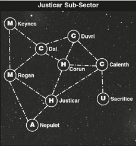
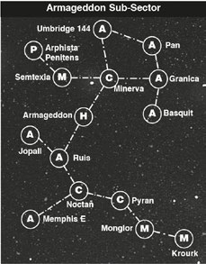
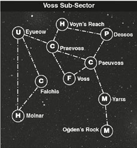
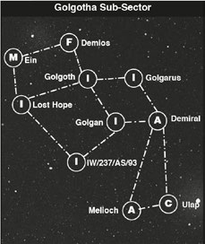
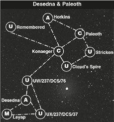

# The Third Armageddon War

*This page is a work-in-progress, but you can help finish it! Send a [pull request](https://github.com/jodrell/bfg/compare)!*

## Armageddon Sector

### Key to Sub-Sector Maps

<table><tbody>
<tr><th scope="row" align="center">A</th><td>Agri-world</td></tr>
<tr><th scope="row" align="center">C</th><td>Civilised world</td></tr>
<tr><th scope="row" align="center">F</th><td>Forge world</td></tr>
<tr><th scope="row" align="center">H</th><td>Hive world</td></tr>
<tr><th scope="row" align="center">M</th><td>Mining world</td></tr>
<tr><th scope="row" align="center">P</th><td>Penal world</td></tr>
<tr><th scope="row" align="center">U</th><td>Uninhabited system</td></tr>
</tbody></table>

## Scenarios

* [Scenario One: The Gauntlet](the-third-armageddon-war/the-gauntlet.md)
* [Scenario Two: Parol’s Bait](the-third-armageddon-war/parols-bait.md)
* [Scenario Three: Pelucidar](the-third-armageddon-war/pelucidar.md)
