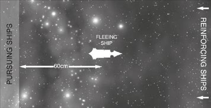

# Scenario Two: Parol’s Bait

_**As the massive tidal wave of Ork ships spread throughout the Armageddon
system, Admiral Parol was forced to disengage his ships from front line combat
or run the risk of having his fleet destroyed before he was able to mount any
serious challenge. With direct battle out of the question, Parol dispersed his
forces with orders to harry the Orks’ flanks wherever possible. With most of
the alien vessels only too willing to seek combat, Parol hoped that he could
distract and possibly destroy enough of the enemy to delay their arrival around
Armageddon itself. Many text book naval stratagems were tested to their limits.**_

## Forces

In this scenario, a small group of Light
Cruisers and Escorts have successfully
drawn out a force of Ork ships from the
main fleet and are leading them towards a
trap. Parol’s Bait is a variation of [Scenario
Two: The Bait](../scenarios/the-bait.md) on [pg. 130](../scenarios/the-bait.md). You may want
to familiarise yourself with The Bait
before proceeding with this mission.

**Pursuing forces:** Up to 500 points of Ork ships.

**Pursued forces:** Up to 250 points initially,
with up to 500 points of reinforcements. Only
Light Cruisers and Escorts may be bought
but, unlike [The Bait](../scenarios/the-bait.md) scenario, more than one
Light Cruiser or squadron may start as the
fleeing ships. The Imperial player may also
purchase up to six Orbital Mines. Although
they start on the table, they will be paid
from the 500 points for the reinforcements.

## Battlezone
Roll for the battlezone randomly. On a 1-4,
this scenario takes place in the [outer reaches](../the-battlefield.md#5-outer-reaches-generator).
On a 5-6 it takes place in the [Primary
Biosphere](../the-battlefield.md#4-primary-biosphere-generator). Generate [celestial phenomena](../the-battlefield.md/#celestial-phenomena)
on the appropriate [battlezone](../the-battlefield.md/#battlezones) table.

## Set-up

The pursued Imperial ships are placed in
the centre of the table, facing one of the
short table edges. Any Orbital mines can be
deployed anywhere in front of these ships.
The pursuing Orks are placed behind the
Imperial ships, at least 60 cm away. The
Imperial reinforcements enter from the short
table edge that the pursued ships are facing.

## First Turn

The Imperial player has the first turn.

## Special Rules

Any reinforcements for the Imperial
ships may enter the table on any turn,
including turn one. If the reinforcing
ships enter after turn one, they may be
deployed up to 30 cm along the long table
edges for each turn after the first.

## Game Length

The battle continues until one fleet
is destroyed or disengages.

## Victory Conditions

Standard [Victory Points](../scenarios.md#victory-points) are earned for ships
crippled, destroyed or disengaged. In addition,
the Orks gain bonus Victory Points equal to
half the points value of any reinforcements
brought on to help the pursued Imperial ships.
If mines are taken, the victory points for these
are automatically awarded to the attacker.
