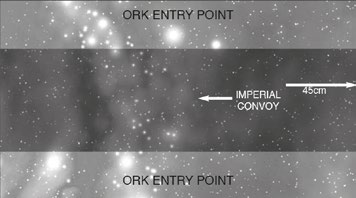

# Scenario One: The Gauntlet

_**The ferocity and speed with which Ghazghkull’s Waaagh! assailed the
Armageddon sector left many worlds isolated, and left much of the Imperial
Navy scattered. To ensure the sector did not become entirely strangled,
numerous daring convoy runs had to be made through Ork held space...**_

## Forces

The Imperial convoy must include at least
two Transport ships. For every two convoy
ships taken, the Imperial and Ork players
may take 100 points worth of ships. The rules
for Heavy Transports may be used freely in
this scenario. The Imperial player may only
take one Cruiser. All his other ships must
be either Light Cruisers or Escorts. The Ork
player is limited to taking just Escorts.

## Battlezone

This battle takes place in the [Primary Biosphere](../the-battlefield.md#4-primary-biosphere-generator)
where the Orks are attempting to tighten
their gauntlet around Armageddon. Generate
[celestial phenomena](../the-battlefield.md#celestial-phenomena) on the [Primary Biosphere
table](../the-battlefield.md#4-primary-biosphere-generator). Ignore any rolls that produce a planet.

## Set-up

The Imperial convoy and escorting ships are all
placed within 45 cm of one short table edge, facing
the opposite edge. The Ork ships move on from any
point along either long table edge in the first turn.

## First Turn

The Ork player has the first turn.

## Game Length

The battle continues until one fleet is
destroyed or disengages, or the Imperial
fleet exits from the far short table edge.

## Victory Conditions

The Imperial player must exit at least three
Transport ships from the opposite short table
edge to the one he started on to claim a victory.
Any less is considered to be an Ork victory.

## Running Battles

As this is a running battle, representing an
Imperial fleet desperately trying to get their
convoy to safety, you might like to try the
following special rule in this scenario.

The Imperial convoy and escorting ships
are all placed within 30 cm of the centre
of the table at the start of the game, facing
either short table edge. The Ork ships
move on from any point along either long
table edge in the first turn as normal.

At the end of every Imperial turn, every ship and
item of [celestial phenomena](../the-battlefield.md#celestial-phenomena) is moved back 20 cm,
away from the table edge the Imperial ships
were facing at the start of the game. Any ship
that ‘drops’ off the end of the table during this is
considered to have disengaged from the battle.

In addition, roll a die at the end of the Imperial
player’s turn. On a 6, a randomly generated
item of [celestial phenomena](../the-battlefield.md#celestial-phenomena) is placed by the
Imperial player along the short table edge his
ships originally faced. It is assumed that the
Imperial commander leading the convoy will
be able to ‘steer’ the battle towards any celestial
phenomena that he feels will give him an
advantage in this mission. As before, ignore
any rolls that generate a planet – Armageddon
is still many thousands of kilometres away!
In this variation of The Gauntlet, the game
lasts for ten turns. If the Imperial player
still has at least three Transports on the
table by this time, he may claim victory.
